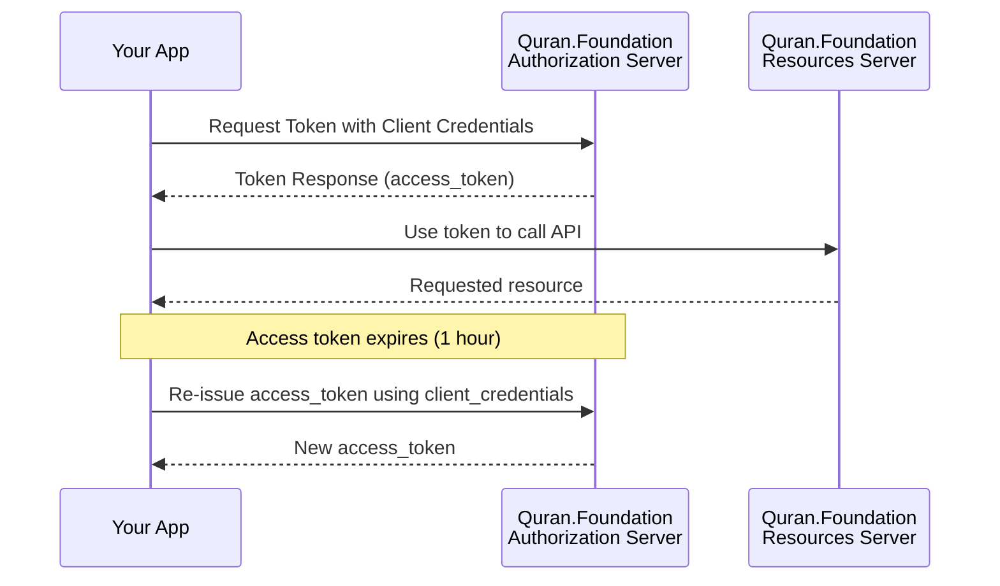

import ApiLogo from "@theme/ApiLogo";
import SchemaTabs from "@theme/SchemaTabs";
import TabItem from "@theme/TabItem";
import Export from "@theme/ApiDemoPanel/Export";

Version: v4

# Content APIs

Quran.Foundation Content APIs offer programmatic access to the Quran's core content like chapters, verses, recitations, translations, and more, distinct from user-specific data like notes and bookmarks provided by [User-related APIs](/docs/category/user-related-apis).

:::important Integrity of Translations
Please **disable any automatic browser-translation features** (e.g. Google-Translate-in-Chrome) when displaying text returned by the *Translations* endpoints.  
Re-translating an already vetted Quranic translation can introduce serious semantic errors.
:::

 ## How to get access 

 We are using OAuth2 flows to authenticate and authorize requests. To get started, you need to [get an access token](/docs/tutorials/oidc/getting-started-with-oauth2#obtaining-oauth-20-client-credentials) to make requests to our APIs. Since the APIs are not user-related, you will need to use the `client_credentials` grant type and [`content` scope](/docs/user_related_apis_versioned/scopes#content) when sending a request to [The OAuth 2.0 Token Endpoint](/docs/oauth2_apis_versioned/oauth-2-token-exchange) to get the access token. 

 After getting a valid access token, each request to get resources will have to include 2 headers mentioned below: `x-auth-token` and `x-client-id`. This spec also includes a small subset of Quran Reflect post-read endpoints that are compatible with the `client_credentials` grant. These operations still require `x-auth-token` and `x-client-id`, but they do not use the `content` scope. Use `post.read` for `/quran-reflect/v1/posts/feed`, `/quran-reflect/v1/posts/{id}`, and `/quran-reflect/v1/posts/user-posts/{id}`. Use `comment.read` for `/quran-reflect/v1/posts/{id}/comments` and `/quran-reflect/v1/posts/{id}/all-comments`. These are Quran Reflect gateway endpoints, not `/content/api/v4/...` endpoints.

<h2 id={"authentication"} style={{"marginBottom":"1rem"}}>Authentication</h2><SchemaTabs className={"openapi-tabs__security-schemes"}><TabItem label={"API Key: x-auth-token"} value={"x-auth-token"}>

The access token required for accessing the endpoints.

<table><tbody><tr><th>Security Scheme Type:</th><td>apiKey</td></tr><tr><th>Header parameter name:</th><td>x-auth-token</td></tr></tbody></table>
</TabItem><TabItem label={"API Key: x-client-id"} value={"x-client-id"}>

Your client Id

<table><tbody><tr><th>Security Scheme Type:</th><td>apiKey</td></tr><tr><th>Header parameter name:</th><td>x-client-id</td></tr></tbody></table>
</TabItem></SchemaTabs>

      