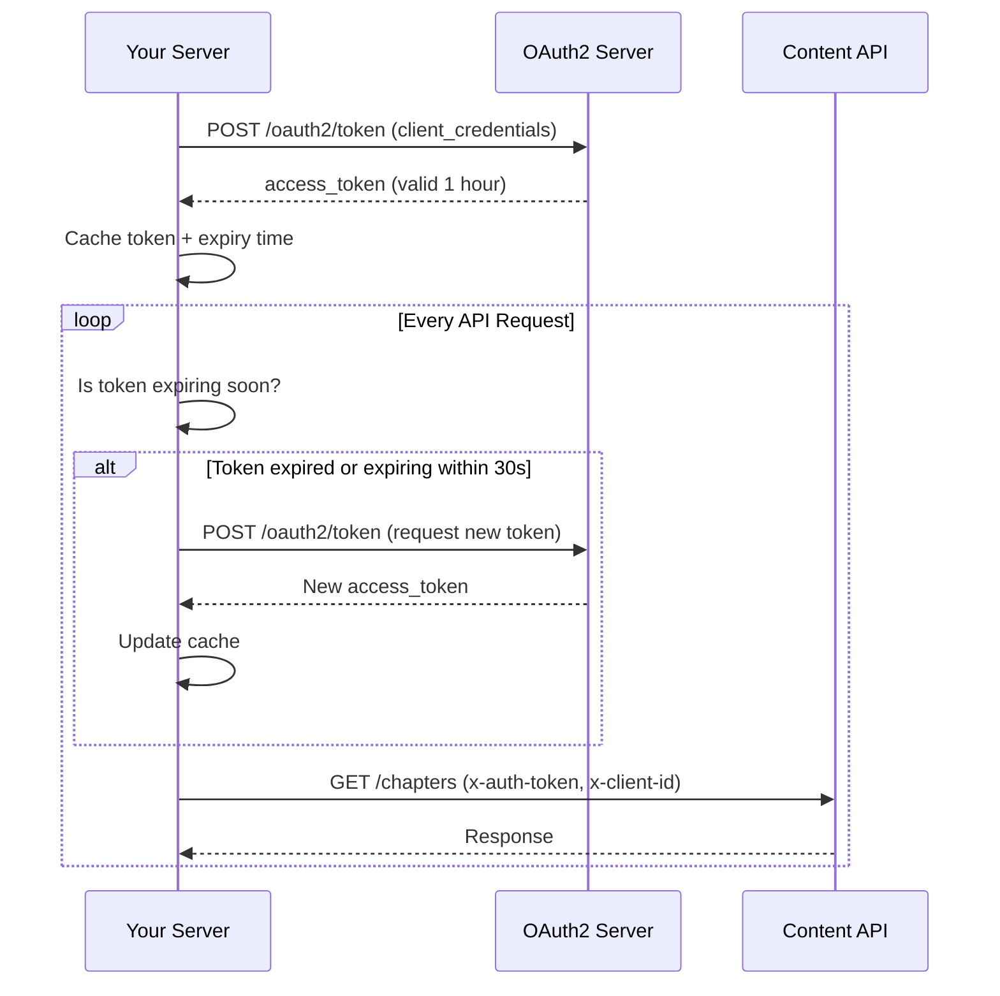

---
id: index
title: 🚀 Quick Start Guide
sidebar_label: Quick Start
---

# 🚀 Quick Start Guide

Welcome to the Quran Foundation API! This Quick Start guide will help you get up and running within minutes.

:::tip Recommended for first-time users
Follow these steps to make your first successful API call.
:::

---

## ⚡ Using JavaScript/TypeScript? Use Our Official SDK

**The fastest way to integrate** — our [`@quranjs/api`](https://github.com/quran/api-js) SDK handles authentication, token caching, automatic retry, and more out of the box.

```bash
npm install @quranjs/api
```

```typescript
import { QuranClient, Language } from "@quranjs/api";

const client = new QuranClient({
  clientId: process.env.QURAN_CLIENT_ID!,
  clientSecret: process.env.QURAN_CLIENT_SECRET!,
  defaults: { language: Language.ENGLISH },
});

// That's it! Token management is automatic.
const chapters = await client.chapters.findAll();
const verse = await client.verses.findByKey("2:255", { translations: [20] });
```

The SDK automatically:

- ✅ Caches tokens and re-requests them before expiry (30s buffer).
- ✅ Retries failed requests with exponential backoff
- ✅ Injects required headers (`x-auth-token`, `x-client-id`)
- ✅ Works in Node.js and browser environments

👉 **[Full SDK Documentation →](/docs/sdk)**

:::info Not using JavaScript/TypeScript?
Continue reading for manual integration examples in Python, cURL, and other languages.
:::

---

## 📋 TL;DR — Quick Reference

<details>
<summary><b>Environment Variables (all languages)</b></summary>

| Variable | Required | Description |
|----------|----------|-------------|
| `QF_CLIENT_ID` or `QURAN_CLIENT_ID` | ✅ Yes | Your client ID from registration |
| `QF_CLIENT_SECRET` or `QURAN_CLIENT_SECRET` | ✅ Yes (server) | Your client secret — **never expose client-side** |
| `QF_ENV` | No | `"prelive"` (default) or `"production"` |

</details>

<details>
<summary><b>Python — Complete Integration (expand to copy)</b></summary>

```python
# qf_client.py — Complete Quran Foundation API client
# Set env vars: QF_CLIENT_ID, QF_CLIENT_SECRET
# Optional: QF_ENV="production" (defaults to "prelive")

import os
import time
import threading
import requests

ENV_CONFIG = {
    'prelive': {
        'auth_base_url': 'https://prelive-oauth2.quran.foundation',
        'api_base_url': 'https://apis-prelive.quran.foundation'
    },
    'production': {
        'auth_base_url': 'https://oauth2.quran.foundation',
        'api_base_url': 'https://apis.quran.foundation'
    }
}

# Token cache with stampede prevention
_token_cache = {'token': None, 'expires_at': 0}
_token_lock = threading.Lock()


def get_config():
    client_id = os.getenv('QF_CLIENT_ID')
    client_secret = os.getenv('QF_CLIENT_SECRET')
    env = os.getenv('QF_ENV', 'prelive')

    if not client_id or not client_secret:
        raise RuntimeError(
            'Missing Quran Foundation API credentials. '
            'Request access: https://api-docs.quran.foundation/request-access'
        )

    return {'client_id': client_id, 'client_secret': client_secret, **ENV_CONFIG[env]}


def get_access_token():
    config = get_config()
    buffer_seconds = 30  # Re-request 30s before expiry

    if _token_cache['token'] and time.time() < _token_cache['expires_at'] - buffer_seconds:
        return _token_cache['token']

    with _token_lock:
        # Double-check after acquiring lock
        if _token_cache['token'] and time.time() < _token_cache['expires_at'] - buffer_seconds:
            return _token_cache['token']

        response = requests.post(
            f"{config['auth_base_url']}/oauth2/token",
            auth=(config['client_id'], config['client_secret']),
            headers={'Content-Type': 'application/x-www-form-urlencoded'},
            data='grant_type=client_credentials&scope=content'
        )
        response.raise_for_status()
        data = response.json()

        _token_cache['token'] = data['access_token']
        _token_cache['expires_at'] = time.time() + data['expires_in']
        return _token_cache['token']


def call_qf_api(endpoint, method='GET', **kwargs):
    config = get_config()
    token = get_access_token()
    headers = {
        'x-auth-token': token,
        'x-client-id': config['client_id'],
        **kwargs.pop('headers', {})
    }

    response = requests.request(method, f"{config['api_base_url']}{endpoint}", headers=headers, **kwargs)

    # On 401: clear cache and retry once
    if response.status_code == 401:
        _token_cache['token'] = None
        token = get_access_token()
        headers['x-auth-token'] = token
        response = requests.request(method, f"{config['api_base_url']}{endpoint}", headers=headers, **kwargs)

    response.raise_for_status()
    return response.json()


def list_chapters():
    return call_qf_api('/content/api/v4/chapters')


# Quick test:
# from qf_client import list_chapters
# data = list_chapters()
# print(f"Fetched {len(data['chapters'])} chapters")
```

</details>

---

:::danger ⚠️ Common Mistakes That Break Integrations
❌ **Storing the access token forever** — Tokens expire after 1 hour! Always track `expires_in`.
❌ **Requesting a new token for every API call** — Cache tokens and reuse until near expiry.
❌ **Using credentials from browser/mobile** — The `client_secret` will be exposed! Use a backend proxy.
❌ **Mixing prelive/production tokens** — Tokens are environment-specific and won't work cross-env.
❌ **Not handling 401 errors** — When you get a 401, re-request a token and retry once.
:::

---

## 📩 Step 1: Request API Access {#step-1-request-api-access}

1. Visit the **[Request Access page](https://api-docs.quran.foundation/request-access)**.
2. Fill out the form to request your **Client ID** and **Client Secret**.
3. Your credentials will be emailed to you.

:::warning
⚠️ **Do not share your credentials.** Keep your `client_id` and `client_secret` secure.
:::

**Server-side:** Store `client_id` and `client_secret` in server env/config.
**Client-side:** Never embed `client_secret` in browser or mobile apps.

<details>
<summary><b>AI prompt: implement Step 1 (credentials + env selection)</b></summary>

```text
Implement Quran Foundation API credential configuration.

Goal
- Make credential and environment selection explicit and impossible to misuse.

Environment variables (server-only)
- QF_CLIENT_ID
- QF_CLIENT_SECRET
- QF_ENV (optional): "prelive" | "production" (default: "prelive")

Base URLs (copy exactly)
- Pre-Production:
  - Auth URL: https://prelive-oauth2.quran.foundation
  - API Base URL: https://apis-prelive.quran.foundation
- Production:
  - Auth URL: https://oauth2.quran.foundation
  - API Base URL: https://apis.quran.foundation

Implementation requirements
- Create a config module (e.g., qfConfig.*) that:
  - reads the env vars above
  - maps QF_ENV => { authBaseUrl, apiBaseUrl }
- Never hardcode or log QF_CLIENT_SECRET.
- Never print credentials in errors.
- If QF_CLIENT_ID or QF_CLIENT_SECRET is missing, throw an error with EXACT message:
  "Missing Quran Foundation API credentials. Request access: https://api-docs.quran.foundation/request-access"

Output shape
- Export a function getQfConfig() that returns:
  { env, clientId, clientSecret, authBaseUrl, apiBaseUrl }

Acceptance checklist
- App boots with a clear error when env vars are missing.
- Switching QF_ENV switches both auth and API base URLs together.
```
</details>

---

## 🔑 Step 2: Get Your Access Token (Authentication) {#step-2-get-your-access-token-authentication}

:::tip Using the JS/TS SDK?
If you're using [`@quranjs/api`](/docs/sdk), **skip this step** — the SDK handles token management automatically, including caching and re-requesting before expiry.
:::

The Quran Foundation API uses **OAuth2 Client Credentials flow**. Access tokens are valid for **1 hour (3600 seconds)**.

:::info Important: Token Lifecycle
**Client Credentials flow does NOT use refresh tokens.** When your access token expires, simply request a new one using the same `/oauth2/token` endpoint. This is different from the Authorization Code flow used for User APIs.
:::

**Server-side:** Request tokens from your backend because it requires `client_secret`.
**Client-side:** Do not call the token endpoint directly; use your backend.

### How Token Lifecycle Works



### Token Request Examples:

<details>
<summary><b>cURL</b></summary>

```bash
curl --request POST \
  --url https://prelive-oauth2.quran.foundation/oauth2/token \
  --user 'YOUR_CLIENT_ID:YOUR_CLIENT_SECRET' \
  --header 'Content-Type: application/x-www-form-urlencoded' \
  --data 'grant_type=client_credentials&scope=content'
```
</details>

<details>
<summary><b>JavaScript (Node.js)</b></summary>

<p><i>Server-side only (Node backend). Do not use in browser/mobile.</i></p>

```javascript
const axios = require('axios');

async function getAccessToken() {
  const clientId = process.env.QF_CLIENT_ID;
  const clientSecret = process.env.QF_CLIENT_SECRET;

  if (!clientId || !clientSecret) {
    throw new Error(
      'Missing Quran Foundation API credentials. Request access: https://api-docs.quran.foundation/request-access'
    );
  }

  const auth = Buffer.from(`${clientId}:${clientSecret}`).toString('base64');

  try {
    const response = await axios({
      method: 'post',
      url: 'https://prelive-oauth2.quran.foundation/oauth2/token',
      headers: {
        'Authorization': `Basic ${auth}`,
        'Content-Type': 'application/x-www-form-urlencoded'
      },
      data: 'grant_type=client_credentials&scope=content'
    });

    return response.data.access_token;
  } catch (error) {
    console.error('Error getting access token:', error);
  }
}
```
</details>

<details>
<summary><b>Python</b></summary>

<p><i>Server-side only (Python backend). Do not use in browser/mobile.</i></p>

```python
import requests

def get_access_token():
    import os

    client_id = os.getenv('QF_CLIENT_ID')
    client_secret = os.getenv('QF_CLIENT_SECRET')

    if not client_id or not client_secret:
        raise RuntimeError(
            'Missing Quran Foundation API credentials. Request access: https://api-docs.quran.foundation/request-access'
        )

    response = requests.post(
        'https://prelive-oauth2.quran.foundation/oauth2/token',
        auth=(client_id, client_secret),
        headers={'Content-Type': 'application/x-www-form-urlencoded'},
        data='grant_type=client_credentials&scope=content'
    )

    return response.json()['access_token']
```
</details>

### Sample Response:

```json
{
  "access_token": "YOUR_ACCESS_TOKEN",
  "token_type": "bearer",
  "expires_in": 3600,
  "scope": "content"
}
```

:::tip
💡 **Store this token securely and reuse it until expiration** to avoid unnecessary token requests. Request a new token ~30 seconds before expiry to ensure uninterrupted service.
:::

<details>
<summary><b>AI prompt: implement Step 2 (token retrieval + caching)</b></summary>

```text
Implement OAuth2 Client Credentials token retrieval with caching.

IMPORTANT: Use the official @quranjs/api SDK if using JavaScript/TypeScript:
  npm install @quranjs/api
The SDK handles all of this automatically. Only implement manually for other languages.

Source of truth
- Token endpoint path: /oauth2/token
- Request method: POST
- Auth: HTTP Basic (client_id:client_secret)
- Content-Type: application/x-www-form-urlencoded
- Body: grant_type=client_credentials&scope=content
- Response fields to use: access_token, expires_in (3600)

Key concept
- Client Credentials flow does NOT use refresh_token.
- When access_token expires, you RE-REQUEST a new token using the same /oauth2/token endpoint.
- This is called "re-requesting" not "refreshing".

Implementation requirements (server-side only)
- Use authBaseUrl from config:
  POST {authBaseUrl}/oauth2/token
- Build Basic auth header safely.
- Cache the token in memory:
  - Store { token, expiresAtMs }
  - Re-request token when expired (re-request early, ~30 seconds before expiry).
- Prevent stampede:
  - If multiple requests need a token at the same time, only one token request should run; others await it.

Error handling
- Do NOT log client_secret or access_token.
- Log only safe details: status code, a short message, and sanitized error body (if any).
- On failure, throw a clear error: "Failed to obtain access token from Quran Foundation OAuth2"

Acceptance checklist
- First call fetches token successfully.
- Subsequent calls reuse token until near expiry.
- Expired token triggers a re-request (not refresh).
- Concurrent calls do not cause multiple token requests.
```
</details>

---

## 🔄 Step 2.5: Token Caching & Re-requesting (Manual Implementations) {#step-2-5-token-caching}

:::tip Using the JS/TS SDK?
If you're using [`@quranjs/api`](/docs/sdk), **skip this section** — the SDK handles token caching, expiry detection, and re-requesting automatically.
:::

Since access tokens expire after 1 hour, you **must** cache them and re-request when expired. Here's how to do it properly:

### Token Caching with Stampede Prevention

<details>
<summary><b>JavaScript (Node.js) — Production-Ready Token Manager</b></summary>

```javascript
const axios = require('axios');

// Token cache - stores the token and its expiry time
let tokenCache = {
  token: null,
  expiresAtMs: 0,
  pending: null  // For stampede prevention
};

const BUFFER_MS = 30000; // Re-request 30 seconds before expiry

/**
 * Check if the cached token is still valid (with buffer)
 */
function isTokenValid() {
  return tokenCache.token && Date.now() < tokenCache.expiresAtMs - BUFFER_MS;
}

/**
 * Fetch a fresh token from the OAuth2 server
 */
async function fetchNewToken() {
  const clientId = process.env.QF_CLIENT_ID;
  const clientSecret = process.env.QF_CLIENT_SECRET;

  if (!clientId || !clientSecret) {
    throw new Error(
      'Missing Quran Foundation API credentials. Request access: https://api-docs.quran.foundation/request-access'
    );
  }

  const auth = Buffer.from(`${clientId}:${clientSecret}`).toString('base64');

  const response = await axios({
    method: 'post',
    url: 'https://prelive-oauth2.quran.foundation/oauth2/token',
    headers: {
      'Authorization': `Basic ${auth}`,
      'Content-Type': 'application/x-www-form-urlencoded'
    },
    data: 'grant_type=client_credentials&scope=content'
  });

  // Update cache with new token and expiry
  tokenCache.token = response.data.access_token;
  tokenCache.expiresAtMs = Date.now() + (response.data.expires_in * 1000);

  return tokenCache.token;
}

/**
 * Get a valid access token - cached or fresh
 * Includes stampede prevention for concurrent requests
 */
async function getAccessToken() {
  // Return cached token if still valid
  if (isTokenValid()) {
    return tokenCache.token;
  }

  // Stampede prevention: if a token request is already in-flight, wait for it
  if (tokenCache.pending) {
    return tokenCache.pending;
  }

  // Start a new token request and store the promise
  tokenCache.pending = fetchNewToken().finally(() => {
    tokenCache.pending = null;  // Clear pending state when done
  });

  return tokenCache.pending;
}

/**
 * Force clear the token cache (useful after 401 errors)
 */
function clearTokenCache() {
  tokenCache = { token: null, expiresAtMs: 0, pending: null };
}

module.exports = { getAccessToken, clearTokenCache, isTokenValid };
```

</details>

<details>
<summary><b>Python — Production-Ready Token Manager</b></summary>

```python
import os
import time
import threading
import requests

# Token cache with thread safety
_token_cache = {
    'token': None,
    'expires_at': 0  # Unix timestamp
}
_token_lock = threading.Lock()

BUFFER_SECONDS = 30  # Re-request 30 seconds before expiry


def is_token_valid():
    """Check if the cached token is still valid (with buffer)"""
    return (
        _token_cache['token'] is not None and
        time.time() < _token_cache['expires_at'] - BUFFER_SECONDS
    )


def fetch_new_token():
    """Fetch a fresh token from the OAuth2 server"""
    client_id = os.getenv('QF_CLIENT_ID')
    client_secret = os.getenv('QF_CLIENT_SECRET')

    if not client_id or not client_secret:
        raise RuntimeError(
            'Missing Quran Foundation API credentials. Request access: https://api-docs.quran.foundation/request-access'
        )

    response = requests.post(
        'https://prelive-oauth2.quran.foundation/oauth2/token',
        auth=(client_id, client_secret),
        headers={'Content-Type': 'application/x-www-form-urlencoded'},
        data='grant_type=client_credentials&scope=content'
    )
    response.raise_for_status()
    data = response.json()

    # Update cache with new token and expiry
    _token_cache['token'] = data['access_token']
    _token_cache['expires_at'] = time.time() + data['expires_in']

    return _token_cache['token']


def get_access_token():
    """
    Get a valid access token - cached or fresh.
    Thread-safe with stampede prevention.
    """
    # Return cached token if still valid (quick check without lock)
    if is_token_valid():
        return _token_cache['token']

    # Acquire lock for token re-request
    with _token_lock:
        # Double-check after acquiring lock (another thread may have re-requested)
        if is_token_valid():
            return _token_cache['token']

        # Fetch new token
        return fetch_new_token()


def clear_token_cache():
    """Force clear the token cache (useful after 401 errors)"""
    with _token_lock:
        _token_cache['token'] = None
        _token_cache['expires_at'] = 0
```

</details>

### Why Stampede Prevention Matters

When multiple concurrent requests need a token at the same time (e.g., at app startup or after token expiry), without stampede prevention you could:
- Make multiple simultaneous token requests
- Waste API quota
- Potentially hit rate limits

The code above ensures **only one token request runs at a time**; other requests wait for it.

<details>
<summary><b>AI prompt: implement Step 2.5 (token caching + lifecycle)</b></summary>

```text
Implement token caching and lifecycle management for Quran Foundation OAuth2 Client Credentials.

IMPORTANT: Use the official @quranjs/api SDK if using JavaScript/TypeScript:
  npm install @quranjs/api
The SDK handles all of this automatically. Only implement manually for other languages.

Key concept
- Client Credentials flow does NOT use refresh_token.
- When access_token expires, you simply request a NEW token using the same /oauth2/token endpoint.
- This is called "re-requesting" not "refreshing".

Implementation requirements
1. Token cache structure:
   - Store: { token, expiresAtMs }
   - Check validity: Date.now() < expiresAtMs - bufferMs

2. Buffer time:
   - Re-request token 30 seconds BEFORE expiry (not after)
   - This prevents edge-case failures during the expiry window

3. Stampede prevention:
   - If multiple requests need a token simultaneously, only ONE token request should run
   - Other requests should await the in-flight request
   - Use a pending promise (JS) or lock (Python/Go/etc.)

4. Cache invalidation:
   - On 401 response: clear cache and re-request immediately
   - Provide a clearTokenCache() function for manual invalidation

5. Thread/async safety:
   - Ensure the cache is safe for concurrent access
   - Use appropriate synchronization for your language

Acceptance checklist
- First API call fetches a token and caches it.
- Subsequent calls (within ~59.5 minutes) reuse the cached token.
- Call at 59.5+ minutes triggers a new token request.
- 100 concurrent requests result in only 1 token request (not 100).
- After a 401, the next call fetches a fresh token.
```
</details>

---

## 🟢 Step 3: Use the Access Token {#step-3-use-the-access-token}

:::tip Using the JS/TS SDK?
If you're using [`@quranjs/api`](/docs/sdk), **skip this step** — the SDK injects headers automatically on every request.
:::

Include the token in your API request headers:

```http
x-auth-token: YOUR_ACCESS_TOKEN
x-client-id: YOUR_CLIENT_ID  # Always include your client ID with each request
```

**Server-side:** Attach `x-auth-token` and `x-client-id` in your backend API client.
**Client-side:** Avoid exposing access tokens; proxy requests through your backend.

### Handling 401 Errors (Token Expired)

When you receive a `401 Unauthorized` response, your token has likely expired. Here's how to handle it:

<details>
<summary><b>JavaScript (Node.js) — API Client with 401 Retry</b></summary>

```javascript
const axios = require('axios');
const { getAccessToken, clearTokenCache } = require('./token-manager');

const API_BASE_URL = 'https://apis-prelive.quran.foundation';

/**
 * Make an authenticated API call with automatic 401 retry
 */
async function callQfApi(endpoint, options = {}) {
  const clientId = process.env.QF_CLIENT_ID;

  async function makeRequest() {
    const token = await getAccessToken();
    return axios({
      ...options,
      url: `${API_BASE_URL}${endpoint}`,
      headers: {
        'x-auth-token': token,
        'x-client-id': clientId,
        ...options.headers
      }
    });
  }

  try {
    return await makeRequest();
  } catch (error) {
    // On 401: clear token cache, get fresh token, retry ONCE
    if (error.response?.status === 401) {
      console.warn('Received 401 - token expired, retrying with fresh token');
      clearTokenCache();
      return await makeRequest();  // Retry once
    }
    throw error;  // Re-throw other errors
  }
}

module.exports = { callQfApi };
```

</details>

<details>
<summary><b>Python — API Client with 401 Retry</b></summary>

```python
import os
import requests
from token_manager import get_access_token, clear_token_cache

API_BASE_URL = 'https://apis-prelive.quran.foundation'


def call_qf_api(endpoint, method='GET', **kwargs):
    """Make an authenticated API call with automatic 401 retry"""
    client_id = os.getenv('QF_CLIENT_ID')

    def make_request():
        token = get_access_token()
        headers = {
            'x-auth-token': token,
            'x-client-id': client_id,
            **kwargs.pop('headers', {})
        }
        response = requests.request(
            method, f"{API_BASE_URL}{endpoint}", headers=headers, **kwargs
        )
        return response

    response = make_request()

    # On 401: clear token cache, get fresh token, retry ONCE
    if response.status_code == 401:
        print('Received 401 - token expired, retrying with fresh token')
        clear_token_cache()
        response = make_request()

    response.raise_for_status()
    return response.json()
```

</details>

<details>
<summary><b>AI prompt: implement Step 3 (authenticated API client)</b></summary>

```text
Create an authenticated API client helper for Quran Foundation Content APIs.

IMPORTANT: Use the official @quranjs/api SDK if using JavaScript/TypeScript:
  npm install @quranjs/api
The SDK handles all of this automatically. Only implement manually for other languages.

Headers (copy exactly)
- x-auth-token: <access token>
- x-client-id: <client id>

Implementation requirements (server-side)
- Build a client wrapper that automatically:
  - calls tokenProvider.getAccessToken()
  - adds x-auth-token and x-client-id to every request
  - targets the correct API base URL from config

Retry behavior
- If a request returns 401:
  - clear token cache
  - re-request a fresh token (NOT refresh — Client Credentials has no refresh_token)
  - retry the request ONCE
  - if it still fails, surface the error (do not loop)

Logging rules
- Never log x-auth-token or client_secret.
- Logging x-client-id is okay, but optional.
- On 401 retry, log a warning (without tokens).

Acceptance checklist
- All outgoing requests include both required headers.
- A 401 response results in exactly one token re-request and one retry.
- No infinite retry loops.
```
</details>

---

## 📂 Step 4: Make Your First API Call

:::tip Using the JS/TS SDK?
With [`@quranjs/api`](/docs/sdk), making API calls is simple:
```typescript
const chapters = await client.chapters.findAll();
const verse = await client.verses.findByKey("2:255", { translations: [20] });
```
:::

### Example: List All Surahs (Chapters)

<details>
<summary><b>Recommended flow (backend proxy)</b></summary>

```javascript
// Backend route: GET /chapters
// Proxies the request so the client never handles tokens.

app.get('/chapters', async (req, res) => {
  try {
    // Use your server-side token + API client from Steps 1–3:
    const data = await listChapters(); // calls upstream /content/api/v4/chapters
    res.json(data);
  } catch (err) {
    res.status(500).json({ error: 'Failed to fetch chapters' });
  }
});
```
</details>

<details>
<summary><b>Recommended flow (frontend)</b></summary>

```javascript
// Frontend: call your backend proxy. No tokens in the client.
const res = await fetch('/chapters');
const data = await res.json();
```
</details>

<details>
<summary><b>cURL</b></summary>

```bash
curl --request GET \
  --url https://apis-prelive.quran.foundation/content/api/v4/chapters \
  --header "x-auth-token: YOUR_ACCESS_TOKEN" \
  --header "x-client-id: YOUR_CLIENT_ID"
```
</details>

<details>
<summary><b>JavaScript (Node.js)</b></summary>

```javascript
const axios = require('axios');

async function getChapters(accessToken, clientId) {
  try {
    const response = await axios({
      method: 'get',
      url: 'https://apis-prelive.quran.foundation/content/api/v4/chapters',
      headers: {
        'x-auth-token': accessToken,
        'x-client-id': clientId
      }
    });

    return response.data;
  } catch (error) {
    console.error('Error fetching chapters:', error);
  }
}
```
</details>

<details>
<summary><b>Python</b></summary>

```python
import requests

def get_chapters(access_token, client_id):
    response = requests.get(
        'https://apis-prelive.quran.foundation/content/api/v4/chapters',
        headers={
            'x-auth-token': access_token,
            'x-client-id': client_id
        }
    )

    return response.json()
```
</details>

### Example Successful Response:

```json
{
  "chapters": [
    {
      "id": 1,
      "revelation_place": "makka",
      "revelation_order": 5,
      "bismillah_pre": false,
      "name_simple": "Al-Fatihah",
      "name_complex": "Al-Fatihah",
      "name_arabic": "الفاتحة",
      "verses_count": 7,
      "pages": [1, 1],
      "translated_name": {
        "language_name": "english",
        "name": "The Opener"
      }
    },
    {
      "id": 2,
      "revelation_place": "madinah",
      "revelation_order": 87,
      "bismillah_pre": true,
      "name_simple": "Al-Baqarah",
      "name_complex": "Al-Baqarah",
      "name_arabic": "البقرة",
      "verses_count": 286,
      "pages": [2, 49],
      "translated_name": {
        "language_name": "english",
        "name": "The Cow"
      }
    }
    // ... more chapters
  ]
}
```

**Server-side:** Call the chapters endpoint from your backend using the access token.
**Client-side:** Prefer calling your backend and returning the data to the UI.

<details>
<summary><b>AI prompt: implement Step 4 (first call + verify)</b></summary>

```text
Implement a "list chapters" call using the authenticated client, plus a quick verification.

IMPORTANT: Use the official @quranjs/api SDK if using JavaScript/TypeScript:
  npm install @quranjs/api
  const chapters = await client.chapters.findAll();
The SDK handles authentication automatically. Only implement manually for other languages.

Request (copy exactly)
- GET {apiBaseUrl}/content/api/v4/chapters

Implementation requirements
- Add function listChapters() that:
  - calls the API using the authenticated client (Step 3)
  - returns the JSON response

Add a verification method (choose one)
Option A: Script
- Add scripts/qf_list_chapters.* that:
  - calls listChapters()
  - prints ONLY safe info (e.g., chapters.length and the first chapter name)
  - does NOT print access tokens

Option B: Debug route (server-only)
- Add GET /debug/qf/chapters (guard it if needed)
- It calls listChapters() and returns the JSON

Acceptance checklist
- Running the script OR calling the debug route returns a JSON object with a "chapters" array.
- No logs contain tokens or client_secret.
```
</details>

---

## ⚠️ Important Considerations

### Environment Configuration

:::warning
🚩 Do not mix tokens between environments! Access tokens are environment-specific and cannot be used across different environments.
:::

| Environment    | Auth URL                                  | API Base URL                              | Usage                       |
| -------------- | ----------------------------------------- | ----------------------------------------- | --------------------------- |
| Pre-Production | `https://prelive-oauth2.quran.foundation` | `https://apis-prelive.quran.foundation`   | For testing and development |
| Production     | `https://oauth2.quran.foundation`         | `https://apis.quran.foundation`           | For live applications       |

**Server-side:** Choose auth/API base URLs via config and keep tokens isolated per environment.
**Client-side:** Only the auto-translate controls apply; avoid direct API calls from the browser.

### Disable Browser Auto-translate

To help ensure users never see machine-re-translated Quranic text:

- Add `<meta name="google" content="notranslate">` (site-wide hint)
- Add `translate="no"` on containers that render Quranic text (or on `<html>`)
- Optionally add `class="notranslate"` on Quranic text containers for additional compatibility

Note: Some teams also rely on CSP to restrict injected translation scripts, but the most reliable approach is `translate="no"` and `notranslate` markers.

<details>
<summary><b>AI prompt: environment config and auto-translate</b></summary>

```text
Add environment selection and client-side safeguards.

Server-side
- Implement QF_ENV ("prelive" | "production") and map it to:
  - authBaseUrl
  - apiBaseUrl
- Keep token caches isolated per environment (separate cache keys or separate instances).

Client-side (Quran text rendering)
- Add <meta name="google" content="notranslate"> to the HTML head.
- Mark Quranic text containers with translate="no".
- Optionally add class="notranslate" on Quranic text containers for extra protection.

Acceptance checklist
- Switching QF_ENV changes both token endpoint base and API base.
- Quranic text containers have translate="no" applied in rendered HTML.
```
</details>

---

## 🔄 Migrating from `api.quran.com`

If you previously used the unauthenticated API at:

```
https://api.quran.com/api/v4/...
```

please note that the new APIs require OAuth2 authentication and use a different base URL.

Steps to migrate:

1. Request API access — see [instructions above](#step-1-request-api-access).
2. Obtain your client credentials and token — follow the [Authentication section](#step-2-get-your-access-token-authentication).
    - Access tokens expire after 3600 seconds (1 hour).
    - After 3600 seconds, request a new token to continue making API calls.
3. Update your base URL:
    - Pre-Production:

      ```
      https://apis-prelive.quran.foundation/content/api/v4/...
      ```

    - Production:

      ```
      https://apis.quran.foundation/content/api/v4/...
      ```

4. Add authorization headers — follow [Use the Access Token](#step-3-use-the-access-token) to include your token and client ID with each request.

:::info
✅ **Endpoints, query parameters, and responses remain unchanged.** Only the base URL and authentication method are different.
:::

**Server-side:** Update base URLs and auth flow in your backend integration.
**Client-side:** If you still call the API directly (not recommended), update base URLs and headers there too.

<details>
<summary><b>AI prompt: migration</b></summary>

```text
Migrate an existing integration from https://api.quran.com/api/v4/... to Quran Foundation Content APIs (OAuth2 required).

What changes
- Old base: https://api.quran.com/api/v4/...
- New base (choose one):
  - Pre-Production: https://apis-prelive.quran.foundation/content/api/v4/...
  - Production:     https://apis.quran.foundation/content/api/v4/...

Environment selection
- Use QF_ENV = "prelive" | "production" (default "prelive")
- Auth base URLs (copy exactly):
  - Pre-Production auth: https://prelive-oauth2.quran.foundation
  - Production auth:     https://oauth2.quran.foundation

Credentials (server-only)
- Read from env/config:
  - QF_CLIENT_ID
  - QF_CLIENT_SECRET
- Never hardcode or log secrets.
- If missing, throw exactly:
  "Missing Quran Foundation API credentials. Request access: https://api-docs.quran.foundation/request-access"

Token retrieval (OAuth2 Client Credentials) — server-side only
- POST {authBaseUrl}/oauth2/token
- HTTP Basic auth with client_id:client_secret
- Content-Type: application/x-www-form-urlencoded
- Body: grant_type=client_credentials&scope=content
- Parse access_token and expires_in (3600)
- Cache token and RE-REQUEST on expiry (not refresh — Client Credentials has no refresh_token)
- Re-request early (~30s before expiry). Prevent concurrent re-request stampede.

Authenticated API requests
- For every request to the new Content API base URL, include BOTH headers exactly:
  - x-auth-token: <access token>
  - x-client-id: <client id>

Migration instructions
- Find all calls to https://api.quran.com/api/v4/... and replace the base URL with the selected Quran Foundation base URL.
- Ensure every call goes through an API client that injects x-auth-token and x-client-id.
- Add safe error handling:
  - 401 => re-request token once, retry once (not refresh)
  - 403 => likely wrong scope/permissions (scope=content)
  - never log tokens

Verification
- Add a simple test call (e.g., GET /chapters) to confirm migration works:
  - GET {apiBaseUrl}/content/api/v4/chapters
- Confirm responses match prior shapes (endpoints/params/response schemas unchanged; only base URL + auth changed).

Client-side rule
- Do not embed client_secret or perform token exchange in browser/mobile code.
- Prefer backend proxy. If you expose tokens to clients, accept that tokens can be extracted.
```
</details>

---

## ❌ Common Issues & Troubleshooting

| Error Code | Meaning                 | Solution                                            |
| ---------- | ----------------------- | --------------------------------------------------- |
| 400        | Bad Request             | Check your request parameters and format.           |
| 401        | Unauthorized            | Token expired or invalid — re-request a new token and retry once. |
| 403        | Forbidden / Wrong Scope | Ensure your token has the correct permissions (`scope=content`). |
| 429        | Rate Limit Exceeded     | Reduce request frequency or contact support for increased limits. |
| 500        | Internal Server Error   | Contact support if this issue persists.             |

**Server-side:** Log status codes and responses to diagnose auth and rate limits.
**Client-side:** Show friendly errors and avoid logging tokens.

<details>
<summary><b>AI prompt: troubleshooting</b></summary>

```text
Add safe error handling for common responses.

IMPORTANT: Use the official @quranjs/api SDK if using JavaScript/TypeScript:
  npm install @quranjs/api
The SDK includes automatic retry with exponential backoff. Only implement manually for other languages.

Server-side behavior
- 400: validate parameters and payload format; surface a readable error.
- 401: re-request token (NOT refresh — Client Credentials has no refresh_token); ensure x-auth-token and x-client-id are present.
- 403: verify scope/permissions (scope=content for Content APIs).
- 429: implement retry with exponential backoff; respect rate limits (do not retry aggressively).
- 500: add a limited safe retry (e.g., 1–2 retries with backoff) and clear logs.

Logging rules
- Never log tokens or client_secret.
- Log status code + request path + environment ("prelive"/"production").
- Include a short, sanitized error body if present.

Acceptance checklist
- Errors are actionable (include status + hint) without leaking secrets.
- Token re-request is not triggered in a loop (max 1 retry per request).
```
</details>

---

## 💼 Need Help?

For any issues or questions, please contact:
📧 **developers@quran.com**

---

:::info 🟢 Next Steps:
Now that you're authenticated and have successfully made your first API call, explore the [API Reference](/docs/category/content-apis) to learn about all available endpoints!
:::

---

## 🤖 Complete Implementation Prompt

```text
Implement the full Quick Start flow end-to-end in this codebase with minimal assumptions.

RECOMMENDED: Use the official SDK (TypeScript/JavaScript)
For TypeScript/JavaScript projects, install @quranjs/api which handles token management,
caching, retry, and headers automatically:
- npm install @quranjs/api
- See https://api-docs.quran.foundation/docs/sdk for full documentation

If NOT using the SDK, implement manually:

Server-side (required)
1) Config
- Read QF_CLIENT_ID and QF_CLIENT_SECRET from server env/config.
- Read QF_ENV ("prelive" | "production") and select BOTH:
  - authBaseUrl (prelive-oauth2.quran.foundation | oauth2.quran.foundation)
  - apiBaseUrl (apis-prelive.quran.foundation | apis.quran.foundation)
- If credentials missing, throw:
  "Missing Quran Foundation API credentials. Request access: https://api-docs.quran.foundation/request-access"
- Never hardcode or log secrets.

2) Token provider (OAuth2 Client Credentials)
- POST {authBaseUrl}/oauth2/token
- Use HTTP Basic auth with client_id:client_secret
- Send x-www-form-urlencoded body: grant_type=client_credentials&scope=content
- Parse access_token and expires_in (3600 seconds)
- IMPORTANT: This is Client Credentials flow - there is NO refresh_token.
  When the token expires, you re-request a new one (same endpoint, same way).
- Cache token in memory with expiry time (re-request ~30s before expiry)
- Prevent concurrent re-request stampede (single in-flight request)

3) Authenticated API client
- For every API request, inject headers EXACTLY:
  - x-auth-token: <access token>
  - x-client-id: <client id>
- Base URL for Content APIs:
  - GET {apiBaseUrl}/content/api/v4/...
- On 401: re-request token once (same endpoint) and retry once.

4) Example call + verification
- Implement listChapters():
  - GET {apiBaseUrl}/content/api/v4/chapters
  - return JSON
- Add a runnable verification (script or debug route) that confirms it works without printing tokens.

Client-side (rules)
- Do not expose client_secret or perform token exchange in browser/mobile code.
- Prefer calling your backend for data and render the response.
- If rendering Quranic text in the browser, disable auto-translate:
  - <meta name="google" content="notranslate">
  - translate="no" on Quranic text containers (and optionally class="notranslate")

Constraints
- Use the Quick Start guide at https://api-docs.quran.foundation/docs/quickstart/ as the source of truth for URLs, headers, and endpoint paths.
- Do not invent endpoints or headers; copy them exactly.
- Remember: Client Credentials has NO refresh_token - re-request tokens, don't try to refresh.

Done when
- A fresh setup can run one command (or hit one endpoint) and successfully fetch /chapters.
- No logs contain access tokens or client_secret.
- Prelive/prod switching works without mixing tokens.
- Token is automatically re-requested before expiry (30s buffer).
```
