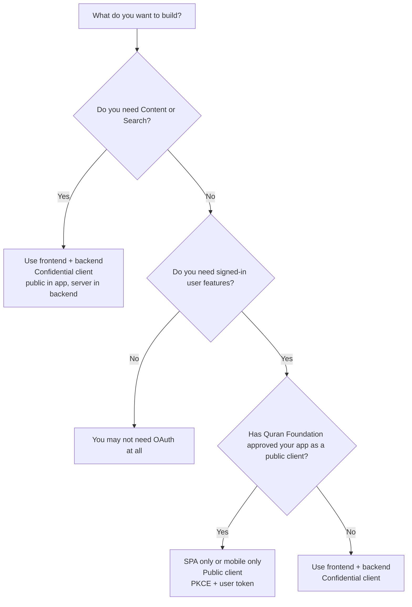

# App Shapes

Purpose: Choose the right app shape before you start coding.  
Use this when: You want a very simple answer for SPA only, mobile only, or frontend plus backend.  
Do not use this when: You already know your app shape and only need endpoint examples.  
Backend required: Depends on the app shape.  
Allowed runtimes: Browser apps, mobile apps, Node.js, serverless functions, workers.  
Required credentials: `client_id` always. `client_secret` only for confidential clients.  
Minimal import: `@quranjs/api/public` and sometimes `@quranjs/api/server`.

## Short Answer

- If you want **Content** or **Search**, you need a backend.
- If you want **User APIs only**, a frontend-only app can work only if Quran Foundation explicitly approves it as a **public client**.
- If you want **both** user features and Quran data, build a frontend plus backend app.
- Most real apps are **confidential clients** and should use a backend.

## Decision Tree



## 3 App Shapes

| App shape | Typical client type | Backend required? | Can use User APIs? | Can use Content? | Can use Search? | Recommended SDK use |
| --- | --- | --- | --- | --- | --- | --- |
| SPA only | Public client | Usually yes unless Quran Foundation explicitly approves a public client | Yes | No | No | `@quranjs/api/public` |
| Mobile only | Public client | Usually yes unless Quran Foundation explicitly approves a public client | Yes | No | No | `@quranjs/api/public` |
| Frontend + backend | Confidential client | Yes | Yes | Yes | Yes | app: `@quranjs/api/public`, backend: `@quranjs/api/server` |

## If You Want This, Build That

| What the client wants | Best app shape | Why |
| --- | --- | --- |
| Quran reader only | Frontend + backend | Reader data comes from the protected Content API |
| Search only | Frontend + backend | Search uses an app token and needs a backend |
| Notes, bookmarks, or collections only | SPA only or mobile only if approved as a public client; otherwise frontend + backend | These are User APIs and use a user token |
| Reader plus bookmarks | Frontend + backend | Reader needs Content and bookmarks need a user session |
| Search plus signed-in user features | Frontend + backend | Search needs an app token and user features need a user token |
| Mobile app with signed-in user features only | Mobile only if approved as a public client; otherwise mobile + backend | PKCE is possible in the app, but most clients are confidential by default |

## Public Client vs Confidential Client

### Public client

Think: code running on the user's device.

- Browser SPA
- Mobile app
- No safe place to keep `client_secret`

Public clients can use:

- PKCE login
- user access tokens
- User APIs like notes, bookmarks, collections, and other signed-in features

Public clients cannot directly use:

- `client_credentials`
- Content API
- Search API
- any secret-based OAuth flow

### Confidential client

Think: app with a safe backend.

- Next.js with server routes
- Express backend
- serverless backend or BFF

Confidential clients can use:

- `client_secret` on the backend
- backend code exchange and refresh
- Content API
- Search API
- User APIs

## The Two Token Paths

There are two different tokens in this platform:

- **User token**: for personal actions like notes, bookmarks, collections, and QuranReflect user features.
- **App token**: for app-level reads like Content and Search.

That is why a frontend-only public client can call some User APIs but cannot honestly call Content or Search directly.

## AI and Vibe-Coding Prompt

Use this prompt when you want an AI tool to scaffold the correct integration shape:

```text
Implement Quran Foundation integration using the correct app shape.

Rules:
- If the app needs Content or Search, use frontend + backend.
- If the app is browser-only or mobile-only, use @quranjs/api/public only for PKCE and User APIs.
- Never place client_secret in browser or mobile code.
- Treat User APIs and Content/Search as different token paths.
- User token = notes, bookmarks, collections, QuranReflect user features.
- App token = Content and Search.
- If the app needs both, use @quranjs/api/public in the app and @quranjs/api/server on the backend.

Docs:
- Start here: https://api-docs.quran.foundation/docs/sdk/javascript
- App shapes: https://api-docs.quran.foundation/docs/sdk/javascript/app-shapes
- Runtime matrix: https://api-docs.quran.foundation/docs/sdk/javascript/runtime-matrix
- Auth matrix: https://api-docs.quran.foundation/docs/sdk/javascript/auth-matrix
```

## Read Next

- [Runtime Matrix](/docs/sdk/javascript/runtime-matrix)
- [Auth Matrix](/docs/sdk/javascript/auth-matrix)
- [Full-Stack Quickstart](/docs/sdk/javascript/full-stack)
- [Public Quickstart](/docs/sdk/javascript/public-quickstart)
