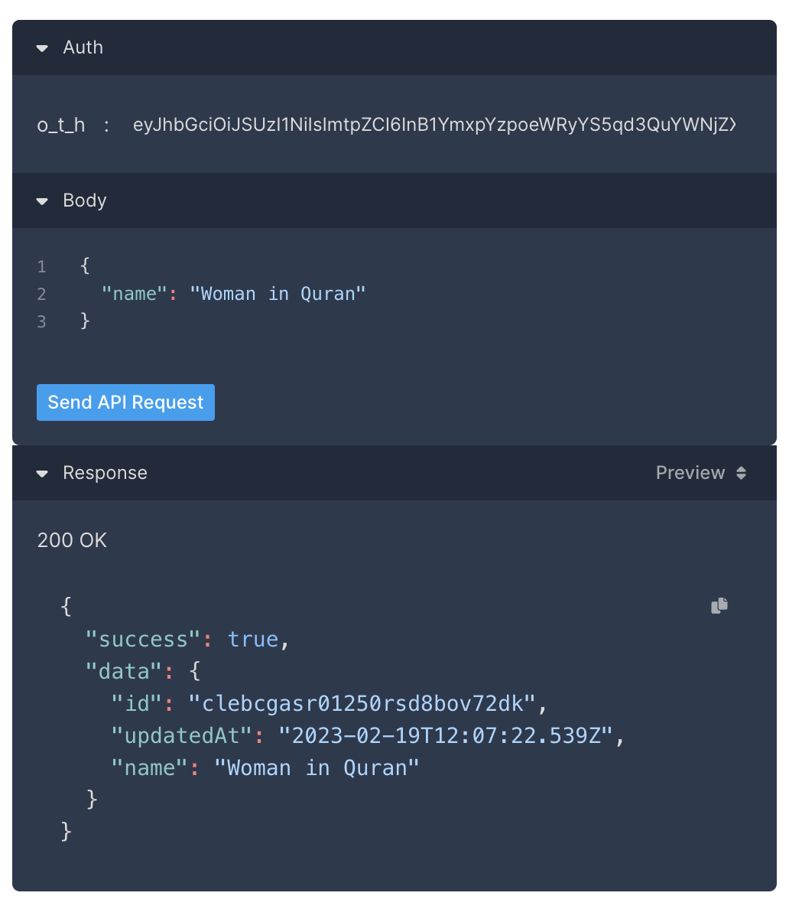

# Quran.com’s OAuth2 Integration Tutorial

## Setup

- Start with cloning our [Oauth2 example repo](https://github.com/quran/quran-oauth2-example/).
- Copy `.env.example` file into `.env`:
  ```bash
  cp env.example .env
  ```
- Paste the following into `.env`:
  ```
  BASE_PATH = 'http://localhost:3000'
  PORT = 3000
  TOKEN_HOST = 'https://oauth2.quran.com'
  CLIENT_ID = 'quran-demo'
  CLIENT_SECRET = 'secret'
  SCOPES = 'openid offline collection bookmark reading_session preference user'
  ```

  - Please note that the values of client id and client secret are set to (`quran-demo` and `secret`) which are meant for testing purposes and are not meant for production use.
  - For production use, please make sure to obtain your own client id and secret use by contacting [us](mailto:osama@quran.com).
- Install dependencies:
  ```bash
  npm install
  ```
- Start the Oauth2 example app:
  ```bash
  npm start
  ```

## Quick Start

- Go to http://localhost:3000.
- Click “Continue with Quran.com”.
- If you are not logged in already, you will be asked to login, make sure you do.
- You might be asked to consent to the example app accessing your data, make sure you consent to all of them.
- Once logging in and consenting steps are done, You will be redirected to http://localhost:3000/callback.
  - a JSON response that has the following structure will be shown:
    - `access_token`
    - `expires_in`
    - `id_token`
    - `refresh_token`
    - `scope`
    - `token_type`
    - `expires_at`
  - `access_token` will be used to access your resources stored on Quran.com’s resources server.
  - `refresh_token` will be used to re-generate a new `access_token` when it expires. Make sure to save it in a long term storage.
  - `scope` object the scopes that have already been granted to the example app to access.

## Accessing resources from Quran.com’s  Resources Server

- You can explore the list of all available APIs [here](/auth/v1).
- For example, to add a collection to your profile, you can use our interactive [collection API](/auth/v1/paths/v1-collections/post)
  - Put the `access_token` value in `o_t_h` header.
  - And add the name of the collection’s inside `name` JSON parameter.
  - Click `Send API Request` button.
    
- Now, to make sure it was added, you can make a call to [get all collections API](/auth/v1/paths/v1-collections/get):
  - Put the `access_token` value in `o_t_h` header.
  - Set the value of `first` parameter to `10` for example.
  - Click `Send API Request` button.
    


## How the quran-oauth2-example repo works

### Dependencies

| Dependancy                                                   | Description                      |
| ------------------------------------------------------------ | -------------------------------- |
| [Express](https://expressjs.com/)                            | A minimal nodejs’s web framework |
| [simple-oauth2](https://www.npmjs.com/package/simple-oauth2) | NodeJS OAuth2 client library     |
| [Pug](https://pugjs.org/api/getting-started.html)          | Templating engine for Express.js |

### Endpoints

If you open index.js, you will see that we have 3 endpoints

| Endpoint    | Description                                                 |
| ----------- | ----------------------------------------------------------- |
| `/`         | Renders the view of http://localhost:3000                   |
| `/auth`     | Initiates the Oauth2 process                                |
| `/callback` | Receives the callback from Quran.com’s authorization server |

# Index.js

First part contains importing the required dependencies and setting up reading environment variables from `.env` file.

```jsx
const { AuthorizationCode } = require('simple-oauth2')
const path = require('path')
const app = require('express')()
const dotenv = require('dotenv')
dotenv.config()
```

Next, we are setting up the view engine to use `pug` and setting which port and path the Oauth2 example app will run on.

```js
const PORT = process.env.PORT
const BASE_PATH = process.env.BASE_PATH

app.set('views', path.join(__dirname, 'views'))
app.set('view engine', 'pug')
```

`createApplication` will be called later to actually kick start the express app at the PORT we set in `.env` file.

```jsx
const createApplication = (cb) => {
  const callbackUrl = BASE_PATH + '/callback'
  app.listen(PORT, (err) => {
    if (err) return console.error(err)
    console.log(`Express server listening at ${BASE_PATH}`)
    return cb({
      app,
      callbackUrl,
    })
  })
  ...
}
```

Next, we start setting up an Oauth2 client using `CLIENT_ID`, `CLIENT_SECRET` and `TOKEN_HOST` values set in `.env` file.

```jsx
const client = new AuthorizationCode({
  client: {
    id: process.env.CLIENT_ID,
    secret: process.env.CLIENT_SECRET,
  },
  auth: {
    tokenHost: process.env.TOKEN_HOST,
    tokenPath: '/oauth2/token',
    authorizePath: '/oauth2/auth',
  },
})
```

### Defining `authoriationUri`

```jsx
// Authorization uri definition
const authorizationUri = client.authorizeURL({
  redirect_uri: callbackUrl,
  scope: process.env.SCOPES,
  state: 'veimvfgqexjicockrwsgcb333o3a',
})
```

- `redirect_uri` is where Quran.com's authorization server will redirect the user back to once a user successfully authorizes the example app and it should be set to our example app's url `[http://localhost:3000](http://localhost:3000)`.
- `scope` value will come from `.env` file. You can read more about all the available scopes [here](/auth/guides/scopes).
- `state` is an optional randomly generated value whose purpose is to prevent CSRF (Cross-Site Request Forgery) attacks. The client app that initiates the OAuth2 flow sends it to the authorization server. The authorization server returns this state parameter to the client as part of the redirect URI. The client should validate it upon receiving it.

### Defining `/` endpoint.

- This endpoint, when accessed will render the view in `views/index.pug`

```jsx
app.get('/', (req, res) => {
  res.render('index')
})
```

### Defining `/auth` endpoint.

- The endpoint that will initiate the entire Oauth2 flow when accessed (via `http://localhost:3000/auth`)

```jsx
app.get('/auth', (req, res) => {
  console.log(authorizationUri)
  res.redirect(authorizationUri)
})
```

### Defining `/callback` endpoint.

- Once a user successfully authorizes the example app, Quran.com’s authorization server will redirect the user back to `http://localhost:3000/callback` with `code` ,`state` and `scope` query params.
- We’re going to exchange the `code` with an access token by calling the `tokenPath` endpoint defined above.

```jsx
app.get('/callback', async (req, res) => {
  const { code } = req.query
  const options = {
    code,
    redirect_uri: callbackUrl,
  }

  try {
    const data = await client.getToken(options)
    console.log(data)

    console.log('The resulting token: ', data.token)

    return res.status(200).json(data.token)
  } catch (error) {
    console.error('Access Token Error', error)
    return res.status(500).json('Authentication failed')
  }
})
```

Putting all of the above configuration together, `createApplication` function looks like:

```javascript
createApplication(({ app, callbackUrl }) => {
  const client = new AuthorizationCode({
    client: {
      id: process.env.CLIENT_ID,
      secret: process.env.CLIENT_SECRET,
    },
    auth: {
      tokenHost: process.env.TOKEN_HOST,
      tokenPath: '/oauth2/token',
      authorizePath: '/oauth2/auth',
    },
  })

  // Authorization uri definition
  const authorizationUri = client.authorizeURL({
    redirect_uri: callbackUrl,
    scope: process.env.SCOPES,
    state: 'veimvfgqexjicockrwsgcb333o3a',
  })

  // Initial page redirecting to Github
  app.get('/auth', (req, res) => {
    console.log(authorizationUri)
    res.redirect(authorizationUri)
  })

  // Callback service parsing the authorization token and asking for the access token
  app.get('/callback', async (req, res) => {
    const { code } = req.query
    const options = {
      code,
      redirect_uri: callbackUrl,
    }

    try {
      const data = await client.getToken(options)
      console.log(data)

      console.log('The resulting token: ', data.token)

      return res.status(200).json(data.token)
    } catch (error) {
      console.error('Access Token Error', error)
      return res.status(500).json('Authentication failed')
    }
  })

  app.get('/', (req, res) => {
    res.render('index')
  })
})
```
