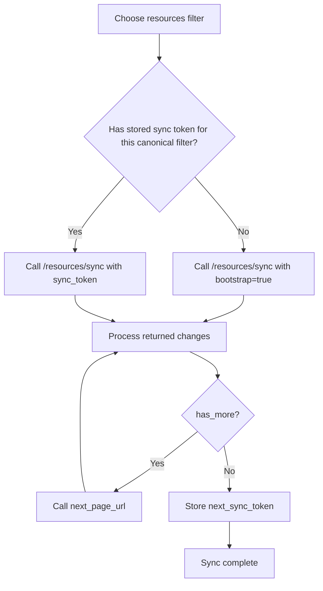
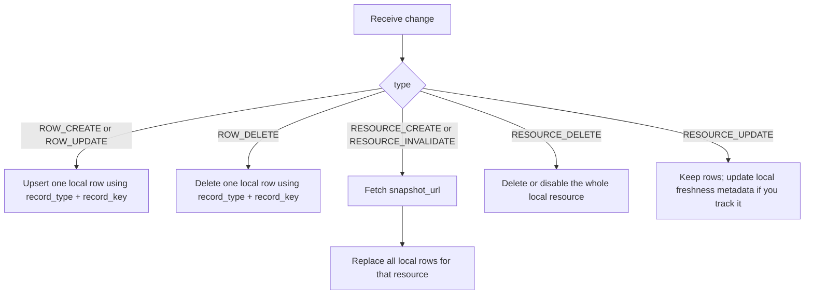
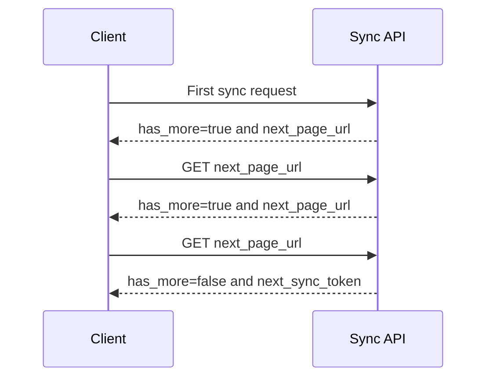

# Content Sync Client Flow

This is the recommended end-to-end flow for a client that stores public content locally.

## Full Flow



Store one sync token per canonical resource filter. Do not reuse a token for a different filter. The API canonicalizes resource filters by group and ID; duplicate IDs are deduped and IDs are sorted before a token is created.

## Applying Changes

Every change belongs to one resource, identified by:

- `resource_group`, such as `translations`
- `resource_id`, such as `19`

Row-level changes also include:

- `record_type`, such as `translation`
- `record_key`, the row key inside that resource



## Client Algorithm

| Change type           | Client action                                                             |
| --------------------- | ------------------------------------------------------------------------- |
| `RESOURCE_CREATE`     | Fetch `snapshot_url`, then replace all local rows for that resource.      |
| `RESOURCE_INVALIDATE` | Fetch `snapshot_url`, then replace all local rows for that resource.      |
| `RESOURCE_DELETE`     | Remove or hide the full local resource. The resource is no longer public. |
| `ROW_CREATE`          | Insert the row from `data`, or replace it if it already exists.           |
| `ROW_UPDATE`          | Replace the local row with `data`.                                        |
| `ROW_DELETE`          | Delete that one local row.                                                |
| `RESOURCE_UPDATE`     | Keep existing rows. Treat it as a freshness marker only.                  |

## Pagination Rules

The sync endpoint can return multiple pages. While `has_more` is `true`, use `next_page_url`. Do not build the cursor yourself.



Only the final page has the token your app should store for the next sync.

## Token Rules

| Rule                                                | Why it matters                                                      |
| --------------------------------------------------- | ------------------------------------------------------------------- |
| Store the token after the final page only.          | Earlier pages do not represent a complete sync.                     |
| Store the token with the canonical resource filter. | Tokens are bound to the normalized filter they were created for.    |
| Replace the old token after each completed sync.    | The latest token is your new checkpoint.                            |
| If token recovery fails, bootstrap again.           | A fresh bootstrap rebuilds local state from current public content. |

## Minimal Local State

```typescript
interface ContentSyncState {
  resourcesFilter: string;
  syncToken: string;
  lastSuccessfulSyncAt: string;
}

interface LocalContentRow {
  resourceGroup: "articles" | "recitations" | "tafsirs" | "translations";
  resourceId: number;
  recordType: string;
  recordKey: string;
  data: Record<string, unknown>;
}
```

The current sync contract accepts only `articles`, `recitations`, `tafsirs`, and `translations` as resource groups.

For the full schema, see [Sync public content resources](/docs/content_apis_versioned/resources-sync/).
