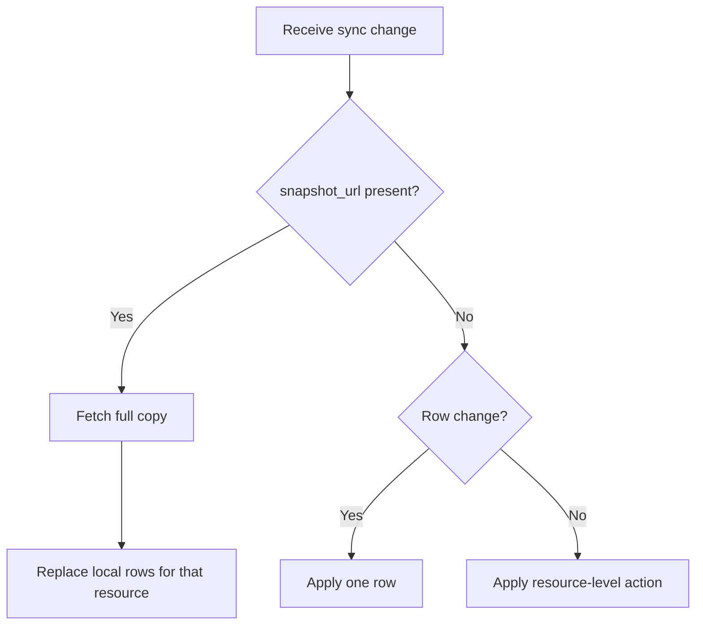
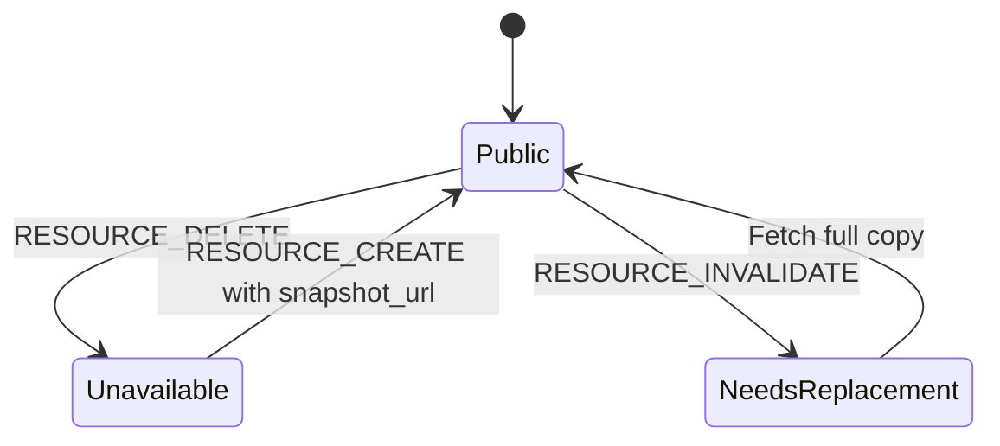
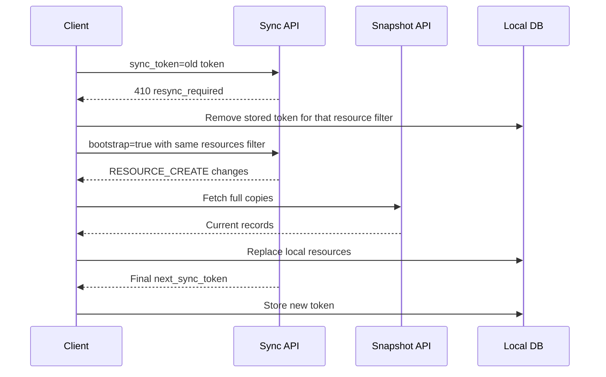

# Full Copies and Recovery

A full copy, called a `snapshot` in the API, is the complete current row list for one public resource.

For example:

- Full copy of `translations:19` returns all current translation rows for translation resource `19`.
- Full copy of `tafsirs:151` returns all current tafsir rows for tafsir resource `151`.
- Full copy of `recitations:10` returns ayah audio file rows and chapter audio file rows for recitation `10`.
- Full copy of `articles:123` returns visible article localization rows for article `123`.

## When You Need a Full Copy



`RESOURCE_CREATE` and `RESOURCE_INVALIDATE` include `snapshot_url`. Fetch it before storing the new sync token.

## Full Copy Response

The response has metadata plus `records`.

```json
{
  "resource_group": "translations",
  "resource_id": 19,
  "resource_content_id": 19,
  "schema_version": 1,
  "sync_sequence": 98234,
  "records": [
    {
      "id": 85108,
      "verse_key": "26:153",
      "text": "They said: Thou art but one of the bewitched;"
    }
  ]
}
```

Client rule: `records` is the full current content for that one resource. Delete your old local rows for the resource, then insert these rows.

## Unavailable Resources

Public Content Sync is not an editorial audit log. It tells public clients what they need to display current public content.



| Server change                                             | Client action                                                      |
| --------------------------------------------------------- | ------------------------------------------------------------------ |
| Resource becomes hidden, rejected, unapproved, or deleted | `RESOURCE_DELETE`: remove or hide the local resource.              |
| Hidden resource changes while unavailable                 | No row changes are replayed to public clients.                     |
| Resource becomes public again                             | `RESOURCE_CREATE`: fetch the full copy and replace local rows.     |
| Resource needs a complete refresh                         | `RESOURCE_INVALIDATE`: fetch the full copy and replace local rows. |

## Error Recovery

| Error code                 | Meaning                                                   | Client recovery                                                   |
| -------------------------- | --------------------------------------------------------- | ----------------------------------------------------------------- |
| `resync_required`          | Token or cursor cannot be used.                           | Discard local token and bootstrap this resource filter again.     |
| `token_filter_mismatch`    | The token belongs to a different resource filter.         | Use the matching filter or bootstrap the new filter.              |
| `cursor_filter_mismatch`   | The cursor belongs to a different resource filter.        | Continue with the original `next_page_url`, or restart the sync.  |
| `cursor_per_page_mismatch` | The cursor was used with a different `per_page`.          | Use `next_page_url` exactly as returned.                          |
| `snapshot_not_found`       | The resource full copy is not public or no longer exists. | Treat the resource as unavailable locally, then continue syncing. |

## Re-Bootstrap Flow



For endpoint details, see [Get content resource snapshot](/docs/content_apis_versioned/resources-snapshot/).
