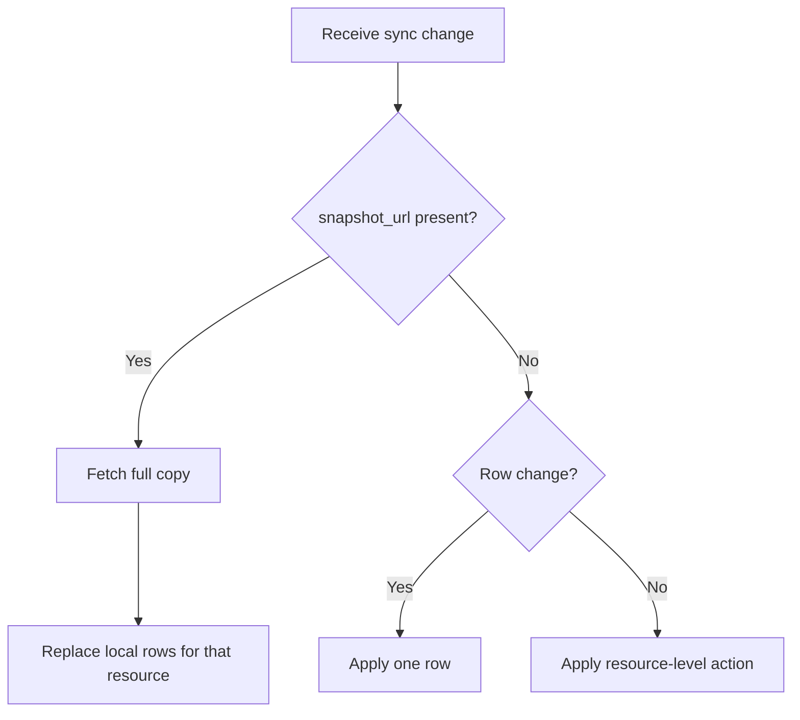
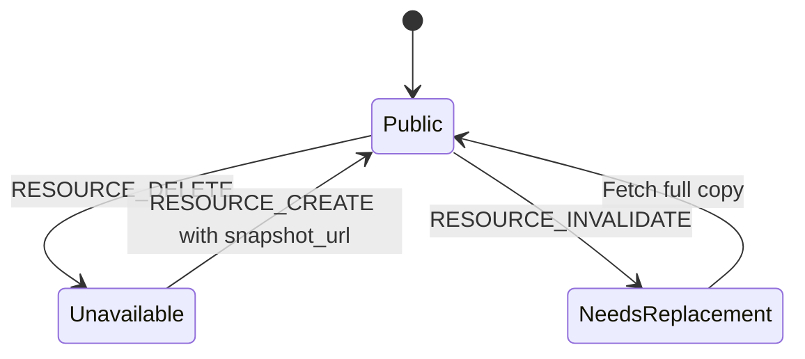
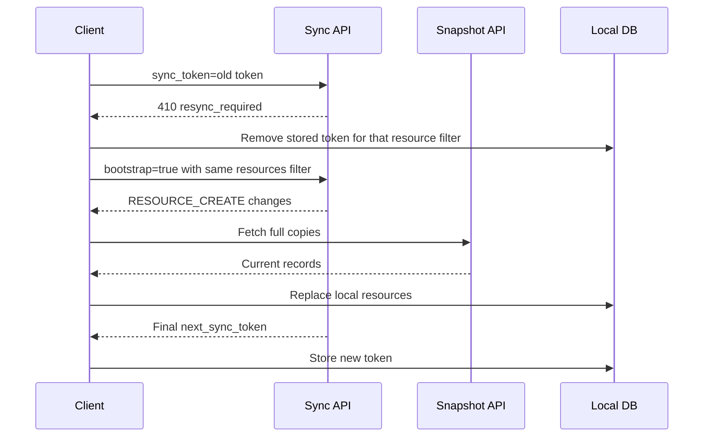

# Full Copies and Recovery

A full copy, called a `snapshot` in the API, is the complete current row list for one public resource.

For example:

- Full copy of `mushafs:1` returns its metadata, page mappings, and positioned words. Font files and images are not included.
- A full copy of `quran_core:1` returns canonical Uthmani verse text, Surah metadata, and Juz/Hizb/Rub-el-Hizb boundaries. It has no Mushaf-specific pages.
- Full copy of `translations:19` returns all current translation rows for translation resource `19`.
- Full copy of `word_by_word_translations:85` returns all current word translation rows for word-by-word translation resource content `85`.
- Full copy of `word_by_word_transliterations:60` returns all current word transliteration rows for production word-by-word transliteration resource `60`.
- Full copy of `tafsirs:151` returns all current tafsir rows for tafsir resource `151`. One tafsir row can cover several verses. See [Tafsir Records](#tafsir-records).
- Full copy of `recitations:10` returns ayah audio file rows and compatible chapter audio file rows for legacy ayah recitation `10`.
- Full copy of `chapter_recitations:159` returns chapter audio file rows for `Audio::Recitation.id` `159`.
- Full copy of `articles:123` returns visible article localization rows for article `123`.

## When You Need a Full Copy


```mermaid
flowchart TD
    A["Receive sync change"] --> B{"snapshot_url present?"}
    B -->|"Yes"| C["Fetch full copy"]
    C --> D["Replace local rows for that resource"]
    B -->|"No"| E{"Row change?"}
    E -->|"Yes"| F["Apply one row"]
    E -->|"No"| G["Apply resource-level action"]
```

`RESOURCE_CREATE` and `RESOURCE_INVALIDATE` include `snapshot_url`. Fetch it before storing the new sync token.

## Full Copy Response

The response has metadata plus `records`.

```json
{
  "resource_group": "translations",
  "resource_id": 19,
  "resource_content_id": 19,
  "schema_version": 1,
  "sync_sequence": 98234,
  "records": [
    {
      "id": 85108,
      "verse_key": "26:153",
      "text": "They said: Thou art but one of the bewitched;"
    }
  ]
}
```

Client rule: `records` is the full current content for that one resource. Delete your old local rows for the resource, then insert these rows.

### Canonical Quran Core Records

The singleton `quran_core:1` has `resource_content_id: null`. Its snapshot
contains `chapter`, `verse`, `juz`, `hizb`, and `rub_el_hizb` records. For example:

```json
{
  "resource_group": "quran_core",
  "resource_id": 1,
  "resource_content_id": null,
  "schema_version": 1,
  "sync_sequence": 98234,
  "records": [
    {"record_type": "chapter", "id": 1, "chapter_number": 1, "name_arabic": "الفاتحة", "verses_count": 7},
    {"record_type": "verse", "id": 1, "chapter_id": 1, "verse_number": 1, "verse_index": 1, "verse_key": "1:1", "text_uthmani": "بِسْمِ ٱللَّهِ"},
    {"record_type": "juz", "id": 1, "juz_number": 1, "first_verse_id": 1, "last_verse_id": 148, "verses_count": 148, "verse_mapping": {"1": "1-7"}}
  ]
}
```

These are abbreviated example rows; actual rows include additional metadata
and `updated_at`. Key local rows by `(record_type, id)` within `quran_core:1`.
Continue using `mushafs:<id>` for page/line/glyph/font layout. Use of the
canonical text remains subject to the Developer Terms, source-specific
redistribution terms, and attribution requirements.

### Word-by-Word Transliteration Records

The `word_by_word_transliterations` group is separate from the
translation-only `word_by_word_translations` group. Its records use
`record_type: "word_transliteration"` for incremental row mutations and are
ordered by `word_id`, then `id` in snapshots.

For production resource `60`, a record has exactly these fields:

```json
{
  "id": 1,
  "resource_content_id": 60,
  "resource_id": 60,
  "word_id": 1,
  "language_id": 38,
  "language_name": "english",
  "text": "bis'mi",
  "updated_at": "2026-08-19T02:43:00Z"
}
```

`resource_id == resource_content_id == ResourceContent.id` identifies the owning
resource, while `word_id` identifies the Word owner. Replace the complete local resource when
bootstrap or a `RESOURCE_INVALIDATE` mutation supplies a `snapshot_url`; apply
`ROW_CREATE`, `ROW_UPDATE`, and `ROW_DELETE` by the mutation's
`resource_group`, `resource_id`, `record_type`, and `record_key`.

### Tafsir Records

A tafsir row can cover one verse or a range of verses, so a tafsir snapshot may
not have one row per verse.

Client rule: to show tafsir for a verse, use the row with non-empty `text`
whose `start_verse_id` to `end_verse_id` range contains that verse's ID. If no
row matches, that tafsir has no entry for the verse.

For example, tafsir `164` has a single row for all of Surah Al-Kawthar, and no
rows for `108:2` or `108:3`:

```json
{
  "id": 67101,
  "resource_content_id": 164,
  "resource_id": 164,
  "verse_id": 6205,
  "verse_key": "108:1",
  "group_verse_key_from": "108:1",
  "group_verse_key_to": "108:3",
  "group_verses_count": 3,
  "start_verse_id": 6205,
  "end_verse_id": 6207,
  "text": "..."
}
```

| Field | Meaning |
| --- | --- |
| `start_verse_id`, `end_verse_id` | First and last verse ID in the range, inclusive. |
| `group_verse_key_from`, `group_verse_key_to` | The range as verse keys. |
| `group_verses_count` | Number of verses in the range. `1` for a single-verse entry. |

Why the rule checks the range: tafsirs store ranges differently.

| Varies by tafsir | Examples |
| --- | --- |
| Which row holds the range's text | First verse in tafsir `164`. Last verse in tafsir `818`, where the `1:7` row covers `1:1` to `1:7`. |
| Other verses in the range | No row in tafsir `164`. A row with empty `text` in tafsir `169`. |
| Verses with no entry | Most tafsirs cover every verse. A few, such as tafsir `14`, have no entry for some verses. |

Do not use `group_tafsir_id` to find the range, because its value is not
consistent across tafsirs. Tafsir row changes from sync use the same row
fields.

### Chapter Recitation Records

Chapter-recitation snapshots use the same envelope as other snapshots, but
their `records` contain only chapter audio files:

```json
{
  "resource_group": "chapter_recitations",
  "resource_id": 159,
  "resource_content_id": 415,
  "schema_version": 1,
  "sync_sequence": 98234,
  "records": [
    {
      "record_type": "chapter_audio_file",
      "id": 2001,
      "audio_recitation_id": 159,
      "chapter_id": 1,
      "audio_url": "https://example.com/audio/001.mp3"
    }
  ]
}
```

The `resource_id` is the `Audio::Recitation.id`; it is not the legacy
`Recitation.id` used by the `recitations` group. The legacy group may also
receive chapter-file mutations for backward compatibility, but its snapshot
is not the independently addressable chapter-recitation resource.

## Unavailable Resources

Public Content Sync is not an editorial audit log. It tells public clients what they need to display current public content.


```mermaid
stateDiagram-v2
    [*] --> Public
    Public --> Unavailable: RESOURCE_DELETE
    Unavailable --> Public: RESOURCE_CREATE with snapshot_url
    Public --> NeedsReplacement: RESOURCE_INVALIDATE
    NeedsReplacement --> Public: Fetch full copy
```

| Server change                                             | Client action                                                      |
| --------------------------------------------------------- | ------------------------------------------------------------------ |
| Resource becomes hidden, rejected, unapproved, or deleted | `RESOURCE_DELETE`: remove or hide the local resource.              |
| Hidden resource changes while unavailable                 | No row changes are replayed to public clients.                     |
| Resource becomes public again                             | `RESOURCE_CREATE`: fetch the full copy and replace local rows.     |
| Resource needs a complete refresh                         | `RESOURCE_INVALIDATE`: fetch the full copy and replace local rows. |

## Error Recovery

| Error code                 | Meaning                                                   | Client recovery                                                   |
| -------------------------- | --------------------------------------------------------- | ----------------------------------------------------------------- |
| `resync_required`          | Token or cursor cannot be used.                           | Discard local token and bootstrap this resource filter again.     |
| `token_filter_mismatch`    | The token belongs to a different resource filter.         | Use the matching filter or bootstrap the new filter.              |
| `cursor_filter_mismatch`   | The cursor belongs to a different resource filter.        | Continue with the original `next_page_url`, or restart the sync.  |
| `cursor_per_page_mismatch` | The cursor was used with a different `per_page`.          | Use the returned `next_page_url` path without changing `per_page`. |
| `snapshot_not_found`       | The resource full copy is not public or no longer exists. | Treat the resource as unavailable locally, then continue syncing. |

## Re-Bootstrap Flow


```mermaid
sequenceDiagram
    participant Client
    participant Sync as Sync API
    participant Snapshot as Snapshot API
    participant DB as Local DB

    Client->>Sync: sync_token=old token
    Sync-->>Client: 410 resync_required
    Client->>DB: Remove stored token for that resource filter
    Client->>Sync: bootstrap=true with same resources filter
    Sync-->>Client: RESOURCE_CREATE changes
    Client->>Snapshot: Fetch full copies
    Snapshot-->>Client: Current records
    Client->>DB: Replace local resources
    Sync-->>Client: Final next_sync_token
    Client->>DB: Store new token
```

For endpoint details, see [Get content resource snapshot](/docs/content_apis_versioned/resources-snapshot/).
