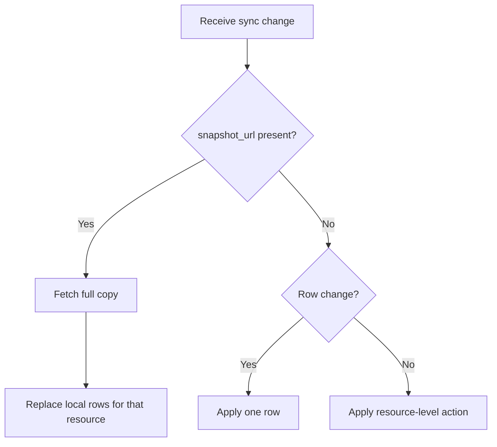
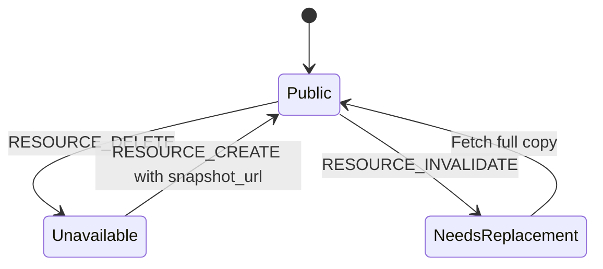
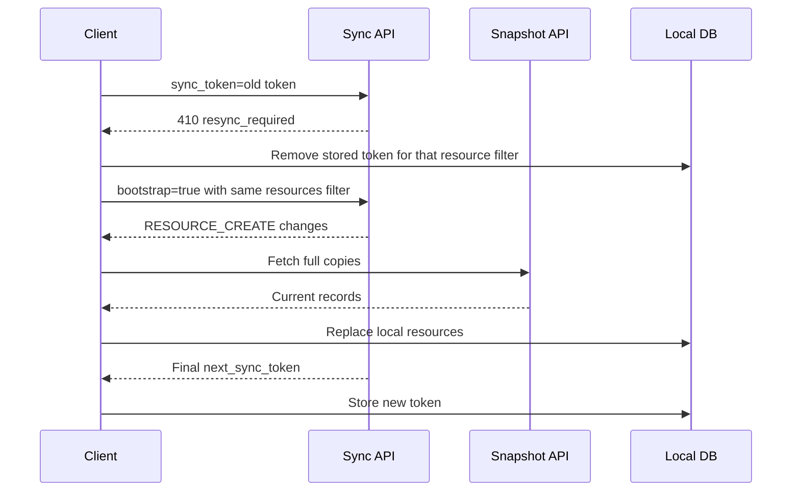

# Full Copies and Recovery

A full copy, called a `snapshot` in the API, is the complete current row list for one public resource.

For example:

- Full copy of `mushafs:1` returns its metadata, page mappings, and positioned words. Font files and images are not included.
- Full copy of `translations:19` returns all current translation rows for translation resource `19`.
- Full copy of `word_by_word_translations:85` returns all current word translation rows for word-by-word translation resource content `85`.
- Full copy of `word_by_word_transliterations:60` returns all current word transliteration rows for production word-by-word transliteration resource `60`.
- Full copy of `tafsirs:151` returns all current tafsir rows for tafsir resource `151`.
- Full copy of `recitations:10` returns ayah audio file rows and compatible chapter audio file rows for legacy ayah recitation `10`.
- Full copy of `chapter_recitations:159` returns chapter audio file rows for `Audio::Recitation.id` `159`.
- Full copy of `articles:123` returns visible article localization rows for article `123`.

## When You Need a Full Copy


```mermaid
flowchart TD
    A["Receive sync change"] --> B{"snapshot_url present?"}
    B -->|"Yes"| C["Fetch full copy"]
    C --> D["Replace local rows for that resource"]
    B -->|"No"| E{"Row change?"}
    E -->|"Yes"| F["Apply one row"]
    E -->|"No"| G["Apply resource-level action"]
```

`RESOURCE_CREATE` and `RESOURCE_INVALIDATE` include `snapshot_url`. Fetch it before storing the new sync token.

## Full Copy Response

The response has metadata plus `records`.

```json
{
  "resource_group": "translations",
  "resource_id": 19,
  "resource_content_id": 19,
  "schema_version": 1,
  "sync_sequence": 98234,
  "records": [
    {
      "id": 85108,
      "verse_key": "26:153",
      "text": "They said: Thou art but one of the bewitched;"
    }
  ]
}
```

Client rule: `records` is the full current content for that one resource. Delete your old local rows for the resource, then insert these rows.

### Word-by-Word Transliteration Records

The `word_by_word_transliterations` group is separate from the
translation-only `word_by_word_translations` group. Its records use
`record_type: "word_transliteration"` for incremental row mutations and are
ordered by `word_id`, then `id` in snapshots.

For production resource `60`, a record has exactly these fields:

```json
{
  "id": 1,
  "resource_content_id": 60,
  "resource_id": 60,
  "word_id": 60,
  "language_id": 38,
  "language_name": "english",
  "text": "bis'mi",
  "updated_at": "2026-08-19T02:43:00Z"
}
```

`resource_id == resource_content_id == ResourceContent.id` identifies the owning
resource, while `word_id` identifies the Word owner. Replace the complete local resource when
bootstrap or a `RESOURCE_INVALIDATE` mutation supplies a `snapshot_url`; apply
`ROW_CREATE`, `ROW_UPDATE`, and `ROW_DELETE` by the mutation's
`resource_group`, `resource_id`, `record_type`, and `record_key`.

### Chapter Recitation Records

Chapter-recitation snapshots use the same envelope as other snapshots, but
their `records` contain only chapter audio files:

```json
{
  "resource_group": "chapter_recitations",
  "resource_id": 159,
  "resource_content_id": 415,
  "schema_version": 1,
  "sync_sequence": 98234,
  "records": [
    {
      "record_type": "chapter_audio_file",
      "id": 2001,
      "audio_recitation_id": 159,
      "chapter_id": 1,
      "audio_url": "https://example.com/audio/001.mp3"
    }
  ]
}
```

The `resource_id` is the `Audio::Recitation.id`; it is not the legacy
`Recitation.id` used by the `recitations` group. The legacy group may also
receive chapter-file mutations for backward compatibility, but its snapshot
is not the independently addressable chapter-recitation resource.

## Unavailable Resources

Public Content Sync is not an editorial audit log. It tells public clients what they need to display current public content.


```mermaid
stateDiagram-v2
    [*] --> Public
    Public --> Unavailable: RESOURCE_DELETE
    Unavailable --> Public: RESOURCE_CREATE with snapshot_url
    Public --> NeedsReplacement: RESOURCE_INVALIDATE
    NeedsReplacement --> Public: Fetch full copy
```

| Server change                                             | Client action                                                      |
| --------------------------------------------------------- | ------------------------------------------------------------------ |
| Resource becomes hidden, rejected, unapproved, or deleted | `RESOURCE_DELETE`: remove or hide the local resource.              |
| Hidden resource changes while unavailable                 | No row changes are replayed to public clients.                     |
| Resource becomes public again                             | `RESOURCE_CREATE`: fetch the full copy and replace local rows.     |
| Resource needs a complete refresh                         | `RESOURCE_INVALIDATE`: fetch the full copy and replace local rows. |

## Error Recovery

| Error code                 | Meaning                                                   | Client recovery                                                   |
| -------------------------- | --------------------------------------------------------- | ----------------------------------------------------------------- |
| `resync_required`          | Token or cursor cannot be used.                           | Discard local token and bootstrap this resource filter again.     |
| `token_filter_mismatch`    | The token belongs to a different resource filter.         | Use the matching filter or bootstrap the new filter.              |
| `cursor_filter_mismatch`   | The cursor belongs to a different resource filter.        | Continue with the original `next_page_url`, or restart the sync.  |
| `cursor_per_page_mismatch` | The cursor was used with a different `per_page`.          | Use the returned `next_page_url` path without changing `per_page`. |
| `snapshot_not_found`       | The resource full copy is not public or no longer exists. | Treat the resource as unavailable locally, then continue syncing. |

## Re-Bootstrap Flow


```mermaid
sequenceDiagram
    participant Client
    participant Sync as Sync API
    participant Snapshot as Snapshot API
    participant DB as Local DB

    Client->>Sync: sync_token=old token
    Sync-->>Client: 410 resync_required
    Client->>DB: Remove stored token for that resource filter
    Client->>Sync: bootstrap=true with same resources filter
    Sync-->>Client: RESOURCE_CREATE changes
    Client->>Snapshot: Fetch full copies
    Snapshot-->>Client: Current records
    Client->>DB: Replace local resources
    Sync-->>Client: Final next_sync_token
    Client->>DB: Store new token
```

For endpoint details, see [Get content resource snapshot](/docs/content_apis_versioned/resources-snapshot/).
