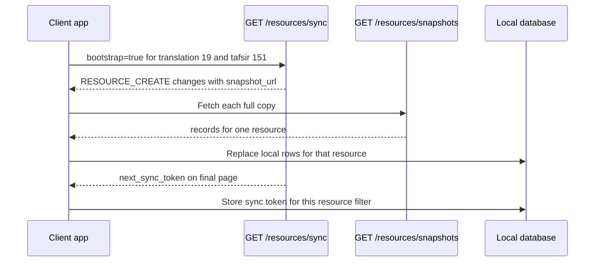
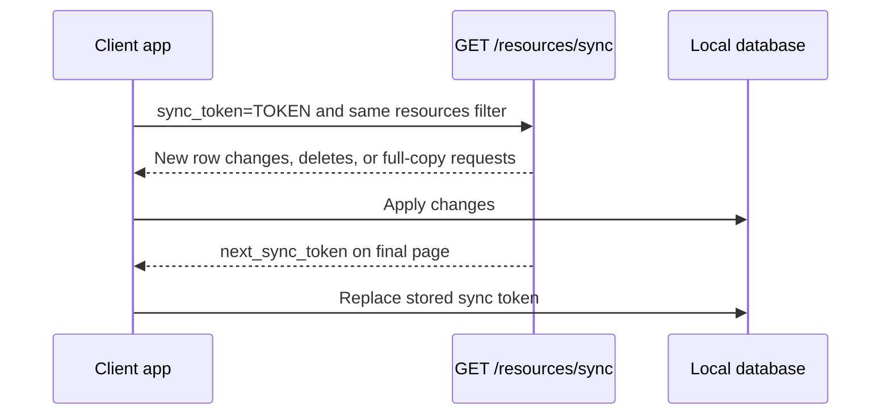

# Getting Started with Content Sync

Content Sync helps an app keep a local copy of public Quran.Foundation content fresh.
Instead of downloading every translation, tafsir, recitation, or article again, your app asks:

1. What changed since the last time I checked?
2. Which small rows can I update directly?
3. Which full content copy do I need to download again?

## Terms

| Term            | Plain meaning                                                                                                |
| --------------- | ------------------------------------------------------------------------------------------------------------ |
| Resource        | One content item your app tracks, such as translation `19`, tafsir `151`, recitation `10`, or article `123`. |
| Resource filter | The list of content your app wants to keep in sync, for example `translations:19;tafsirs:151`.               |
| Change          | One server event telling your app what changed. The API field is called `type`.                              |
| Full copy       | The complete current rows for one resource. The API calls this a `snapshot`.                                 |
| Sync token      | A private checkpoint returned by the API. Store it and send it next time to get only newer changes.          |
| Cursor          | A temporary page link. Use it only while finishing the current sync request.                                 |

## Supported Content

| Resource group | What the full copy contains                                                          | Row changes included                                                           |
| -------------- | ------------------------------------------------------------------------------------ | ------------------------------------------------------------------------------ |
| `translations` | Translation rows for the resource. Footnotes are nested inside each translation row. | Translation row updates, deletes, and footnote-driven translation row updates. |
| `tafsirs`      | Tafsir rows for the resource.                                                        | Tafsir row updates and deletes.                                                |
| `recitations`  | Ayah audio files and chapter audio files for the recitation.                         | Ayah audio file and chapter audio file updates and deletes.                    |
| `articles`     | Visible article localizations.                                                       | Article localization updates and resource refresh events.                      |

:::note Recitation timing coverage
Ayah audio file fields, including the `segments` value on an audio file row, are included when that audio file row is saved. Separate chapter-level segment rows edited through the surah segment builder are not part of the V1 public sync stream yet.
:::

## First Sync

On first sync, ask for the content you want and set `bootstrap=true`. The API returns pages of `RESOURCE_CREATE` changes. Each one includes a `snapshot_url`, which points to the full copy for that resource.



```bash
curl "https://apis.quran.foundation/content/api/v4/resources/sync?bootstrap=true&resources=translations:19;tafsirs:151&per_page=100" \
  -H "x-auth-token: $ACCESS_TOKEN" \
  -H "x-client-id: $CLIENT_ID"
```

If `has_more` is `true`, call `next_page_url` until it becomes `false`. Store `next_sync_token` only from the final page.

## Fetching a Full Copy

A full copy returns all current rows for one resource. For example, a translation full copy returns the current translation rows for that translation resource.

```bash
curl "https://apis.quran.foundation/content/api/v4/resources/snapshots/translations/19" \
  -H "x-auth-token: $ACCESS_TOKEN" \
  -H "x-client-id: $CLIENT_ID"
```

Client rule: replace all local rows for `translations:19` with the `records` array from the response.

## Next Sync

After first sync, use the stored `sync_token` with the same `resources` filter. The API returns only newer changes.



```bash
curl "https://apis.quran.foundation/content/api/v4/resources/sync?sync_token=$SYNC_TOKEN&resources=translations:19;tafsirs:151&per_page=100" \
  -H "x-auth-token: $ACCESS_TOKEN" \
  -H "x-client-id: $CLIENT_ID"
```

## API References

- [Sync public content resources](/docs/content_apis_versioned/resources-sync/)
- [Get content resource snapshot](/docs/content_apis_versioned/resources-snapshot/)
