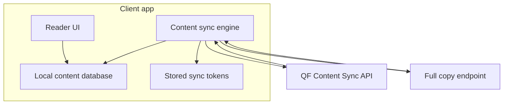
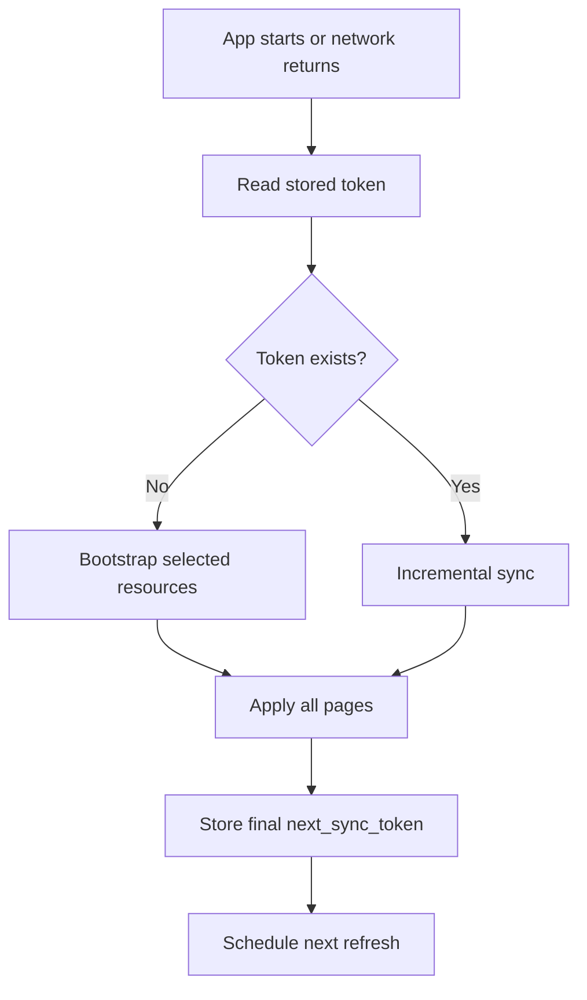
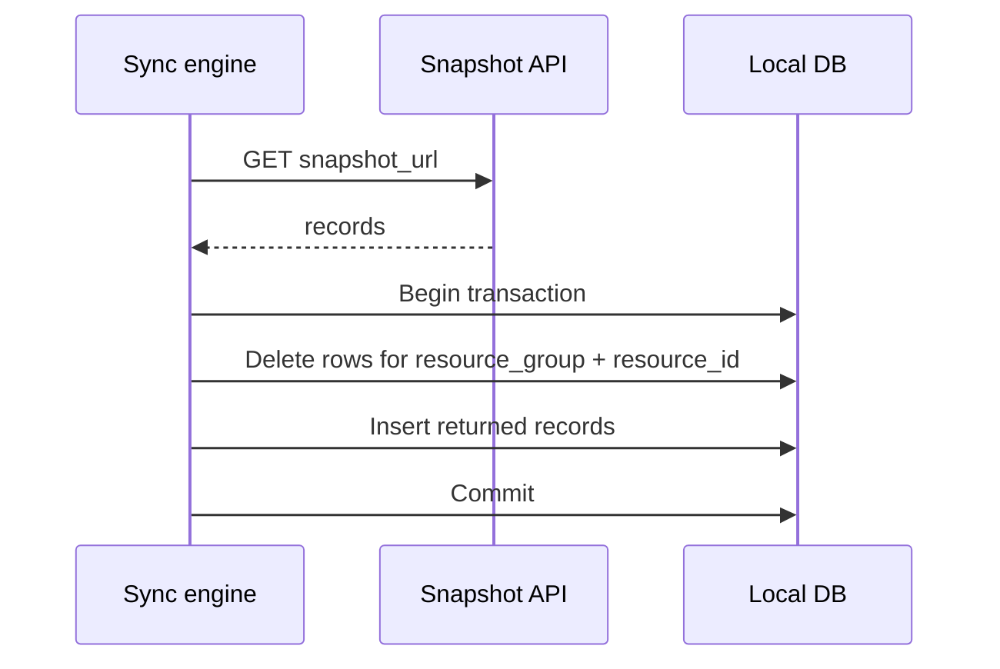

# Offline Content Cache Patterns

Content Sync works best when your app treats the server as the source of truth and the local database as a readable cache.

## Recommended Architecture



The UI reads from local storage. The sync engine updates that storage in the background.

## Local Tables

Use separate tables for sync state and cached rows.

```typescript
interface ContentSyncToken {
  resourcesFilter: string;
  syncToken: string;
  updatedAt: string;
}

interface ContentCacheRow {
  resourceGroup: string;
  resourceId: number;
  recordType: string;
  recordKey: string;
  payload: Record<string, unknown>;
  updatedAt: string;
}
```

Use a unique key on:

```text
resourceGroup + resourceId + recordType + recordKey
```

That makes `ROW_CREATE` and `ROW_UPDATE` safe to apply more than once.

## Background Refresh



Recommended triggers:

| Trigger                   | Suggested action                                               |
| ------------------------- | -------------------------------------------------------------- |
| App install or first open | Bootstrap only the resources the app needs.                    |
| App launch                | Run incremental sync in the background.                        |
| Network restored          | Run incremental sync.                                          |
| Reader opens a resource   | Use local content immediately, then refresh in the background. |
| Token rejected            | Re-bootstrap that resource filter.                             |

## Replacing a Resource

When a change includes `snapshot_url`, fetch the full copy and replace rows in one transaction.



This prevents mixed old and new rows from appearing in the reader UI.

## Practical Defaults

| Decision               | Default                                                                |
| ---------------------- | ---------------------------------------------------------------------- |
| Page size              | Use `per_page=100` unless your client needs smaller pages.             |
| Token storage          | Store per resource filter, not globally.                               |
| Applying changes       | Make every apply operation idempotent.                                 |
| Failed sync            | Keep the old token and retry later.                                    |
| Failed full copy fetch | Do not store the new sync token until the required full copy succeeds. |

## What Not To Do

- Do not construct cursors manually. Use `next_page_url`.
- Do not store `next_sync_token` before all pages and required full copies are applied.
- Do not reuse a token with a different `resources` filter.
- Do not treat `RESOURCE_UPDATE` as an instruction to delete or refetch rows.
