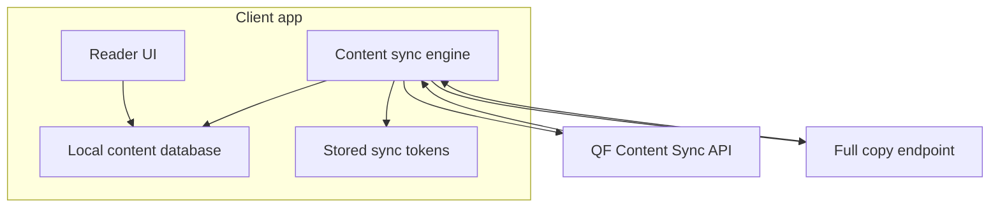
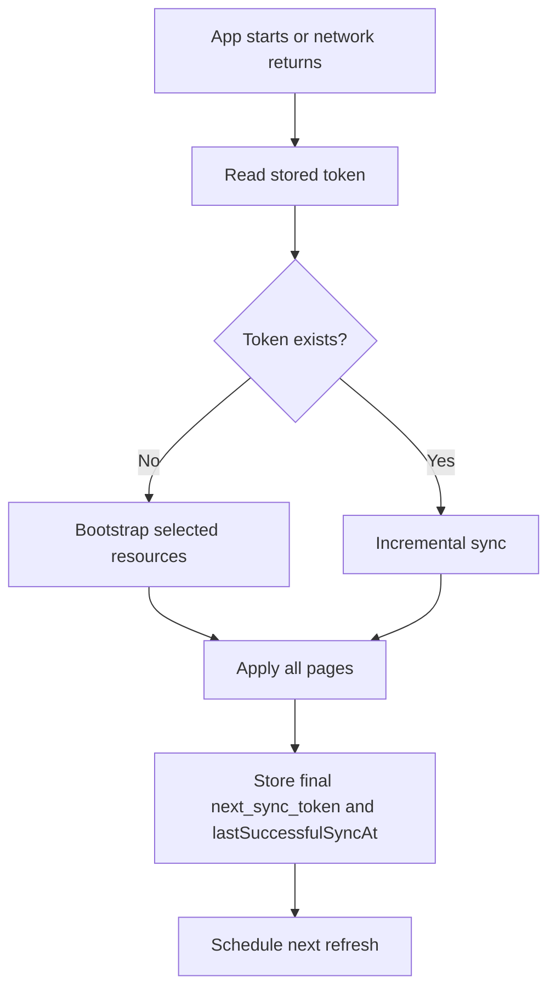
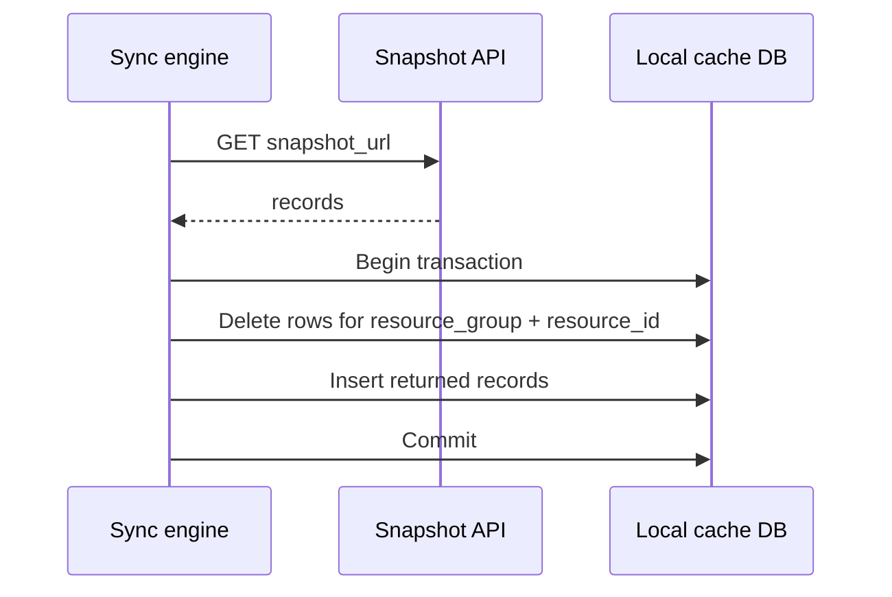

# Offline Content Cache Patterns

Content Sync works best when your app treats the server as the source of truth and the local database as a readable cache.

## Recommended Architecture


```mermaid
flowchart TB
    subgraph App["Client app"]
        UI["Reader UI"]
        DB["Local content database"]
        Engine["Content sync engine"]
        State["Stored sync tokens"]
    end

    API["QF Content Sync API"]
    Snapshot["Full copy endpoint"]

    UI --> DB
    Engine --> State
    Engine --> API
    API --> Engine
    Engine --> Snapshot
    Snapshot --> Engine
    Engine --> DB
```

The UI reads from local storage while the sync engine updates it in the background. If connectivity to QF is unavailable, the [Developer Terms](/legal/developer-terms) allow the Application to keep using its previously synced Content Sync copy for end-user features, even beyond seven days. A backend cache follows the same reconnect-and-sync obligation; neither cache should claim an unsynced copy is current.

## Local Tables

Use separate tables for sync state and cached rows.

```typescript
interface ContentSyncToken {
  resourcesFilter: string;
  syncToken: string;
  lastSuccessfulSyncAt: string; // Use to schedule the next sync; do not reset on a failed attempt.
}

interface ContentCacheRow {
  resourceGroup: string;
  resourceId: number;
  recordType: string;
  recordKey: string;
  payload: Record<string, unknown>;
  updatedAt: string;
}
```

Use a unique key on:

```text
resourceGroup + resourceId + recordType + recordKey
```

That makes `ROW_CREATE` and `ROW_UPDATE` safe to apply more than once.

## Background Refresh


```mermaid
flowchart TD
    A["App starts or network returns"] --> B["Read stored token"]
    B --> C{"Token exists?"}
    C -->|"No"| D["Bootstrap selected resources"]
    C -->|"Yes"| E["Incremental sync"]
    D --> F["Apply all pages"]
    E --> F
    F --> G["Store final next_sync_token and lastSuccessfulSyncAt"]
    G --> H["Schedule next refresh"]
```

Recommended triggers:

| Trigger                   | Suggested action                                               |
| ------------------------- | -------------------------------------------------------------- |
| App install or first open | Bootstrap only the resources the app needs.                    |
| App launch                | Check `lastSuccessfulSyncAt` for each retained filter; if sync is due and connectivity is available, start it promptly, even when the copy is more than seven days old. |
| Network restored          | Attempt incremental sync promptly for every due filter; re-bootstrap if its token is rejected. |
| Reader opens a resource   | Use the previously synced local content while refreshing, including when the device remains offline beyond seven days; do not label an overdue copy current. |
| Token rejected            | Re-bootstrap that resource filter; retain the last successful sync time until the replacement is fully applied. |

The timestamp is a **successful apply** time, not the time a request was attempted or a token was issued. Initialize it after bootstrap completes, and update it only after all incremental pages, deletions, and required replacement snapshots have been applied. Use it to schedule a next sync at least every seven days when connected, for every filter that supplies content to a screen, whether the cache is on a device or your backend. If connectivity to QF is unavailable beyond that window, keep the previously synced copy readable and attempt sync promptly when connectivity returns. If a sync attempt fails, keep the old token and timestamp and retry without intentionally deferring updates; apply corrections and removals when the sync succeeds. This offline-continuity rule applies only to Content Sync-eligible rows, not to unsupported content or referenced media files. See the [Developer Terms](/legal/developer-terms).

## Replacing a Resource

When a change includes `snapshot_url`, fetch the full copy and replace only that resource's cached rows in one local transaction. The transaction boundary is one resource, not the full sync run, and the snapshot request should finish before the transaction begins.

When `snapshot_url` is present and non-null, we return a relative `/api/v4/...` path like `/api/v4/resources/snapshots/translations/19`. You should prefix that path with `https://apis.quran.foundation/content`.


```mermaid
sequenceDiagram
    participant Engine as Sync engine
    participant Snapshot as Snapshot API
    participant DB as Local cache DB

    Engine->>Snapshot: GET snapshot_url
    Snapshot-->>Engine: records
    Engine->>DB: Begin transaction
    Engine->>DB: Delete rows for resource_group + resource_id
    Engine->>DB: Insert returned records
    Engine->>DB: Commit
```

This prevents mixed old and new rows from appearing in the reader UI.

## Choosing a Sync Token Scope

A sync token belongs to the exact canonical `resources` filter. Both single-resource filters such as `translations:19` and combined filters such as `translations:19,20;tafsirs:151` are supported. Store a separate token for every filter your app uses.

Using one filter per resource can isolate retries and refresh schedules, while a combined filter reduces incremental sync requests. It does not change how many snapshots bootstrap requires: each resource still has its own `snapshot_url`. When a broad filter returns many snapshot URLs, fetch them with bounded concurrency and apply each snapshot in its own local cache transaction.

## Practical Defaults

| Decision               | Default                                                                |
| ---------------------- | ---------------------------------------------------------------------- |
| Page size              | Use `per_page=100` unless your client needs smaller pages.             |
| Token storage          | Store per resource filter, not globally.                               |
| Applying changes       | Make every apply operation idempotent.                                 |
| Failed sync            | Keep the old token and success timestamp; retry promptly when connectivity permits. Previously synced content may remain available while offline or during retries. |
| Failed full copy fetch | Do not store the new sync token until the required full copy succeeds. |

## What Not To Do

- Do not construct cursors manually. Use `next_page_url`.
- Do not treat `next_page_url` or `snapshot_url` as an absolute URL.
- Do not store `next_sync_token` before all pages and required full copies are applied.
- Do not reuse a token with a different `resources` filter.
- Do not treat `RESOURCE_UPDATE` as an instruction to delete or refetch rows.
