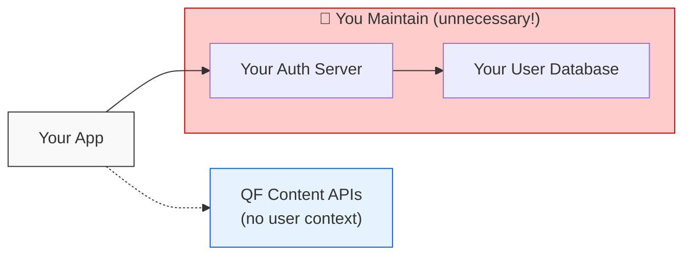
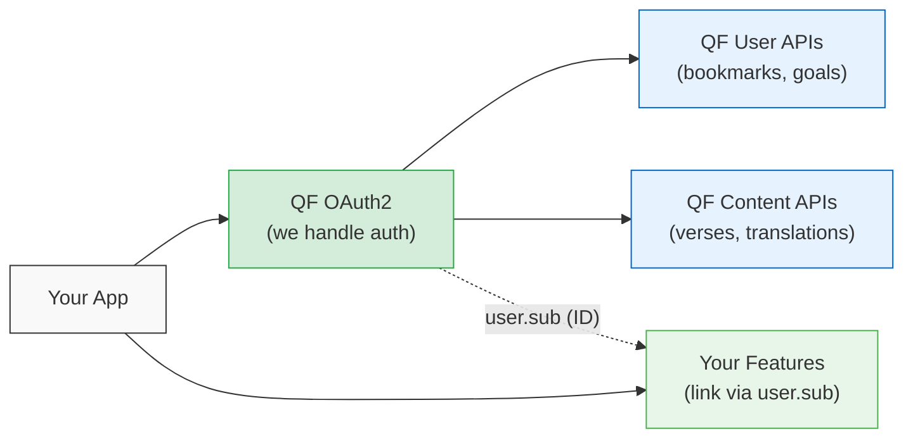
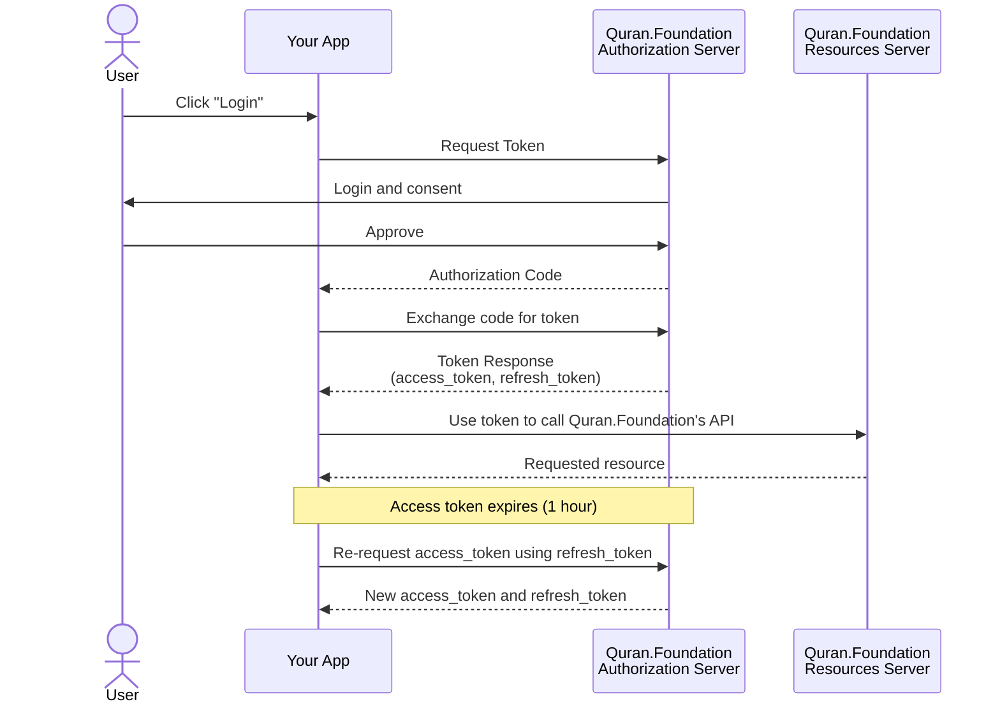

# Using OAuth 2.0 to Access Quran.Foundation APIs

Quran.Foundation **User APIs** use the OAuth 2.0 **Authorization Code** flow with **PKCE** for authenticating users and authorizing access to their data. This guide mirrors our Quick Start style: clear steps, tips, and ready-to-run examples in Python (requests) and JavaScript (Node + axios).

For identity details (ID token), see [OpenID Connect](/docs/tutorials/oidc/openid-connect).

:::tip Recommended for first-time users
This guide walks you through OAuth2 Authorization Code flow step-by-step.

🤖 **Using AI to code?** Look for the <b>"🤖 AI prompt"</b> sections throughout this guide — copy-paste them into ChatGPT, Claude, or Copilot for instant implementation help!
:::

> 🔀 Flow split: Use **Client Credentials** for **Content APIs** (see [Quick Start](/docs/quickstart)). Use **Authorization Code (+PKCE)** for **User APIs** (this page).

---

## 🤲 Why Use Quran Foundation Authentication?

**We've built this for the Ummah so you don't have to.**

Many developers integrate our APIs but still maintain their own user accounts, sessions, and databases. **This is unnecessary extra work.** By fully adopting Quran Foundation OAuth2, you get everything out of the box — while still having **complete freedom** to build your own features on top.

| What You Get              | Without QF Auth         | With QF Auth                    |
| ------------------------- | ----------------------- | ------------------------------- |
| User login/signup         | You build & maintain it | ✅ Done                         |
| Password reset & recovery | You build & maintain it | ✅ Done                         |
| Session management        | You build & maintain it | ✅ Done                         |
| Cross-app Single Sign-On  | ❌ Not possible         | ✅ One login for all Quran apps |
| Synced bookmarks & notes  | ❌ Per-app only         | ✅ Synced with Quran.com        |
| Synced reading progress   | ❌ Per-app only         | ✅ Shared goals & streaks       |
| User preferences          | You build & maintain it | ✅ Done                         |
| Social features           | You build & maintain it | ✅ Comments, reflections ready  |
| **Your custom features**  | You build & maintain it | ✅ **Still yours to build!**    |

:::tip Real Example: Automatic Cross-App Sync
When a user logs into **your app** using Quran Foundation OAuth2:

- Their bookmarks from **Quran.com automatically appear** in your app
- Their reading goals and streaks **continue** in your app
- Their saved verses are **available everywhere**

**No database sync. No migration. It just works.**
:::

### The Easy Way vs. The Hard Way

#### ❌ The Hard Way (What Some Developers Do)



> **Problems**: Separate accounts, no sync with Quran.com, duplicate auth work, users need another password

#### ✅ The Easy Way (Use Our Auth + Build Your Features)



> **Benefits**: SSO, synced data, zero auth headaches — **and full flexibility to build anything you want**

:::info 🔑 You Can Still Build Custom Features!
Using our auth doesn't limit you. After login, you get a unique `user.sub` (user ID) that you can use as a foreign key in your own database. Build whatever you need:

- **Custom analytics** — Track usage patterns for your app
- **Premium features** — Gate features based on your own subscription logic
- **App-specific data** — Store settings, preferences, or data unique to your app
- **Gamification** — Build your own achievements, leaderboards, etc.

**Just link `user.sub` to your internal records — we handle auth, you handle everything else.**
:::

### 💡 How to Link QF Users to Your Data

After OAuth2 login, decode the ID token to get the user's unique identifier:

```javascript
const jwt = require("jsonwebtoken");

// After successful OAuth2 callback
const idToken = tokenResponse.id_token;
const user = jwt.decode(idToken);

// user.sub is the unique, stable identifier for this user
const qfUserId = user.sub; // e.g., "a1b2c3d4-e5f6-7890-abcd-ef1234567890"

// Use this as a foreign key in YOUR database
await db.query(
  `
  INSERT INTO my_app_users (qf_user_id, premium_until, custom_setting)
  VALUES ($1, $2, $3)
  ON CONFLICT (qf_user_id) DO UPDATE SET last_login = NOW()
`,
  [qfUserId, null, "default"]
);
```

```python
import jwt

# After successful OAuth2 callback
id_token = token_response['id_token']
user = jwt.decode(id_token, options={"verify_signature": False})

# user['sub'] is the unique, stable identifier for this user
qf_user_id = user['sub']  # e.g., "a1b2c3d4-e5f6-7890-abcd-ef1234567890"

# Use this as a foreign key in YOUR database
cursor.execute("""
    INSERT INTO my_app_users (qf_user_id, premium_until, custom_setting)
    VALUES (%s, %s, %s)
    ON CONFLICT (qf_user_id) DO UPDATE SET last_login = NOW()
""", (qf_user_id, None, 'default'))
```

| ID Token Claim | Description                             | Use For                                |
| -------------- | --------------------------------------- | -------------------------------------- |
| `sub`          | Unique user ID (stable, never changes)  | **Primary key** for linking to your DB |
| `email`        | User's email (if `email` scope granted) | Display, notifications                 |
| `first_name`   | User's first name                       | Personalization                        |
| `name`         | Full name                               | Display                                |

:::warning Don't use email as primary key
Always use `sub` as the foreign key to link users. Email addresses can change, but `sub` is permanent and unique.
:::

### 🚀 Ready-to-Run Examples

Get started in minutes with our official example repositories:

| Platform           | Repository                                                                                        | Features                                  |
| ------------------ | ------------------------------------------------------------------------------------------------- | ----------------------------------------- |
| **Web (Node.js)**  | [quran-oauth2-client-example](https://github.com/quran/quran-oauth2-client-example)               | Express, session management, JWT decoding |
| **React Native**   | [oauth2-react-native-client-example](https://github.com/quran/oauth2-react-native-client-example) | Expo, PKCE, token management              |
| **iOS Native**     | See [iOS Guide](/docs/tutorials/oidc/mobile-apps/iOS)                                             | AppAuth-iOS                               |
| **Android Native** | See [Android Guide](/docs/tutorials/oidc/mobile-apps/android)                                     | AppAuth-Android                           |

---

## Overview

Here's how the OAuth2 Authorization Code flow works when user consent is needed to access their data:



> 🔧 **Ready to code?** Check out the [User APIs Quick Start](/docs/tutorials/oidc/user-apis-quickstart) for copy-paste examples, or see the [Web Integration Example](/docs/tutorials/oidc/example-integration) and the [hosted demo](https://oauth2-client-prelive.quran.foundation/).

---

## 🧩 Step 1: Request OAuth 2.0 Client Credentials

1. Submit an [Application](/request-access) to obtain your `client_id` and (for confidential apps) `client_secret`.
2. Provide one or more exact `redirect_uri` values. These must match exactly at runtime.

> ⚠️ Never embed `client_secret` in public clients (SPA/mobile). Use PKCE and keep secrets on the server only.

<details>
<summary><b>🤖 AI prompt: implement Step 1 (OAuth client config + env selection)</b></summary>

```text
Implement Quran Foundation OAuth2 client configuration for User APIs.

Goal
- Make OAuth2 client configuration and environment selection explicit and hard to misuse.

Environment variables (server-only)
- QF_CLIENT_ID (required)
- QF_CLIENT_SECRET (optional): required only for confidential server apps
- QF_ENV (optional): "prelive" | "production" (default: "prelive")

Base URLs (copy exactly)
- Pre-Production:
  - Auth URL: https://prelive-oauth2.quran.foundation
  - API Base URL: https://apis-prelive.quran.foundation
- Production:
  - Auth URL: https://oauth2.quran.foundation
  - API Base URL: https://apis.quran.foundation

Implementation requirements
- Create a config module (e.g., qfOAuthConfig.*) that:
  - reads QF_CLIENT_ID, QF_CLIENT_SECRET (optional), QF_ENV
  - maps QF_ENV => { authBaseUrl, apiBaseUrl }
- Never hardcode or log QF_CLIENT_SECRET.
- Never print credentials in errors.
- If QF_CLIENT_ID is missing, throw an error with EXACT message:
  "Missing Quran Foundation API credentials. Request access: https://api-docs.quran.foundation/request-access"

Output shape
- Export a function getQfOAuthConfig() that returns:
  { env, clientId, clientSecret, authBaseUrl, apiBaseUrl }

Acceptance checklist
- App boots with a clear error when QF_CLIENT_ID is missing.
- Switching QF_ENV switches both auth and API base URLs together.
- No logs ever contain client_secret.
```

</details>

---

## 🔗 Step 2: Build Authorization URL (with PKCE)

**Authorization endpoint:** `/oauth2/auth`
**Method:** `GET`

**Required query params:**

- `response_type=code`
- `client_id=YOUR_CLIENT_ID`
- `redirect_uri=YOUR_REDIRECT_URI` (must match exactly)
- `scope=openid offline_access user collection`
- `state=RANDOM_STRING` (validate on callback; CSRF)
- `nonce=RANDOM_STRING` (strongly recommended when requesting `openid`; some deployments **require** it. If an ID token is returned, verify the token’s `nonce` claim matches your original value.)
- `code_challenge=BASE64URL_SHA256(code_verifier)`
- `code_challenge_method=S256`

**Environment bases**

- Pre-Production: `https://prelive-oauth2.quran.foundation`
- Production: `https://oauth2.quran.foundation`

**Example URL (Pre-Production with PKCE):**

```
https://prelive-oauth2.quran.foundation/oauth2/auth?response_type=code
&client_id=YOUR_CLIENT_ID
&redirect_uri=https%3A%2F%2Fyour-app.com%2Foauth%2Fcallback
&scope=openid%20offline_access%20user%20collection
&state=VeimvfgqexjiCoCkRWSGcb333o3a
&nonce=RANDOM_NONCE_VALUE
&code_challenge=BASE64URL_SHA256_OF_CODE_VERIFIER
&code_challenge_method=S256
```

Least privilege: Add scopes only as you need them.

> Tip: Persist your `code_verifier` server-side (session or secure httpOnly cookie) **before** redirecting to `/oauth2/auth`, then read it on the callback to redeem the `code`.

For example, request `collection` only when the user actually creates or manages a collection.

<details>
<summary><b>PKCE helpers (Node)</b></summary>

```js
const crypto = require("crypto");

function base64url(buf) {
  return buf
    .toString("base64")
    .replace(/\+/g, "-")
    .replace(/\//g, "_")
    .replace(/=+$/, "");
}

function generatePkcePair() {
  const codeVerifier = base64url(crypto.randomBytes(32));
  const hash = crypto.createHash("sha256").update(codeVerifier).digest();
  const codeChallenge = base64url(hash);
  return { codeVerifier, codeChallenge };
}
```

</details>

<details>
<summary><b>PKCE helpers (Python)</b></summary>

```python
import os, base64, hashlib

def base64url(b: bytes) -> str:
  return base64.urlsafe_b64encode(b).decode().rstrip('=')

def generate_pkce_pair():
  code_verifier = base64url(os.urandom(32))
  code_challenge = base64url(hashlib.sha256(code_verifier.encode()).digest())
  return code_verifier, code_challenge
```

</details>

<details>
<summary><b>Authorization URL builder (Node, server-side)</b></summary>

```js
const crypto = require("crypto");
const { getQfOAuthConfig } = require("./qfOAuthConfig"); // your Step 1 config
const { generatePkcePair } = require("./pkce"); // from PKCE helpers above

function randomString(bytes = 16) {
  return crypto.randomBytes(bytes).toString("hex");
}

/**
 * Store { state, nonce, codeVerifier, redirectUri } in a server session
 * BEFORE redirecting, then validate state on callback and use codeVerifier
 * in the token exchange.
 */
function buildAuthorizationUrl({
  redirectUri,
  scope = "openid offline_access user collection",
}) {
  const { authBaseUrl, clientId } = getQfOAuthConfig();
  const { codeVerifier, codeChallenge } = generatePkcePair();

  const state = randomString(16);
  const nonce = randomString(16);

  const params = new URLSearchParams();
  params.set("response_type", "code");
  params.set("client_id", clientId);
  params.set("redirect_uri", redirectUri);
  params.set("scope", scope);
  params.set("state", state);
  params.set("nonce", nonce);
  params.set("code_challenge", codeChallenge);
  params.set("code_challenge_method", "S256");

  const url = `${authBaseUrl}/oauth2/auth?${params.toString()}`;

  return {
    url,
    // persist these server-side (session or secure httpOnly cookie)
    pkce: { state, nonce, codeVerifier },
  };
}

module.exports = { buildAuthorizationUrl };
```

</details>

<details>
<summary><b>🤖 AI prompt: implement Step 2 (PKCE + auth URL + secure state)</b></summary>

```text
Implement Authorization Code + PKCE authorization URL builder.

Goal
- Safely redirect users to /oauth2/auth with correct params (state/nonce/PKCE),
  and safely persist the PKCE verifier for the callback.

Source of truth
- Authorization endpoint path: /oauth2/auth
- Required query params:
  response_type=code
  client_id
  redirect_uri
  scope
  state
  nonce (required when requesting openid in many deployments)
  code_challenge
  code_challenge_method=S256

Implementation requirements
- Use authBaseUrl from getQfOAuthConfig():
  Redirect to {authBaseUrl}/oauth2/auth
- Generate:
  - code_verifier (random)
  - code_challenge = BASE64URL(SHA256(code_verifier))
  - state (random) and nonce (random)
- Persist { state, nonce, codeVerifier, redirectUri } server-side BEFORE redirect:
  - session store or secure httpOnly cookie
- On callback:
  - Validate state matches the persisted value (CSRF protection)
  - Use the persisted codeVerifier for token exchange
- Never log secrets. (PKCE verifier is sensitive; do not log it.)

Output shape
- Export a function buildAuthorizationUrl({ redirectUri, scopes? }) that returns:
  { url, state, nonce }
- Persist the codeVerifier internally (do not return it to the browser)

Acceptance checklist
- Redirect URL includes all required params.
- state is generated and later validated on callback.
- codeVerifier is stored server-side and used in Step 3 token exchange.
- No logs include codeVerifier, tokens, or client_secret.
```

</details>

---

## 🔑 Step 3: Exchange Code for Tokens

- Token endpoint: `/oauth2/token`
- Method: `POST`
- Public PKCE clients: send `client_id` in the body + `code_verifier`
- Confidential clients: use HTTP Basic (`client_id:client_secret`)

Expected response includes `access_token`, `refresh_token` (if `offline_access` scope), `id_token` (if `openid`), `expires_in`.

Note: If you used PKCE in Step 2, always send `code_verifier` here.

<details>
<summary><b>cURL (confidential client)</b></summary>

```bash
curl --request POST \
  --url https://prelive-oauth2.quran.foundation/oauth2/token \
  --user 'YOUR_CLIENT_ID:YOUR_CLIENT_SECRET' \
  --header 'Content-Type: application/x-www-form-urlencoded' \
  --data 'grant_type=authorization_code&code=YOUR_CODE&redirect_uri=https%3A%2F%2Fyour-app.com%2Foauth%2Fcallback&code_verifier=YOUR_CODE_VERIFIER'
```

</details>

<details>
<summary><b>cURL (public PKCE client)</b></summary>

```bash
curl --request POST \
  --url https://prelive-oauth2.quran.foundation/oauth2/token \
  --header 'Content-Type: application/x-www-form-urlencoded' \
  --data 'grant_type=authorization_code&client_id=YOUR_CLIENT_ID&code=YOUR_CODE&redirect_uri=https%3A%2F%2Fyour-app.com%2Foauth%2Fcallback&code_verifier=YOUR_CODE_VERIFIER'
```

</details>

<details>
<summary><b>JavaScript (Node, axios — public PKCE)</b></summary>

```js
const axios = require("axios");
const { getQfOAuthConfig } = require("./qfOAuthConfig");

async function exchangeCodeForTokens({ code, redirectUri, codeVerifier }) {
  const { authBaseUrl, clientId } = getQfOAuthConfig();

  const params = new URLSearchParams();
  params.append("grant_type", "authorization_code");
  params.append("client_id", clientId);
  params.append("code", code);
  params.append("redirect_uri", redirectUri);
  params.append("code_verifier", codeVerifier);

  const res = await axios.post(
    `${authBaseUrl}/oauth2/token`,
    params.toString(),
    { headers: { "Content-Type": "application/x-www-form-urlencoded" } }
  );

  return res.data;
}

module.exports = { exchangeCodeForTokens };
```

</details>

<details>
<summary><b>JavaScript (Node, axios — confidential server client)</b></summary>

```js
const axios = require("axios");
const { getQfOAuthConfig } = require("./qfOAuthConfig");

async function exchangeCodeForTokensConfidential({
  code,
  redirectUri,
  codeVerifier,
}) {
  const { authBaseUrl, clientId, clientSecret } = getQfOAuthConfig();

  if (!clientSecret) {
    throw new Error(
      "Client secret is required for confidential client token exchange"
    );
  }

  const params = new URLSearchParams();
  params.append("grant_type", "authorization_code");
  params.append("code", code);
  params.append("redirect_uri", redirectUri);
  params.append("code_verifier", codeVerifier);

  const res = await axios.post(
    `${authBaseUrl}/oauth2/token`,
    params.toString(),
    {
      headers: { "Content-Type": "application/x-www-form-urlencoded" },
      auth: { username: clientId, password: clientSecret },
    }
  );

  return res.data;
}

module.exports = { exchangeCodeForTokensConfidential };
```

</details>

<details>
<summary><b>Python (requests — public PKCE)</b></summary>

```python
import requests
from qf_oauth_config import get_qf_oauth_config  # your Step 1 config

def exchange_code_for_tokens(code: str, redirect_uri: str, code_verifier: str):
    cfg = get_qf_oauth_config()

    resp = requests.post(
        f"{cfg['authBaseUrl']}/oauth2/token",
        headers={'Content-Type': 'application/x-www-form-urlencoded'},
        data={
            'grant_type': 'authorization_code',
            'client_id': cfg['clientId'],
            'code': code,
            'redirect_uri': redirect_uri,
            'code_verifier': code_verifier,
        },
    )
    return resp.json()
```

</details>

Sample token response

```json
{
  "access_token": "ACCESS_TOKEN",
  "token_type": "Bearer",
  "expires_in": 3600,
  "refresh_token": "REFRESH_TOKEN_IF_OFFLINE_SCOPE",
  "id_token": "JWT_IF_OPENID_SCOPE",
  "scope": "openid offline_access user collection"
}
```

### Verify granted scopes

After the token exchange, compare the `scope` field in the token response with the features your app intends to enable; hide or disable any feature whose scope wasn’t granted.

<details>
<summary><b>🤖 AI prompt: implement Step 3 (code exchange + safe errors)</b></summary>

```text
Implement Authorization Code token exchange for Quran Foundation OAuth2.

Source of truth
- Token endpoint path: /oauth2/token
- Method: POST
- Content-Type: application/x-www-form-urlencoded
- grant_type: authorization_code
- Must send: code, redirect_uri, code_verifier (if PKCE was used)
- Public PKCE clients: include client_id in body
- Confidential server clients: use HTTP Basic auth (client_id:client_secret)

Implementation requirements
- Use authBaseUrl from getQfOAuthConfig():
  POST {authBaseUrl}/oauth2/token
- Validate callback inputs:
  - state must match stored value (CSRF protection)
  - redirect_uri must be exactly the one used in Step 2
  - code_verifier must come from server storage (not from browser input)
- Never log:
  - client_secret
  - authorization code
  - code_verifier
  - access_token / refresh_token / id_token
- On failure, throw a clear error:
  "Failed to exchange authorization code for tokens"

Output shape
- Export a function exchangeAuthorizationCode({ code, redirectUri, codeVerifier, isConfidential? }) that returns:
  { access_token, refresh_token?, id_token?, expires_in, scope, token_type }

Acceptance checklist
- Token exchange succeeds for public PKCE clients.
- Token exchange succeeds for confidential clients when client_secret is present.
- Errors do not leak secrets, codes, or tokens.
```

</details>

---

## 🟢 Step 4: Call User APIs with Headers

Include the token and your client ID in request headers:

```http
x-auth-token: YOUR_ACCESS_TOKEN
x-client-id: YOUR_CLIENT_ID
```

<details>
<summary><b>cURL — Get collections</b></summary>

```bash
curl --request GET \
  --url https://apis-prelive.quran.foundation/auth/v1/collections \
  --header "x-auth-token: YOUR_ACCESS_TOKEN" \
  --header "x-client-id: YOUR_CLIENT_ID"
```

</details>

<details>
<summary><b>JavaScript (Node)</b></summary>

```js
const axios = require("axios");
const { getQfOAuthConfig } = require("./qfOAuthConfig");

async function getCollections({ accessToken }) {
  const { apiBaseUrl, clientId } = getQfOAuthConfig();

  const res = await axios.get(`${apiBaseUrl}/auth/v1/collections?first=1`, {
    headers: { "x-auth-token": accessToken, "x-client-id": clientId },
  });

  return res.data;
}

module.exports = { getCollections };
```

</details>

<details>
<summary><b>Python</b></summary>

```python
import requests
from qf_oauth_config import get_qf_oauth_config  # your Step 1 config

def get_collections(access_token: str):
    cfg = get_qf_oauth_config()
    r = requests.get(
        f"{cfg['apiBaseUrl']}/auth/v1/collections?first=1",
        headers={'x-auth-token': access_token, 'x-client-id': cfg['clientId']}
    )
    return r.json()
```

</details>

<details>
<summary><b>🤖 AI prompt: implement Step 4 (authenticated User API client)</b></summary>

```text
Create an authenticated API client helper for Quran Foundation User APIs.

Headers (copy exactly)
- x-auth-token: <access token>
- x-client-id: <client id>

Implementation requirements (server-side)
- Build a client wrapper that automatically:
  - injects x-auth-token and x-client-id on every request
  - targets the correct API base URL from getQfOAuthConfig()

User API base
- Use apiBaseUrl from config:
  {apiBaseUrl}/auth/v1/...

Retry behavior
- If a request returns 401:
  - if a refresh_token is available, refresh access token once (Step 5)
  - retry the request once
  - if it still fails, surface the error (do not loop)

Logging rules
- Never log access tokens, refresh tokens, id tokens, or client_secret.
- Logging x-client-id is okay, but optional.

Acceptance checklist
- All outgoing requests include both required headers.
- A forced-expired token causes exactly one refresh + one retry (when refresh_token exists).
- No infinite refresh loops.
```

</details>

---

## 🔁 Step 5: Refresh the Access Token (offline_access scope)

When `expires_in` elapses, exchange the `refresh_token` for a new `access_token`.

<details>
<summary><b>cURL (confidential)</b></summary>

```bash
curl --request POST \
  --url https://prelive-oauth2.quran.foundation/oauth2/token \
  --user 'YOUR_CLIENT_ID:YOUR_CLIENT_SECRET' \
  --header 'Content-Type: application/x-www-form-urlencoded' \
  --data 'grant_type=refresh_token&refresh_token=YOUR_REFRESH_TOKEN'
```

</details>

<details>
<summary><b>cURL (public PKCE)</b></summary>

```bash
curl --request POST \
  --url https://prelive-oauth2.quran.foundation/oauth2/token \
  --header 'Content-Type: application/x-www-form-urlencoded' \
  --data 'grant_type=refresh_token&client_id=YOUR_CLIENT_ID&refresh_token=YOUR_REFRESH_TOKEN'
```

</details>

<details>
<summary><b>JavaScript (Node)</b></summary>

```js
const axios = require("axios");
const { getQfOAuthConfig } = require("./qfOAuthConfig");

async function refreshAccessToken({ refreshToken }) {
  const { authBaseUrl, clientId, clientSecret } = getQfOAuthConfig();

  const params = new URLSearchParams();
  params.append("grant_type", "refresh_token");
  params.append("refresh_token", refreshToken);

  // Confidential server apps should use HTTP Basic.
  // Public PKCE apps should NOT use client_secret; include client_id in body.
  const isConfidential = Boolean(clientSecret);

  if (!isConfidential) {
    params.append("client_id", clientId);
  }

  const res = await axios.post(
    `${authBaseUrl}/oauth2/token`,
    params.toString(),
    {
      headers: { "Content-Type": "application/x-www-form-urlencoded" },
      ...(isConfidential
        ? { auth: { username: clientId, password: clientSecret } }
        : {}),
    }
  );

  return res.data;
}

module.exports = { refreshAccessToken };
```

</details>

<details>
<summary><b>Python</b></summary>

```python
import requests
from qf_oauth_config import get_qf_oauth_config  # your Step 1 config

def refresh_access_token(refresh_token: str):
    cfg = get_qf_oauth_config()

    data = {'grant_type': 'refresh_token', 'refresh_token': refresh_token}

    # Confidential server apps use HTTP Basic; public clients include client_id in body.
    if cfg.get('clientSecret'):
        resp = requests.post(
            f"{cfg['authBaseUrl']}/oauth2/token",
            auth=(cfg['clientId'], cfg['clientSecret']),
            headers={'Content-Type': 'application/x-www-form-urlencoded'},
            data=data
        )
    else:
        data['client_id'] = cfg['clientId']
        resp = requests.post(
            f"{cfg['authBaseUrl']}/oauth2/token",
            headers={'Content-Type': 'application/x-www-form-urlencoded'},
            data=data
        )

    return resp.json()
```

</details>

<details>
<summary><b>🤖 AI prompt: implement Step 5 (refresh token + session-safe storage)</b></summary>

```text
Implement refresh token handling for Quran Foundation OAuth2 (offline_access).

Source of truth
- Token endpoint path: /oauth2/token
- Method: POST
- Content-Type: application/x-www-form-urlencoded
- grant_type: refresh_token
- Must send refresh_token
- Public PKCE clients: include client_id in body
- Confidential clients: use HTTP Basic (client_id:client_secret)

Implementation requirements
- Use authBaseUrl from getQfOAuthConfig():
  POST {authBaseUrl}/oauth2/token
- Store refresh_token securely (server-side only):
  - Never store in localStorage in browsers
  - Prefer server sessions, encrypted storage, or httpOnly secure cookies (app-dependent)
- Never log refresh_token or access_token.
- Prevent refresh stampede per user/session:
  - If multiple requests refresh at once, only one refresh runs; others await it.
- Update stored access token + expiry (expires_in) after refresh.

Error handling
- On refresh failure, do not retry aggressively.
- Surface a clear error:
  "Failed to refresh access token"

Acceptance checklist
- Expired access_token triggers exactly one refresh (per session).
- Refreshed token is used for subsequent API calls.
- No logs contain tokens or client_secret.
```

</details>

---

## ⚠️ Important Considerations

- Redirect URIs: Must match exactly (including scheme, host, path, and trailing slash).
- State: Always send and validate `state` to protect against CSRF.
- Nonce: When you request `openid`, always include a `nonce`. Some deployments enforce it; if an ID token is issued, you **must** verify the `nonce` claim equals the value you initially sent.
- PKCE: Use for public clients (SPAs/mobile). Do not ship `client_secret` to browsers/mobile apps.
- Scopes: Use `openid offline_access user collection`. Add more scopes only as needed.
- Scopes note: Quran.Foundation expects `offline_access` (not `offline`).
- Token storage: Store `refresh_token` securely; rotate if compromised.
- Clock skew: Ensure system time is correct (e.g., via NTP) to avoid `invalid_grant` due to time drift.

> 🚩 Do not mix tokens across environments. A token from Pre-Production will not work on Production, and vice versa.

| Environment    | Auth URL                                  | API Base URL                            | Usage                 |
| -------------- | ----------------------------------------- | --------------------------------------- | --------------------- |
| Pre-Production | `https://prelive-oauth2.quran.foundation` | `https://apis-prelive.quran.foundation` | Testing & development |
| Production     | `https://oauth2.quran.foundation`         | `https://apis.quran.foundation`         | Live applications     |

<details>
<summary><b>🤖 AI prompt: environment isolation + safety rules</b></summary>

```text
Harden environment selection and token isolation for Quran Foundation OAuth2.

Server-side
- Use QF_ENV ("prelive" | "production") to select BOTH:
  - authBaseUrl
  - apiBaseUrl
- Keep tokens isolated per environment:
  - never reuse a token from one env in the other
  - separate per-env token stores/caches/session keys
- Never log tokens (access/refresh/id) or client_secret.

Client-side
- Public clients (SPA/mobile) MUST use PKCE and must not use client_secret.
- Prefer server-side backend to hold refresh tokens securely.

Acceptance checklist
- Switching QF_ENV changes BOTH auth and API bases.
- Tokens are stored/used per environment and never mixed.
- Logs remain free of secrets and tokens.
```

</details>

---

## ❌ Common Issues & Troubleshooting

| Error                     | Likely Cause                               | Resolution                                           |
| ------------------------- | ------------------------------------------ | ---------------------------------------------------- |
| `invalid_client`          | Wrong client credentials                   | Verify `client_id/secret`, environment               |
| `invalid_grant`           | Bad/expired/used `code` or `refresh_token` | Ensure one-time use, check clock skew                |
| `redirect_uri_mismatch`   | Redirect URI not exact match               | Align with registered value                          |
| `invalid_scope`           | Scope misspelled or not allowed            | Use valid scopes; request incrementally              |
| `401 Unauthorized` (APIs) | Missing/expired token                      | Send `x-auth-token` and `x-client-id`, refresh token |

<details>
<summary><b>🤖 AI prompt: troubleshooting + safe logs</b></summary>

```text
Add safe error handling for OAuth2 and User API calls.

OAuth2 errors
- invalid_client: wrong client_id/secret or wrong environment
- invalid_grant: code/refresh_token invalid, expired, already used, or clock skew
- redirect_uri_mismatch: redirect URI differs from registered value
- invalid_scope: scope is misspelled or not allowed

User API errors
- 401: missing/expired token:
  - refresh once (if refresh_token exists), retry once
  - if still failing, require re-auth (do not loop)
- 403: scope/permission not granted:
  - hide/disable feature and prompt user for correct consent

Logging rules
- Never log:
  - authorization codes
  - code_verifier
  - access_token / refresh_token / id_token
  - client_secret
- Log only safe diagnostics:
  - environment (prelive/production)
  - request path (no query secrets)
  - status code
  - short sanitized error body (if present)

Acceptance checklist
- Errors are actionable (status + hint) without leaking secrets.
- No infinite token refresh loops.
```

</details>
