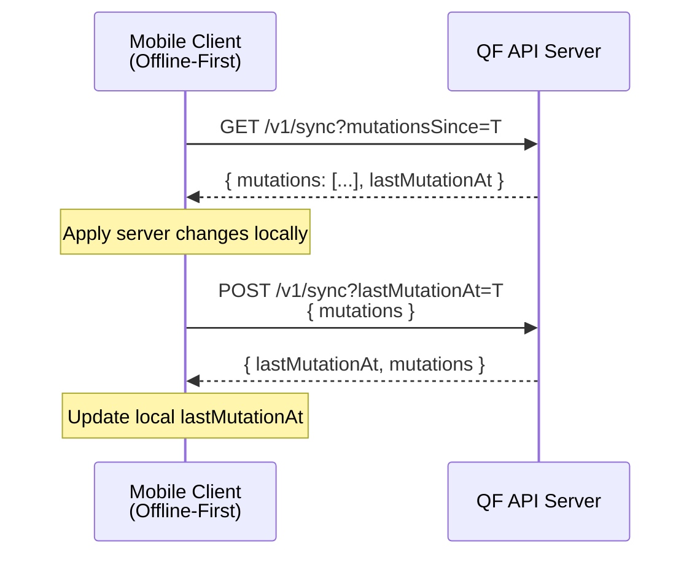
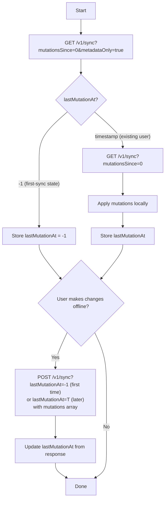

# Getting Started with Data Sync

The Quran.Foundation Sync API enables **offline-first mobile applications** to synchronize user data
across devices. This guide covers the core concepts and helps you implement your first sync flow.

## Overview

The Sync Layer provides:

1. **Pull Changes** — Fetch all mutations (creates, updates, deletes) that occurred after a timestamp
2. **Push Changes** — Batch-submit local mutations made while offline
3. **Conflict Detection** — Prevents data conflicts using `lastMutationAt` timestamps

## Prerequisites

Before using the Sync API, ensure you have:

1. **OAuth2 Client Credentials** — [Set up OAuth2](/docs/tutorials/oidc/getting-started-with-oauth2) for your app
2. **Required Scopes** — Request these scopes during authorization:
   - [`sync`](/docs/user_related_apis_versioned/scopes#sync) — Required for `GET /v1/sync` and `POST /v1/sync`
   - [`bookmark`](/docs/user_related_apis_versioned/scopes#bookmarks) — For syncing bookmarks
   - [`collection`](/docs/user_related_apis_versioned/scopes#collections) — For syncing collections
   - [`note`](/docs/user_related_apis_versioned/scopes#notes) — For syncing notes

:::tip Scope Requirements
You only receive mutations for resources your token has access to. If you request [`sync`](/docs/user_related_apis_versioned/scopes#sync) + [`bookmark`](/docs/user_related_apis_versioned/scopes#bookmarks) but not [`collection`](/docs/user_related_apis_versioned/scopes#collections), you won't see collection changes.
:::

## Supported Resources

The Sync API currently tracks these resources. All `/v1/sync` calls also require the [`sync`](/docs/user_related_apis_versioned/scopes#sync) scope.

| Resource              | Description                        | Required Scope                                                                                                                         |
| --------------------- | ---------------------------------- | -------------------------------------------------------------------------------------------------------------------------------------- |
| `BOOKMARK`            | User bookmarks (ayah, surah, etc.) | [`bookmark`](/docs/user_related_apis_versioned/scopes#bookmarks)                                                                       |
| `COLLECTION`          | User collections                   | [`collection`](/docs/user_related_apis_versioned/scopes#collections)                                                                   |
| `COLLECTION_BOOKMARK` | Bookmarks within collections       | [`bookmark`](/docs/user_related_apis_versioned/scopes#bookmarks), [`collection`](/docs/user_related_apis_versioned/scopes#collections) |
| `NOTE`                | User notes/reflections             | [`note`](/docs/user_related_apis_versioned/scopes#notes)                                                                               |

:::note Resource IDs vs composite keys
For `BOOKMARK`, `COLLECTION`, and `NOTE`, sync mutations include a single `resourceId`.
For `COLLECTION_BOOKMARK`, there is no single ID; use `data.collectionId` and `data.bookmarkId` instead and omit `resourceId` in your mutation.
:::

## Key Concepts

### lastMutationAt

A Unix timestamp (milliseconds) tracking the most recent mutation for a user. This is your sync cursor.

- **Stored locally** — Your app saves this after each successful sync
- **Sent with requests** — Include it to get only newer changes or validate your state
- **Updated by server** — The server assigns timestamps, ensuring consistent ordering

### First Sync Behavior

When a user has never synced before (no `lastMutationAt` stored on the server):

| Scenario                        | Server Response               | Client Action                                     |
| ------------------------------- | ----------------------------- | ------------------------------------------------- |
| No sync history yet             | `lastMutationAt: -1`          | Store `-1`, treat as first-sync state             |
| First mutation from this device | Send `lastMutationAt=-1`      | Server accepts, returns new timestamp             |
| User already has sync history   | `lastMutationAt: <timestamp>` | Store timestamp, fetch mutations since `0` (or T) |

:::warning First Sync Requirement
For a user's very first mutation via `POST /v1/sync`, you **must** send `lastMutationAt=-1`. Any other value will be rejected.
:::

## Quick Start: Your First Sync

### Step 1: Check Sync Status

First, check if the user has any existing data using `metadataOnly=true`. This returns only `lastMutationAt` without fetching mutations. (You still need to pass `mutationsSince`, even when `metadataOnly=true`.)

- `lastMutationAt: -1` means no sync history yet (first-sync state)
- Any positive number means existing data exists

### Step 2: Pull Existing Data

If the user has data (`lastMutationAt > -1`), fetch all mutations and apply them locally. Store the `lastMutationAt` value for future requests.

### Step 3: Push Local Changes

When the user creates data offline, push mutations to the server using `POST /v1/sync?lastMutationAt=...`. Update your local `lastMutationAt` from the response.

### API References

- [GET /v1/sync (Get mutations)](/docs/user_related_apis_versioned/get-mutations)
- [POST /v1/sync (Sync local mutations)](/docs/user_related_apis_versioned/sync-local-mutations)
- [POST /v1/bookmarks (Add bookmark)](/docs/user_related_apis_versioned/add-user-bookmark) — for bookmark field requirements

## Using metadataOnly for Efficiency

The `metadataOnly=true` parameter returns only the `lastMutationAt` without fetching mutations. Use it for:

1. **Pre-sync checks** — Quickly check if new data exists before a full sync
2. **Background polling** — Efficiently detect changes without heavy payloads
3. **Recovering state** — If you missed the `X-Mutation-At` header from a previous response

This is significantly faster than a full sync (single DB query vs multiple joins).

For the full request/response schema, see:

- [GET /v1/sync (Get mutations)](/docs/user_related_apis_versioned/get-mutations)

## Filtering & Pagination

`GET /v1/sync` supports resource filtering and pagination:

- `resources=BOOKMARK,COLLECTION` limits results to those resources
- `limit` and `page` paginate results (max `limit` is 1000)
- Continue fetching pages until `hasMore=false`

When `metadataOnly=true`, the response includes only `lastMutationAt` (no pagination fields).

## Important Notes

- **Mutation limits** — `POST /v1/sync` accepts a maximum of 100 mutations per request.
- **Direct endpoints** — Direct mutation endpoints (e.g. `POST /v1/bookmarks`) require `lastMutationAt` as a query param and return the `X-Mutation-At` header for updating `lastMutationAt`.

## Next Steps

- [Handling Conflicts](./handling-conflicts) — Learn how to handle 409 errors and resolve conflicts
- [Offline-First Patterns](./offline-first-patterns) — Best practices for client-side architecture
