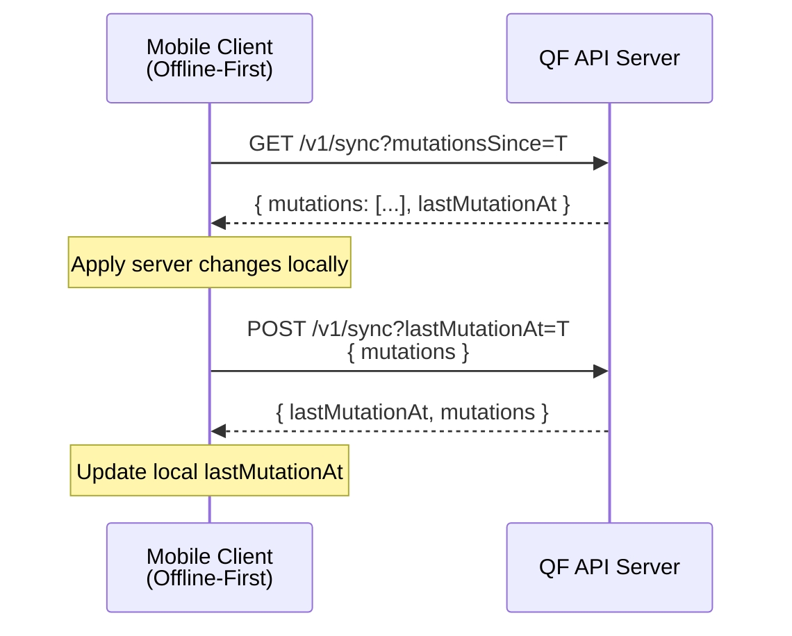
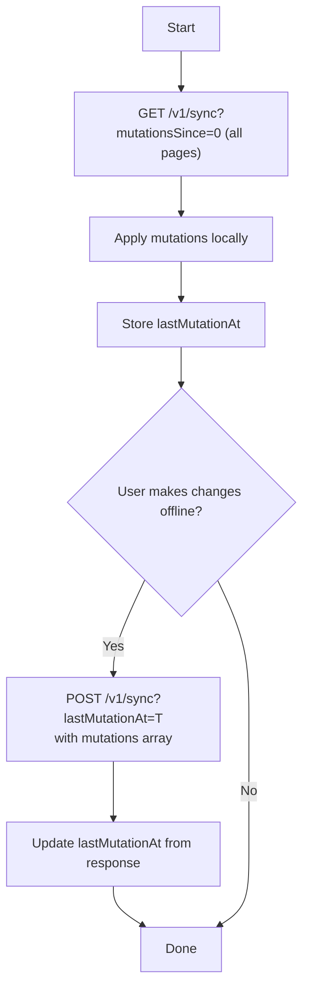

# Getting Started with Data Sync

The Quran Foundation Sync API enables **offline-first mobile applications** to synchronize user data
across devices. This guide covers the core concepts and helps you implement your first sync flow.

:::info Base URLs
The Sync API endpoints (`GET /v1/sync` and `POST /v1/sync`) are available in production and pre-live. Endpoint paths in this guide are relative to the User API auth base URL: `https://apis.quran.foundation/auth` for production and `https://apis-prelive.quran.foundation/auth` for pre-live.
:::

## Overview

The Sync Layer provides:

1. **Pull Changes** — Fetch all mutations (creates, updates, deletes) that occurred after a timestamp
2. **Push Changes** — Batch-submit local mutations made while offline
3. **Conflict Detection** — Prevents data conflicts using `lastMutationAt` timestamps

```mermaid
sequenceDiagram
    participant Client as Mobile Client<br/>(Offline-First)
    participant Server as QF API Server

    Client->>Server: GET /v1/sync?mutationsSince=T
    Server-->>Client: { mutations: [...], lastMutationAt }

    Note over Client: Apply server changes locally

    Client->>Server: POST /v1/sync?lastMutationAt=T<br/>{ mutations }
    Server-->>Client: { lastMutationAt, mutations }

    Note over Client: Update local lastMutationAt
```

## Prerequisites

Before using the Sync API, ensure you have:

1. **OAuth2 Client Credentials** — [Set up OAuth2](/docs/tutorials/oidc/getting-started-with-oauth2) for your app
2. **Required Scopes** — Request these scopes during authorization:
   - [`sync`](/docs/user_related_apis_versioned/scopes#sync) — Required for `GET /v1/sync` and `POST /v1/sync`
   - [`bookmark`](/docs/user_related_apis_versioned/scopes#bookmarks) — For syncing bookmarks
   - [`collection`](/docs/user_related_apis_versioned/scopes#collections) — For syncing collections
   - [`note`](/docs/user_related_apis_versioned/scopes#notes) — For syncing notes
   - [`reading_session`](/docs/user_related_apis_versioned/scopes#reading-sessions) — For syncing reading sessions

:::tip Scope Requirements
You only receive mutations for resources your token has access to. If you request [`sync`](/docs/user_related_apis_versioned/scopes#sync) + [`bookmark`](/docs/user_related_apis_versioned/scopes#bookmarks) but not [`collection`](/docs/user_related_apis_versioned/scopes#collections), you won't see collection changes.
:::

## Supported Resources

The Sync API currently tracks these resources. All `/v1/sync` calls also require the [`sync`](/docs/user_related_apis_versioned/scopes#sync) scope.

| Resource              | Description                        | Required Scope                                                                                                                         |
| --------------------- | ---------------------------------- | -------------------------------------------------------------------------------------------------------------------------------------- |
| `BOOKMARK`            | User bookmarks (ayah, surah, etc.) | [`bookmark`](/docs/user_related_apis_versioned/scopes#bookmarks)                                                                       |
| `COLLECTION`          | User collections                   | [`collection`](/docs/user_related_apis_versioned/scopes#collections)                                                                   |
| `COLLECTION_BOOKMARK` | Bookmarks within collections       | [`bookmark`](/docs/user_related_apis_versioned/scopes#bookmarks), [`collection`](/docs/user_related_apis_versioned/scopes#collections) |
| `NOTE`                | User notes/reflections             | [`note`](/docs/user_related_apis_versioned/scopes#notes)                                                                               |
| `READING_SESSION`     | User reading sessions              | [`reading_session`](/docs/user_related_apis_versioned/scopes#reading-sessions)                                                         |
| `READING_BOOKMARK`    | Reading bookmark slots             | [`bookmark`](/docs/user_related_apis_versioned/scopes#bookmarks)                                                                       |

:::note Resource IDs vs composite keys
For `BOOKMARK`, `COLLECTION`, and `NOTE`, sync mutations include a single `resourceId`.
For `COLLECTION_BOOKMARK`, there is no single ID; omit `resourceId`. Create mutations identify the bookmark by a collection-bookmark request body plus `data.collectionId`: ayah bodies use `key` and `verseNumber`, while surah/juz/page bodies use `key`; include `type`, `mushafId`, and `mushaf` according to the collection bookmark schema. Delete mutations may use either those same bookmark details or `data.bookmarkId`, always with `data.collectionId`. Pull responses can include `data.bookmarkId` because the backend has already resolved the bookmark to its stored ID.
:::

:::note Favorites/default collection
The Quran.com Favorites collection uses the virtual collection ID `__default__`.

Push Favorites changes through `POST /v1/sync` as `COLLECTION_BOOKMARK` mutations with `data.collectionId: "__default__"`. Create mutations use a collection-bookmark request body: ayah bodies use `key` and `verseNumber`, while surah/juz/page bodies use `key`; include `type`, `mushafId`, and `mushaf` according to the collection bookmark schema. Delete mutations may use either `data.bookmarkId` or the same bookmark details. The virtual collection does not create a real `CollectionBookmark` row. Pulls return Favorites changes as `COLLECTION_BOOKMARK` mutations with `__default__` as the collection, and the bookmark itself carries `BOOKMARK.isInDefaultCollection`; treat `isInDefaultCollection` as the source of truth for membership.

Creating a `BOOKMARK` (other than a reading bookmark) also adds it to Favorites. A following `__default__` create for the same bookmark changes nothing and returns the unchanged `lastMutationAt`.

Removing a bookmark from Favorites deletes the bookmark when it is in no other collection and is not used as a reading bookmark. The pull then also returns a `BOOKMARK` `DELETE`.

Clients that do not use the Sync API can keep using the direct collection endpoints. Use `POST /v1/collections/__default__/bookmarks` to add Favorites. To remove Favorites, prefer `DELETE /v1/collections/__default__/bookmarks/{bookmarkId}` when you have the bookmark ID, or use `DELETE /v1/collections/__default__/bookmarks` with a JSON body containing either `bookmarkId` or the bookmark details.
:::

## Key Concepts

### lastMutationAt

`lastMutationAt` is the user's **sync head**: a server-assigned Unix timestamp in milliseconds for the most recent mutation, including virtual resources such as the default Favorites collection.

- **Authoritative on the server** — it is always assigned by the server; clients never invent it
- **Stored locally** — persist the value returned by the latest `GET` or `POST`
- **Sent as a precondition on push** — `POST /v1/sync` requires the current head and rejects a stale or different value with `409`
- **Sent as the continuation head on production pulls** — page 2 and later of a production `GET /v1/sync` pull send the head returned by page 1 (see [Step 2](#step-2-pull-and-apply-mutations))

### First Sync Behavior

Every user already has a sync head, even before their first sync. It is never `-1`: it is at least the time the account was created, and it moves forward with each change. `POST /v1/sync` only accepts the exact current head, so always read it from the server before your first push.

| Scenario                     | What to do                                                                                              |
| ---------------------------- | ------------------------------------------------------------------------------------------------------- |
| First sync on this device    | Call `GET /v1/sync?mutationsSince=0`, apply all pages, then store the returned `lastMutationAt`          |
| First push from this device  | Send the `lastMutationAt` from your latest pull (or from `metadataOnly=true`), never a made-up value     |
| Later syncs                  | Pull with `mutationsSince=<stored lastMutationAt>`, then push with the head from that pull or last push |

:::warning Don't send `-1`
Older versions of this guide said to send `lastMutationAt=-1` for a user's first push. The API now rejects that with `409`. Read the head with `GET /v1/sync` first.
:::

## Quick Start: Your First Sync

```mermaid
flowchart TD
    A[Start] --> B["GET /v1/sync?mutationsSince=0 (all pages)"]
    B --> C["Apply mutations locally"]
    C --> D["Store lastMutationAt"]
    D --> H{User makes changes offline?}
    H -->|Yes| I["POST /v1/sync?lastMutationAt=T<br/>with mutations array"]
    I --> J["Update lastMutationAt from response"]
    J --> K[Done]
    H -->|No| K
```

### Step 1: Read the Sync Head

Optionally check the current head with `metadataOnly=true`. This returns only `lastMutationAt` without fetching mutations. (You still need to pass `mutationsSince`, even when `metadataOnly=true`.) Use it to skip a pull when nothing changed since your stored value.

### Step 2: Pull and Apply Mutations

Fetch all mutations since `0` on a new device (or since your stored value later), page through until `hasMore=false`, and apply them locally. Store the `lastMutationAt` from the final page for future requests.

For pagination, keep `mutationsSince`, `resources` and `limit` the same on every page of a pull.

- **Production:** page 2 and later must also send `lastMutationAt` set to the head returned by page 1. If the head changed, the server returns `409 OutOfSyncError` because another write landed mid-pull: restart from page 1 with the original `mutationsSince`. A missing head also returns `409`; that is a request bug, so add the parameter rather than restarting.
- **Pre-live:** do not send `lastMutationAt` on `GET /v1/sync` (pre-live rejects the parameter). Instead, compare the `lastMutationAt` returned by each page with page 1's, and restart from page 1 if it changed.

### Step 3: Push Local Changes

When the user creates data offline, send `POST /v1/sync?lastMutationAt=<current head>` with up to 100 mutations, using the head returned by the latest `GET`, pull, or push. Store the head returned by the response.

If the push returns `409 OutOfSyncError`, another device wrote first: pull, replay the local changes on top, then push again with the new head.

### API References

- [GET /v1/sync (Get mutations)](/docs/user_related_apis_versioned/1.0.0/get-mutations/)
- [POST /v1/sync (Sync local mutations)](/docs/user_related_apis_versioned/1.0.0/sync-local-mutations/)

## Using metadataOnly for Efficiency

The `metadataOnly=true` parameter returns only the `lastMutationAt` without fetching mutations. Use it for:

1. **Pre-sync checks** — Quickly check if new data exists before a full sync
2. **Background polling** — Efficiently detect changes without heavy payloads
3. **Recovering state** — If you missed the `X-Mutation-At` header from a previous response

This is significantly faster than a full sync (single DB query vs multiple joins).

For the full request/response schema, see:

- [GET /v1/sync (Get mutations)](/docs/user_related_apis_versioned/1.0.0/get-mutations/)

## Filtering & Pagination

`GET /v1/sync` supports resource filtering and pagination:

- `resources=BOOKMARK,COLLECTION` limits results to those resources
- `limit` and `page` paginate results (max `limit` is 1000)
- Continue fetching pages until `hasMore=false`
- Page 2 and later follow the continuation rules in [Step 2](#step-2-pull-and-apply-mutations)

When `metadataOnly=true`, the response includes only `lastMutationAt` (no pagination fields).

## Important Notes

- **Mutation limits** — `POST /v1/sync` accepts a maximum of 100 mutations per request.
- **Favorites/default collection** — Use `COLLECTION_BOOKMARK` with `data.collectionId: "__default__"` to push default collection membership. Create with a collection-bookmark request body: ayah bodies use `key` and `verseNumber`, while surah/juz/page bodies use `key`; include `type`, `mushafId`, and `mushaf` according to the collection bookmark schema. Delete with either `data.bookmarkId` or bookmark details. Pull default membership from `BOOKMARK.isInDefaultCollection`. Removing a bookmark that is in no other collection deletes the bookmark.

## Next Steps

- [Handling Conflicts](/docs/tutorials/sync/handling-conflicts/) — Learn how to handle 409 errors and resolve conflicts
- [Offline-First Patterns](/docs/tutorials/sync/offline-first-patterns/) — Best practices for client-side architecture
