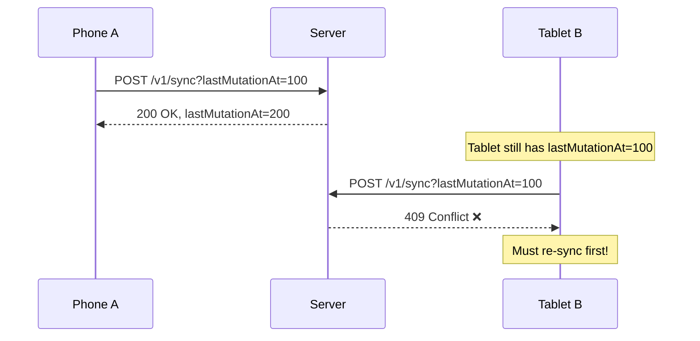
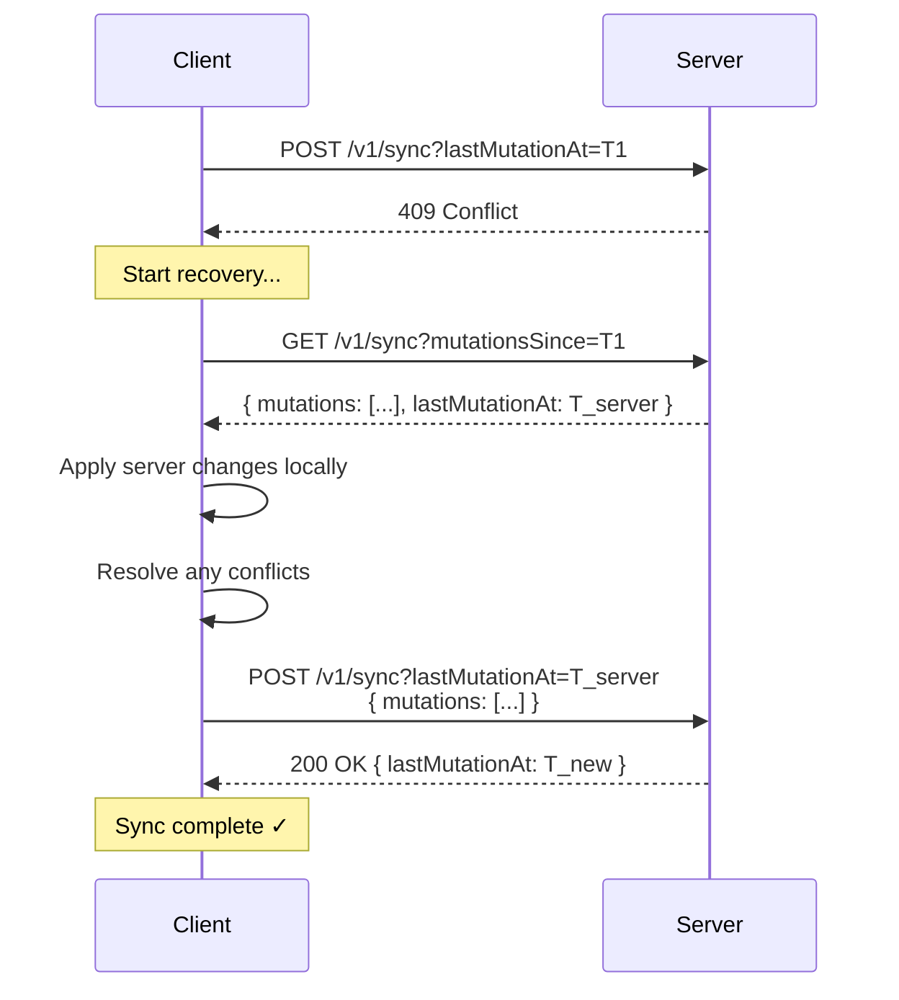

# Handling Sync Conflicts

When your client's `lastMutationAt` doesn't exactly match the server's state, you'll receive a **409 Conflict** error. This guide explains when conflicts occur and how to resolve them.

## When Conflicts Occur

A 409 `OutOfSyncError` happens when:

1. **Another device synced** — User made changes on a different device
2. **Concurrent mutations** — Server received mutations while you were offline
3. **Missed header** — Client didn't capture the `X-Mutation-At` response header
4. **First sync mismatch** — Sending wrong `lastMutationAt` for a new user

## The 409 Error Response

When a conflict occurs, the server responds:

- **Error code:** `OutOfSyncError`
- **Message:** `Invalid lastMutationAt, please re-sync your data and try again.`

**HTTP Status:** `409 Conflict`

### First-Sync Variant

If this is a new user's first sync and you send the wrong `lastMutationAt`:

- **Error code:** `OutOfSyncError`
- **Message:** `First sync detected. Please use lastMutationAt=-1 for initial sync.`

## Conflict Resolution Flow

Here's the standard recovery pattern:

### Step-by-Step Recovery

1. **Catch the 409 error**
2. **Fetch server changes** — `GET /v1/sync?mutationsSince=<your_lastMutationAt>`
3. **Apply server mutations** to your local database
4. **Resolve conflicts** if the same resource was modified both locally and remotely
5. **Retry your mutations** with the new `lastMutationAt`

## Code Example

For production-ready implementations, see the [SDK docs](/docs/sdk).

## Conflict Resolution Strategies

When the same resource is modified both locally and on the server, you need a strategy:

### 1. Server Wins (Recommended for simplicity)

Server changes always take precedence. Discard conflicting local changes.

### 2. Client Wins

Local changes always take precedence. Re-submit all local mutations.

### 3. Last-Write Wins

Compare timestamps and keep the most recent change.

### 4. Merge (Complex)

Combine changes field-by-field. Best for resources with independent fields.

## Recovering lastMutationAt

If your client loses track of `lastMutationAt` (e.g., app crash, missed header), use `metadataOnly`:

This quickly retrieves the current `lastMutationAt` without fetching all mutations. You still need to pass `mutationsSince` in the request.

See the full request/response schema in the API reference:

- [GET /v1/sync (Get mutations)](/docs/user_related_apis_versioned/get-mutations)

## Direct Mutation Endpoints

When using direct mutation endpoints (e.g., `POST /v1/bookmarks`), the same conflict rules apply:

1. Include `lastMutationAt` as a query parameter
2. Check for 409 responses
3. Update `lastMutationAt` from the `X-Mutation-At` response header

:::tip Always Capture the Header
Store the `X-Mutation-At` header value after every successful mutation. If you miss it, use `metadataOnly=true` to recover.
:::

## Best Practices

1. **Always handle 409** — Don't assume sync will succeed
2. **Queue mutations locally** — Store pending changes before attempting sync
3. **Implement retry logic** — Automatic recovery improves UX
4. **Choose a consistent strategy** — Pick one conflict resolution approach and stick with it
5. **Log conflicts** — Track how often conflicts occur to optimize your sync frequency

## Next Steps

- [Offline-First Patterns](./offline-first-patterns) — Architecture for robust offline support
