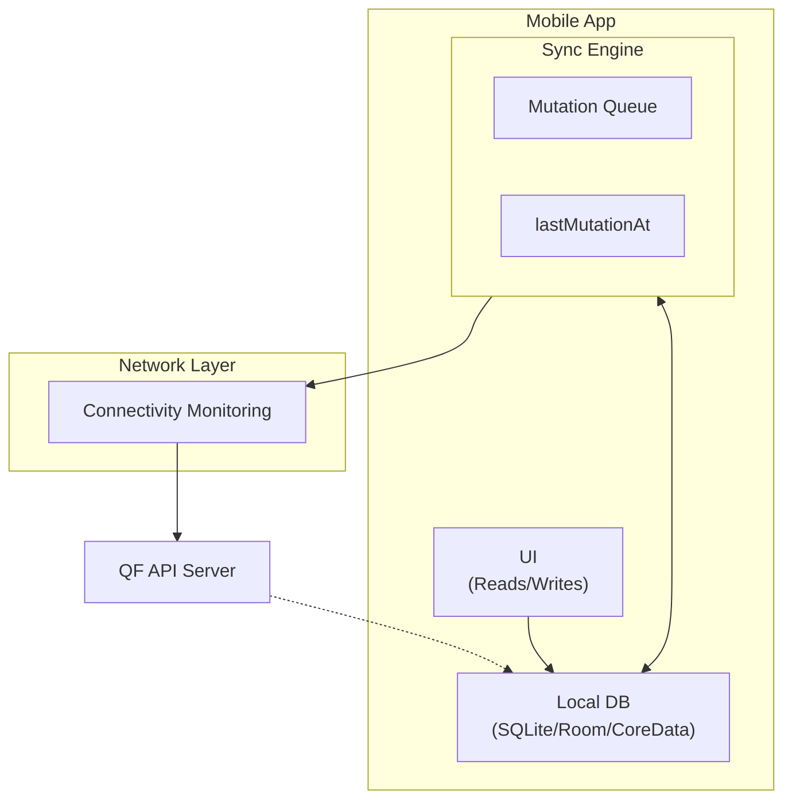

# Offline-First Architecture Patterns

This guide covers best practices for building mobile apps that work seamlessly offline and sync reliably when connectivity is restored.

:::tip SDK Implementations
For production-ready implementations, see our [SDK docs](/docs/sdk).
:::

## Core Principles

1. **Local-first** — All reads and writes happen against local storage first
2. **Optimistic UI** — Show changes immediately, sync in background
3. **Queue mutations** — Store pending changes for later sync
4. **Graceful degradation** — App works fully offline, syncs when possible

## Architecture Overview



## Local Storage Design

### Data Model

Store synced resources with metadata. Resource fields vary by type, so keep them in a data payload you can map into your domain model.

```typescript
interface LocalResource<TData = Record<string, any>> {
  // Server fields
  id: string;
  resource: "BOOKMARK" | "COLLECTION" | "COLLECTION_BOOKMARK" | "NOTE";
  data: TData;

  // Sync metadata
  syncStatus: "synced" | "pending_create" | "pending_update" | "pending_delete";
  localUpdatedAt: number; // Local timestamp for conflict detection
  serverTimestamp?: number; // From mutation response
}
```

### Sync Metadata Table

Track global sync state:

```typescript
interface SyncMetadata {
  lastMutationAt: number; // Server's latest mutation timestamp
  lastSyncAttempt: number; // When we last tried to sync
  lastSuccessfulSync: number; // When sync last succeeded
  pendingMutationCount: number; // Mutations waiting to sync
}
```

## Mutation Queue

Queue all local changes for reliable sync:

```typescript
interface QueuedMutation {
  id: string; // Local unique ID
  type: "CREATE" | "UPDATE" | "DELETE";
  resource: string;
  resourceId?: string; // For UPDATE/DELETE
  data: Record<string, any>;
  createdAt: number; // When queued
  retryCount: number; // For exponential backoff
  lastError?: string; // Track failures
}
```

## Sync Engine

Your sync engine should follow a **pull → apply → push** cycle and handle 409 conflicts by re-syncing before retrying local mutations. For a production-ready implementation, see the [SDK docs](/docs/sdk).

### Pull → Apply → Push (with pagination)

1. **Pull** — Call `GET /v1/sync?mutationsSince=T` and page through results (`page`/`limit`) until `hasMore=false`.
2. **Apply** — Apply mutations in timestamp order and update local records.
3. **Push** — Send queued mutations with `POST /v1/sync?lastMutationAt=T` and update `lastMutationAt` from the response.

## Connectivity Handling

Monitor connectivity and trigger sync when connectivity is restored. Use `metadataOnly=true` for lightweight polling to detect server changes.

## Optimistic Updates

Update UI immediately, sync in background:

Apply local changes immediately, then enqueue mutations for sync. When the server responds, reconcile local IDs and timestamps with server-assigned values.

### Handling Sync Results

When the server returns mutation results, update local records with server IDs and timestamps, then dequeue the synced mutations. For direct mutation endpoints (e.g., `POST /v1/bookmarks`), read `X-Mutation-At` from the response header and persist it as your new `lastMutationAt`.

## Error Handling & Retry

Implement exponential backoff for failed syncs:

Use exponential backoff, cap retry attempts, and persist failures so users can recover changes later.

## Best Practices Summary

| Practice                | Description                              |
| ----------------------- | ---------------------------------------- |
| **Local-first**         | Always read/write locally first          |
| **Queue everything**    | Never lose mutations - queue before sync |
| **Optimistic UI**       | Show changes immediately                 |
| **Handle offline**      | App should work without network          |
| **Batch syncs**         | Minimize network requests                |
| **Exponential backoff** | Don't hammer the server on failures      |
| **Background sync**     | Keep data fresh automatically            |
| **Conflict strategy**   | Pick one approach and be consistent      |
