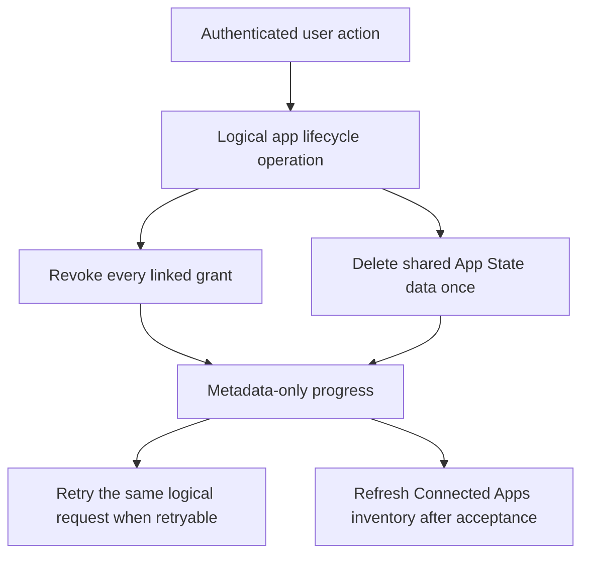

# App State lifecycle and launch policy

App State access and App State data deletion are independent actions. A user can revoke OAuth
access without deleting retained state, delete app data without changing every linked grant, or ask
the canonical lifecycle service to do both. This page distinguishes implemented behavior from
policy decisions that still require accountable approval.

## User Connected Apps operations

The authenticated Users API exposes two additive metadata-only operations:

Both successful operations use the JSON success envelope `{ success, data }`. The inventory payload
is `data.apps`; every returned `appId` is a UUID. The lifecycle path `appId` and body `requestId` are
UUIDs, and the POST lifecycle result is nested under `data`.

| Operation | Contract |
| --- | --- |
| `GET /auth/v1/users/connected-apps` | Groups every linked OAuth client under one logical app. Returns app identity/display metadata, environment, storage status/categories, recorded grant scopes, effective scopes, and approved last-access metadata in `data.apps`. It never returns raw OAuth client or namespace identifiers or App State documents. |
| `POST /auth/v1/users/connected-apps/{appId}/lifecycle` | Accepts required `action` and high-entropy UUID `requestId`, then returns `requestId`, `action`, overall `status`, `retryable`, and metadata-only `progress` inside `data`. An exact retry reuses the same request ID and body. |

The `400`, `404`, `409`, `500`, and `503` service failures use the service-error envelope
`{ success: false, error }`. The `401` response is the authenticated-session boundary and is
documented separately rather than being presented as a service error.

| Status | Operations | Meaning |
| --- | --- | --- |
| 400 | Lifecycle POST | The action, app UUID, request UUID, or request body was rejected. |
| 401 | Inventory and lifecycle POST | A valid Quran.com user session is required. |
| 404 | Lifecycle POST | The requested connected logical app was not found for the user. |
| 409 | Lifecycle POST | The lifecycle operation was rejected because its request conflicts with current state. |
| 500 | Inventory and lifecycle POST | An unexpected Connected Apps service failure occurred. |
| 503 | Inventory and lifecycle POST | A required Connected Apps dependency is temporarily unavailable. |

The exact actions are:

- `REVOKE`: revoke the user's access for every OAuth client linked to the logical app.
- `DELETE_DATA`: delete the shared App State namespace once, not once per linked client.
- `REVOKE_AND_DELETE`: perform the grouped revocation and the one data deletion through the
  canonical idempotent operation.

Progress separates revoke and delete-data steps. Partial or external-provider failure remains
retryable and must not be reported as complete. A user interface keeps the original request ID and
action in memory for safe retry, disables duplicate submission while a request is pending, and
refreshes inventory only after an accepted result.

## Conceptual diagram: logical-app lifecycle

This diagram is conceptual; it does not add routes, states, or response fields beyond the generated
contract.

## Storage status behavior

| Storage status | Ordinary App State use | Lifecycle behavior |
| --- | --- | --- |
| `active` | Subject to enabled data groups, scopes, and quota. | Revoke, delete-data, and combined actions are available. |
| `disabled` | New partner storage remains disabled. | Data deletion and grouped lifecycle resolution still work. |
| `suspended` | Normal App State access is blocked by policy. | Data deletion and grouped lifecycle resolution still work. |
| `archived` | Normal App State access is not treated as active. | Data deletion and grouped lifecycle resolution still work. |

Disabled, suspended, and archived are not reasons to strand user data. They do not bypass
authorization or make the namespace writable; they preserve the canonical deletion path.

## App/client removal, closure, and ownership

The implemented grouping boundary maps a linked client to its canonical app/environment, covers
every sibling client, revokes each linked grant, and sends one namespace deletion target. Admin and
other staff tools must use that grouped lifecycle instead of directly deleting one linked provider
client and leaving an active binding. Retrying a partial operation uses the same request ID.

No ownership-transfer or app-closure state-transfer policy is approved. Do not infer that private
App State follows a new owner, can be exported to an owner, or can be silently inherited by a
recreated client. Until those decisions are approved, keep normal access disabled and use only the
reviewed lifecycle operations authorized for the current user.

## Account deletion

- Self-service account deletion keeps its existing route and request/response compatibility. The
  Users service covers every App State namespace as part of the same lifecycle-aware deletion; the
  Quran.com user interface waits for the request result and does not claim completion early.
- Staff/system deletion and existing signed internal callers use the same canonical Users data
  plane. They do not create an alternate provider client or parallel deletion mechanism.
- Incoming user-deletion lifecycle events and replayed deletion for an already-absent user remain
  idempotent.
- Locally, account deletion locks the user, orders namespace fences, writes metadata-only retained
  audit records, and removes user-owned App State in one transaction. A concurrent write cannot
  survive that deletion. Completion events are emitted only after commit.
- Audit and telemetry never include App State bodies, values, tokens, cursors, dynamic key
  identifiers, namespace identifiers, raw user identifiers, raw client identifiers, deletion
  reasons, credentials, or sensitive literal paths.

The existence of retained audit metadata does not approve a retention duration. Backup expiry and
restoration rules also remain unresolved; operators must not restore deleted App State without an
explicit approved policy and evidence.

## Revocation bound

The implemented Gateway positive introspection cache uses the shorter of access-token lifetime and
60 seconds. Cache identity is derived from a token hash and the cached value contains only safe
introspection fields. Raw credentials are never cached. Therefore a cached positive result cannot
extend beyond 60 seconds, but the accountable approval and evidence for that revocation SLA remain
Pending and are a launch blocker.

## Pending policy decisions

`Pending` is deliberate. No owner, approval, duration, or evidence is inferred from implementation
code, example limits, or a passing local test. In particular, the configuration field
`changeRetentionDays` concerns change-stream recovery and is not approval for retained App State,
audit, or backup duration.

| Policy decision | Status | Accountable owner/approver | Approval or deployed evidence required before enablement |
| --- | --- | --- | --- |
| Accountable approver | Pending | Pending | Named human approver and recorded decision. |
| Revocation access SLA (implemented maximum: 60 seconds) | Pending | Pending | Product/security approval plus deployed pre-live evidence. |
| Retained-state duration | Pending | Pending | Duration, legal/privacy basis, and deletion trigger. |
| Deletion-completion SLA | Pending | Pending | User/staff expectation, retry escalation, and measured evidence. |
| Backup expiry and restoration policy | Pending | Pending | Backup expiry, restore limits, deletion propagation, and operator controls. |
| Ownership transfer | Pending | Pending | Whether transfer is allowed and how consent, isolation, and audit work. |
| App/client removal | Pending | Pending | Closure/removal policy and repair owner beyond the implemented grouped mechanism. |
| App closure | Pending | Pending | Data/grant disposition and user communication. |
| Self-service account deletion | Pending | Pending | Product/privacy approval and end-to-end deployed evidence. |
| Staff account deletion | Pending | Pending | Authorized roles, audit requirements, and end-to-end deployed evidence. |
| Disabled, suspended, and archived deletion | Pending | Pending | Policy approval and deployed evidence that deletion remains available. |
| Lifecycle-operation audit retention | Pending | Pending | Retention duration, access controls, and deletion/expiry behavior. |

## Launch gate

**Launch status: NO-LAUNCH.**

Partner traffic remains disabled. The user interface remains disabled. Documentation, local tests,
reviewed commits, or generated contracts do not change that state. Production enablement is blocked
until every row above has a named accountable owner, explicit approval, and required evidence, and
Task 17 supplies deployed prelive evidence for the mixed-version matrix, full request chain,
reconciliation/recovery, revocation bound, lifecycle deletion, privacy assertions, monitoring, and
rollback.

Task 17 must supply deployed prelive evidence before launch.

Rollout must remain backward compatible: old and new Platform, Gateway, Users, SDK, Admin, Console,
and frontend binaries interoperate, and rollback disables grants/routes without destructive schema
reversal. No partner pilot or UI rollout starts from local-only evidence.

## Related pages

- [App State API contract](./index)
- [Transactional reconciliation](../reconciliation/)
