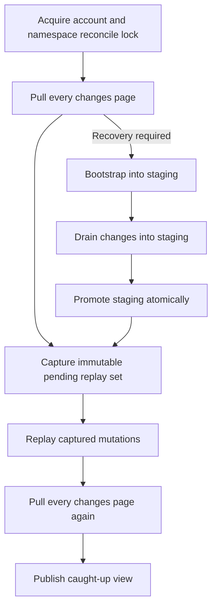

# Transactional App State reconciliation

Use a reconciler when an app must work offline, survive process crashes, or coordinate multiple
devices. Keep the seven-operation low-level HTTP layer available for direct calls; the reconciler is
an additive state machine over that transport, not a replacement wire protocol.

## State model

Persist these fields per explicit verified account and resolved namespace boundary:

- `shadow`: the last committed server state, including tombstone lineage.
- `stagingBootstrap`: an unexposed base scan being assembled.
- `syncToken`: the opaque incremental checkpoint.
- `bootstrapCursor`: the opaque base-scan continuation.
- `pendingMutations`: immutable local replacement/delete intents awaiting replay.
- `localRevision`: the local order used to capture and retire pending work safely.

App-visible state is a derived overlay: server shadow plus pending local intent. Keep this visible
view separate from durable shadow so bootstrap recovery never discards an offline edit.

## Conceptual diagram: one reconciliation run

This diagram is conceptual. The exact wire fields and statuses are defined by the
[API contract](./index).

The run order is pull, captured replay, then pull again. Queue writes may continue while network I/O
is in flight, but only the captured local revisions are retired. A mutation queued later remains
pending for the next run.

## Page and checkpoint atomicity

Apply each complete page and its returned token in one local transaction. A crash before commit
leaves both the prior shadow and prior checkpoint. A crash after commit leaves both the new shadow
and new checkpoint. Never persist a checkpoint independently from the state it represents.

For bootstrap:

1. Start or resume `stagingBootstrap`; never expose a partial staging snapshot.
2. Persist each complete bootstrap page with `bootstrapCursor` atomically.
3. Require the terminal page's `nextSyncToken`.
4. Drain `GET /auth/v1/app-state:changes` from that checkpoint into staging.
5. Promote staging to server shadow only after the drain has completed with `hasMore` false.

If bootstrap or its drain reports `410`, discard only the partial staging scan and restart. Preserve
pending local mutations, conflicted work, and blocked work.

On `410`, preserve pending mutations while rebuilding server shadow. Keep staging isolated, drain
changes into staging, and promote only after the terminal page commits.

## Change application

- Apply a server document or tombstone only when its numeric `version` is greater than the version
  already retained for the same logical key.
- Ignore a byte-identical duplicate.
- Treat a same-version conflicting payload as a protocol error. Do not commit the page or its
  checkpoint.
- Out-of-order older pages cannot replace a newer retained version.
- Apply an upsert to shadow; apply a delete operation as a tombstone that hides the live document
  while retaining lineage metadata.

## Tombstone pruning and recreation

Document version is opaque. The version increases on each server mutation: put, delete, and
recreation. Tombstone consumption retains the tombstone lineage version. Payload pruning also
retains that lineage version; it may remove retained tombstone payload/history only after a valid
watermark.

After prune, the recreated document version must be greater than the tombstone version. Apply the
recreated upsert before the token can advance. This prevents an existing SDK's strictly-newer rule
from rejecting a legitimate recreation as stale.

Prune retains the lineage version. The token may advance only after applying the recreated upsert.

## Mutation replay and conflicts

Snapshot method, encoded path, complete request body, preconditions, and `Idempotency-Key` before
awaiting authentication or network work. Reuse the key only while this mutation fingerprint is
byte-identical.

For a strict `412` conflict:

1. Read the current document; a document-not-found result means the current live state is absent.
2. Preserve the queued complete replacement or delete intent. Do not perform a generic merge or
   automatic overwrite.
3. Update `If-Match` or `If-None-Match` to match the refreshed state.
4. Rotate the idempotency key only when that change alters the request fingerprint.
5. Retry within a bounded rebase count; otherwise expose a conflict state to the app.

A delete of an already-absent document is reconciled. An ambiguous `500` or transport failure uses
the same bytes, precondition, and idempotency key with bounded backoff. Respect `Retry-After` on
`429`. Authentication, validation, policy, local-storage, and protocol failures remain explicit
states rather than silent drops.

## `410` recovery

For synchronization recovery, `410 bootstrap_required` or `410 sync_token_expired` means:

1. Preserve pending mutations.
2. Bootstrap into staging.
3. Drain changes into staging.
4. Promote staging.
5. Replay the captured pending mutations.
6. Pull again before reporting caught up.

This is the frozen client action: Preserve pending mutations, bootstrap into staging, drain changes, promote, replay, then pull again.

Status-only `410` fallback belongs to bootstrap/change synchronization. Do not reinterpret an
unrelated mutation failure globally; use the symbolic service codes and operation-specific rules.

## Account switching

Use an explicit non-empty account identity and an account generation counter. Capture both before
any transport call. On sign-out or account switch, advance the generation, change the visible
account immediately, and reject every late result or response whose account generation is stale.

A late response is rejected before classification, recovery, refresh, or commit.

Never infer the account by decoding an opaque credential. Store shadow, staging, checkpoints,
pending mutations, and local revisions independently per account/namespace. Clear in-memory
references and cancel app-visible subscriptions from the old account so one user's documents never
flash into another user's view.

## Low-level HTTP and reconciler SDK layers

The reviewed JavaScript and Python changes are additive and remain unpublished/pre-live until the
launch gate passes. Keep existing imports and low-level calls working; opt into reconciliation only
when the application provides durable transactional storage.

| Layer | JavaScript / TypeScript | Python | Use it for |
| --- | --- | --- | --- |
| Low-level HTTP | Existing `client.auth.appState` and `client.auth.v1.appState` facades implement `AppStateTransport` and the seven operation methods. | Existing synchronous `get_app_state_configuration`, `bootstrap_app_state`, `get_app_state_changes`, `list_app_state_documents`, `get_app_state_document`, `put_app_state_document`, and `delete_app_state_document`. | Direct online calls or an application's own state machine. |
| Reconciler | `createAppStateReconciler` with an `AppStateStore`; `createAppStateMemoryStore` is a reference, not durable production storage. | `AppStateReconciler` with an `AppStateStore`; `MemoryAppStateStore` is a reference, not durable production storage. | Offline queues, atomic page/checkpoint commits, recovery, and account isolation. |

The JavaScript reconciler/store reducers are synchronous and transactional. Python exposes the same
language-neutral behavior with synchronous transactional reducers. Production adapters must commit
a reducer atomically, reject asynchronous/network work inside the transaction, and return isolated
copies or immutable views.

## Secure native and mobile storage

- Encrypt durable state at rest using the platform's protected storage facilities and database
  encryption appropriate to the threat model.
- Keep OAuth credentials in the platform credential store, never in the App State database.
- Never put App State bodies, values, tokens, cursors, dynamic key identifiers, namespace
  identifiers, raw user identifiers, raw client identifiers, deletion reasons, credentials, or
  literal paths in logs, analytics, traces, crash reports, push payloads, filenames, or backup
  labels.
- Redact errors before surfacing them to telemetry. Preserve status, safe error type/code, and
  retry metadata for the state machine.
- Test crash points around page commit, bootstrap promotion, mutation response/local commit, and
  account switching.

## Related pages

- [App State API contract](./index)
- [Lifecycle and launch policy](../lifecycle/)
