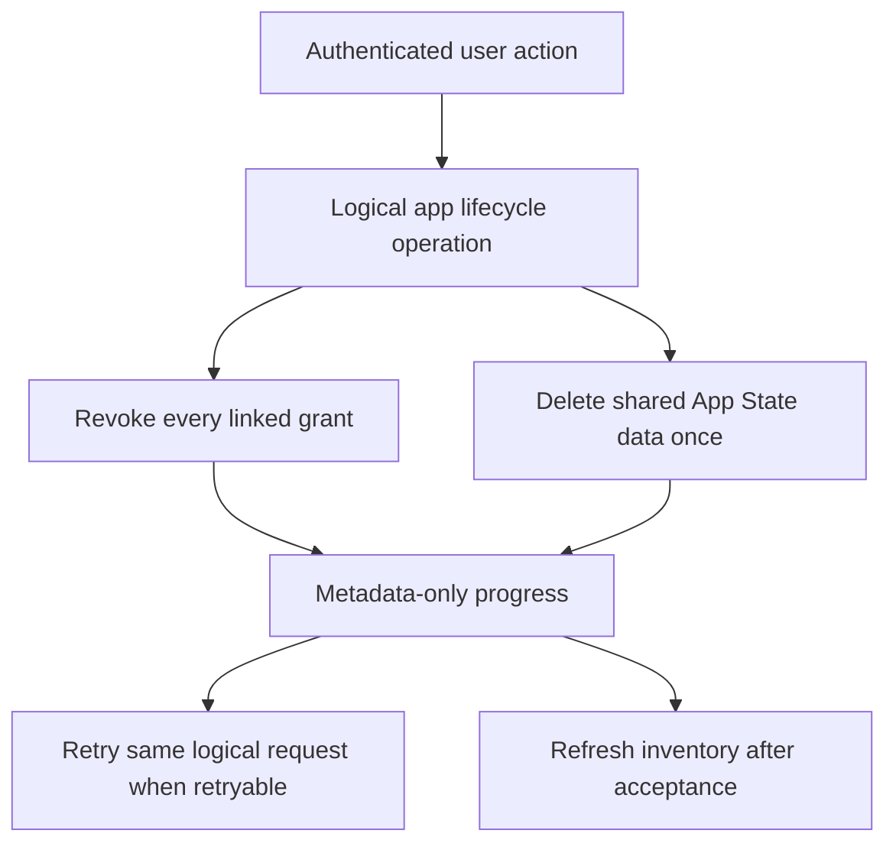

# App State lifecycle and launch policy

Access revocation and data deletion are independent. A user can revoke linked OAuth access, delete
the logical app's data, or request both through one canonical idempotent lifecycle operation. This
page separates reviewed implementation behavior from policy decisions that remain unapproved.

## User Connected Apps operations

Both successful operations use the JSON success envelope `{ success, data }`. The inventory payload
is `data.apps`; every returned `appId` is a UUID. The lifecycle path `appId` and body `requestId` are
UUIDs, and the POST lifecycle result is nested under `data`.

| Operation | Contract |
| --- | --- |
| `GET /auth/v1/users/connected-apps` | Groups linked OAuth clients under one logical app and returns only app display/environment, storage, grant/effective-scope, and approved last-access metadata in `data.apps`. Raw provider client and namespace identifiers and App State documents are excluded. |
| `POST /auth/v1/users/connected-apps/{appId}/lifecycle` | Requires `action` and a high-entropy UUID `requestId`; returns `requestId`, `action`, `status`, `retryable`, and metadata-only `progress` inside `data`. Exact retries reuse the request ID and body. |

The `400`, `404`, `409`, `500`, and `503` service failures use the service-error envelope
`{ success: false, error }`. The `401` response is the authenticated-session boundary and is
documented separately rather than being presented as a service error.

| Status | Operations | Meaning |
| --- | --- | --- |
| 400 | Lifecycle POST | The action, app UUID, request UUID, or request body was rejected. |
| 401 | Inventory and lifecycle POST | A valid Quran.com user session is required. |
| 404 | Lifecycle POST | The requested connected logical app was not found for the user. |
| 409 | Lifecycle POST | The lifecycle operation was rejected because its request conflicts with current state. |
| 500 | Inventory and lifecycle POST | An unexpected Connected Apps service failure occurred. |
| 503 | Inventory and lifecycle POST | A required Connected Apps dependency is temporarily unavailable. |

The actions are:

- `REVOKE`: revoke the user's access for every linked OAuth client.
- `DELETE_DATA`: delete the one shared App State namespace once.
- `REVOKE_AND_DELETE`: perform grouped revocation and one deletion through the canonical operation.

Partial provider/data-plane failure stays retryable and cannot be called complete. A user interface
retains the exact logical request for retry, disables duplicate submission while pending, and
refreshes inventory after an accepted result.

## Conceptual diagram: logical-app lifecycle

This diagram is conceptual and does not define new routes, fields, or states.

## Storage status behavior

| Status | Ordinary use | Lifecycle behavior |
| --- | --- | --- |
| `active` | Governed by data-group policy, scope, and quota. | Revoke, delete-data, and combined actions are available. |
| `disabled` | New partner storage remains disabled. | Data deletion and grouped resolution remain available. |
| `suspended` | Normal App State access is blocked. | Data deletion and grouped resolution remain available. |
| `archived` | Normal App State access is not active. | Data deletion and grouped resolution remain available. |

Disabled, suspended, and archived states do not strand user data or make it writable; they retain
the authorized canonical deletion path.

## App/client removal, closure, and ownership

The implementation maps a client to the canonical app/environment, covers sibling clients, revokes
linked grants, and sends exactly one namespace deletion target. Staff tools use grouped lifecycle
instead of directly removing one provider client and leaving an active binding. Partial retries use
the original request ID.

No ownership-transfer or app-closure state-transfer policy is approved. Private state must not be
silently transferred, exported to a new owner, or inherited by a recreated client. Keep normal
access disabled until an explicit policy exists.

## Account deletion

- Self-service account deletion retains its compatible public entrypoint. Users covers every App
  State namespace, and the Quran.com user interface waits for the result before redirecting.
- Staff/system deletion and signed internal callers use the same canonical Users data plane, not a
  parallel provider/deletion mechanism.
- Deletion events and already-absent-user replays remain idempotent.
- Users locks the account, orders namespace fences, writes metadata-only audit rows, and removes
  user-owned state transactionally; a concurrent write cannot survive deletion.
- Audit and telemetry never include App State bodies, values, tokens, cursors, dynamic key
  identifiers, namespace identifiers, raw user identifiers, raw client identifiers, deletion
  reasons, credentials, or sensitive literal paths.

Retained audit metadata does not approve a duration. Backup expiry/restoration also remains
unresolved; deleted state must not be restored without explicit approved policy and evidence.

## Revocation bound

The positive introspection cache uses the shorter of token lifetime and 60 seconds. Its key is a
token hash and its value contains only safe introspection fields; raw credentials are never cached.
The technical exposure cannot exceed 60 seconds, but accountable approval and deployed evidence
remain Pending and block launch.

## Pending policy decisions

`Pending` means no owner, approval, duration, or evidence is inferred from code, example limits, or
local tests. `changeRetentionDays` is change-stream recovery configuration, not approval for
retained App State, audit, or backup duration.

| Policy decision | Status | Accountable owner/approver | Approval/evidence required |
| --- | --- | --- | --- |
| Accountable approver | Pending | Pending | Named human approver and recorded decision. |
| Revocation access SLA (implemented maximum: 60 seconds) | Pending | Pending | Product/security approval and deployed pre-live evidence. |
| Retained-state duration | Pending | Pending | Duration, legal/privacy basis, and deletion trigger. |
| Deletion-completion SLA | Pending | Pending | User/staff expectation, retry escalation, and measurement. |
| Backup expiry and restoration policy | Pending | Pending | Expiry, restore limits, deletion propagation, and controls. |
| Ownership transfer | Pending | Pending | Whether allowed and how consent, isolation, and audit work. |
| App/client removal | Pending | Pending | Closure/removal policy and repair owner beyond grouping. |
| App closure | Pending | Pending | Data/grant disposition and user communication. |
| Self-service account deletion | Pending | Pending | Product/privacy approval and deployed evidence. |
| Staff account deletion | Pending | Pending | Authorized roles, audit requirements, and deployed evidence. |
| Disabled, suspended, and archived deletion | Pending | Pending | Policy approval and deployed deletion evidence. |
| Lifecycle-operation audit retention | Pending | Pending | Duration, access controls, and expiry behavior. |

## Launch gate

**Launch status: NO-LAUNCH.**

Partner traffic remains disabled. The user interface remains disabled. Documentation, generated
contracts, local tests, or reviewed commits do not enable production. Every Pending row needs a
named accountable owner, explicit approval, and evidence. Task 17 must provide deployed prelive
evidence for mixed-version interoperability, the full request chain, recovery, revocation,
lifecycle deletion, privacy, monitoring, and rollback before any pilot or UI rollout.

Task 17 must provide deployed prelive evidence before launch.

Old/new service and SDK binaries must interoperate throughout rolling deployment. Rollback disables
grants or routes and never depends on destructive schema reversal.

## Related pages

- [App State API contract](../)
- [Transactional reconciliation](../reconciliation/)
