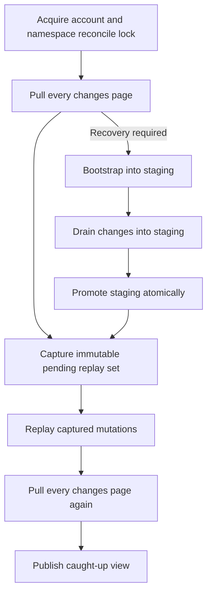

# Transactional App State reconciliation

Use a reconciler when an app must work offline, survive process crashes, or coordinate multiple
devices. Keep the seven-operation low-level HTTP layer available for direct calls; the reconciler is
an additive state machine over that transport, not a replacement wire protocol.

## State model

Persist these fields per explicit verified account and resolved namespace boundary:

- `shadow`: the last committed server state, including tombstone lineage.
- `stagingBootstrap`: an unexposed base scan being assembled.
- `syncToken`: the opaque incremental checkpoint.
- `bootstrapCursor`: the opaque base-scan continuation.
- `pendingMutations`: immutable local replacement/delete intents awaiting replay.
- `localRevision`: the local order used to capture and retire pending work safely.

App-visible state is a derived overlay: server shadow plus pending local mutations. Keep this visible
view separate from durable shadow so bootstrap recovery never discards an offline edit.

## Conceptual diagram: one reconciliation run

This diagram is conceptual. The exact wire fields and statuses are defined by the
[API contract](./index).

The run order is pull, captured replay, then pull again. Queue writes may continue while network I/O
is in flight, but only captured local revisions are retired. Later work remains pending.

## Page and checkpoint atomicity

Apply each complete page and its returned token in one local transaction. A crash before commit
leaves both prior shadow and prior checkpoint; a crash after commit leaves both new shadow and new
checkpoint. Never persist a checkpoint separately from represented state.

Bootstrap safely:

1. Start or resume `stagingBootstrap`; never expose partial staging.
2. Persist each complete page with `bootstrapCursor` atomically.
3. Require the terminal page's `nextSyncToken`.
4. Drain `GET /auth/v1/app-state:changes` into staging.
5. Promote staging only when the drain reaches `hasMore` false.

If bootstrap or its drain reports `410`, discard only partial staging and restart. Preserve pending
local mutations, conflicts, and blocked work.

On `410`, preserve pending mutations while rebuilding server shadow. Keep staging isolated, drain
changes into staging, and promote only after the terminal page commits.

## Change application

- Apply a server document or tombstone only when its `version` is greater than retained lineage.
- Ignore a byte-identical duplicate.
- Treat a same-version conflicting payload as a protocol error; do not commit page or checkpoint.
- An out-of-order older page cannot replace a newer retained version.
- Upserts update shadow. Deletes retain a tombstone and hide the live document.

## Tombstone pruning and recreation

Document version is opaque. The version increases on each server mutation: put, delete, and
recreation. Tombstone consumption retains the tombstone lineage version. Payload pruning also
retains that lineage version; it may remove tombstone payload/history only after a valid watermark.

After prune, the recreated document version must be greater than the tombstone version. Apply the
recreated upsert before the token can advance. This keeps existing SDK strictly-newer rules from
rejecting a legitimate recreation.

Prune retains the lineage version. The token may advance only after applying the recreated upsert.

## Mutation replay and conflicts

Snapshot method, encoded path, complete request body, preconditions, and `Idempotency-Key` before
awaiting authentication or network work. Reuse the key only for a byte-identical fingerprint.

For a strict `412` conflict:

1. Read current state; document-not-found means live state is absent.
2. Preserve the queued complete replacement or delete intent; do not generic-merge or overwrite.
3. Update `If-Match` or `If-None-Match` for the refreshed state.
4. Rotate the idempotency key only if the request fingerprint changes.
5. Retry within a bound, then expose conflict state to the app.

An already-absent delete is reconciled. Ambiguous `500` or transport failure retries with identical
bytes, precondition, and key. Respect `Retry-After` for `429`. Authentication, validation, policy,
storage, and protocol failures remain explicit states.

## `410` recovery

For `410 bootstrap_required` or `410 sync_token_expired`:

1. Preserve pending mutations.
2. Bootstrap into staging.
3. Drain changes into staging.
4. Promote staging.
5. Replay captured pending mutations.
6. Pull again before reporting caught up.

The frozen action is: Preserve pending mutations, bootstrap into staging, drain changes, promote, replay, then pull again.

Status-only `410` fallback is synchronization-scoped. Do not globally reinterpret unrelated
mutation failures; use symbolic codes and operation-specific rules.

## Account switching

Use an explicit non-empty account identity and an account generation counter. Capture both before
transport I/O. On sign-out or switch, advance the generation, change the visible account, and reject
every late result or response whose account generation is stale.

A late response is rejected before classification, recovery, refresh, or commit.

Never infer identity by decoding an opaque credential. Isolate shadow, staging, checkpoints,
pending mutations, and local revisions per account/namespace. Tear down old subscriptions so one
user's state never becomes visible to another.

## Low-level HTTP and reconciler SDK layers

The reviewed JavaScript and Python additions remain unpublished/pre-live until launch evidence
passes. Existing imports and low-level calls remain valid; reconciliation is opt-in.

| Layer | JavaScript / TypeScript | Python | Use it for |
| --- | --- | --- | --- |
| Low-level HTTP | Existing `client.auth.appState` and `client.auth.v1.appState` facades implement `AppStateTransport` and the seven operation methods. | Existing synchronous `get_app_state_configuration`, `bootstrap_app_state`, `get_app_state_changes`, `list_app_state_documents`, `get_app_state_document`, `put_app_state_document`, and `delete_app_state_document`. | Direct online calls or an application's own state machine. |
| Reconciler | `createAppStateReconciler` with an `AppStateStore`; `createAppStateMemoryStore` is a reference, not durable production storage. | `AppStateReconciler` with an `AppStateStore`; `MemoryAppStateStore` is a reference, not durable production storage. | Offline queues, atomic page/checkpoint commits, recovery, and account isolation. |

JavaScript and Python transactional reducers are synchronous and network-free. A production store
must commit reducers atomically and return isolated copies or immutable views.

## Secure native and mobile storage

- Encrypt durable state using platform-protected storage appropriate to the threat model.
- Keep OAuth credentials in the credential store, never the App State database.
- Never put App State bodies, values, tokens, cursors, dynamic key identifiers, namespace
  identifiers, raw user identifiers, raw client identifiers, deletion reasons, credentials, or
  literal paths in logs, analytics, traces, crash reports, push payloads, filenames, or backup
  labels.
- Redact telemetry errors while retaining safe status/type/code/retry metadata.
- Test crash points around page commit, bootstrap promotion, mutation response/local commit, and
  account switching.

## Related pages

- [App State API contract](./index)
- [Lifecycle and launch policy](../lifecycle/)
